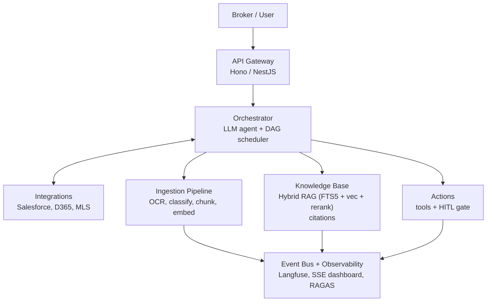
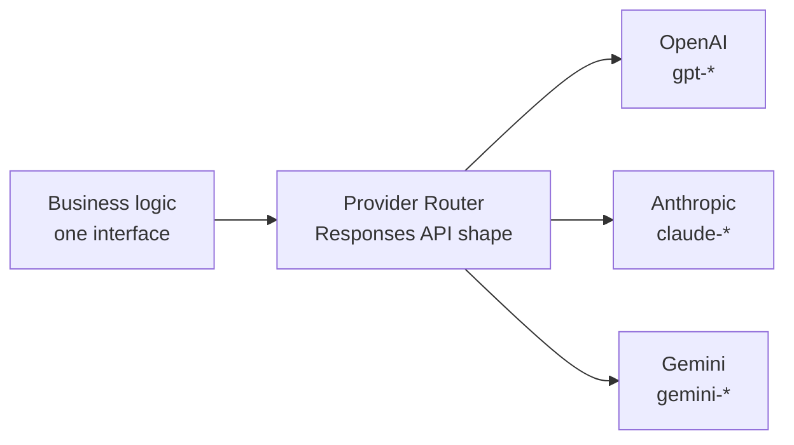
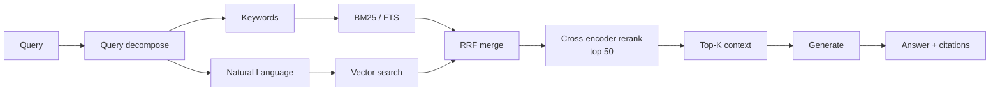
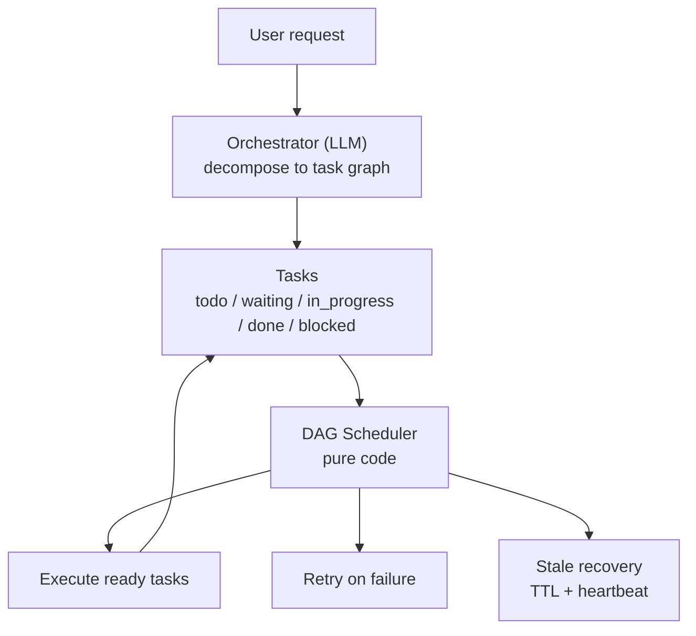
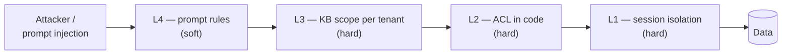
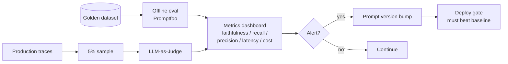

# AI System Design Interview — Cheatsheet (Alex Xu overlay)

> **Use:** The on-the-day reference. Classic `System Design Interview` (Alex Xu) 4-step framework, rewritten with AI-system priors. Skim right before the session. The PLAYBOOK.md holds the deep patterns; this file holds the *structure* of how to move through them.

---

## The 4 steps (Alex Xu, AI-aware)

1. **Clarify** — 5 to 10 minutes. Questions *before* any boxes. Demonstrate you don't design without knowing the constraints. Interviewer-specific AI questions below.
2. **Estimate** — capacity, throughput, cost, latency. AI units are different from classic web — see below.
3. **High-level design** — draw ONE diagram. AI-aware template in Section 3.
4. **Deep dive** — interviewer picks 2–3 components. Be ready with tradeoffs on each.

**Meta-rule:** Narrate everything. Interviewers grade process and communication, not the diagram.

---

## Step 1 — Clarify (the questions you ask first)

Split your clarifying questions into **functional, non-functional, and AI-specific**. Ask at least one from each bucket before touching the whiteboard.

### Functional
- **Who are the users?** Brokers, asset managers, tenant reps, investors, property managers?
- **What's the core job-to-be-done?** Extract data from a document? Answer questions about a document? Search across a portfolio? Draft something?
- **What does the user do with the output?** Goes to CRM? Email? PDF report? Another agent?
- **What documents/data are in scope?** Leases only? + OMs? + rent rolls? + emails? Historical or live?
- **What's the expected volume?** Docs per day, per month, per portfolio?

### Non-functional
- **Latency budget?** Is this interactive (broker copilot, <5s) or batch (overnight, minutes OK)?
- **Accuracy SLO?** What's the acceptable error rate? Who absorbs the risk when the model is wrong?
- **Audit-trail requirements?** Do we need clause-level citations? For how long? Who's the audit audience (internal, legal, regulator)?
- **Data residency / compliance?** US-only? EU? HIPAA-adjacent? Any PII?
- **Multi-tenant isolation requirements?** One tenant one database? Shared DB with tenant column? Separate API keys?
- **Integration points?** Salesforce, Dynamics 365, MLS, email, Slack?

### AI-specific (these are the ones that signal seniority)
- **Who pays for the wrong answer?** (Determines how much HITL we need.)
- **What's the cost ceiling per transaction / per user / per month?** (Determines model tier, caching, routing.)
- **Do we have labeled training data for eval?** (Determines eval strategy and PoC timeline.)
- **What's the ground truth?** (Domain expert? Legal team? Existing CRM data?)
- **Are we okay with the model saying "I don't know"?** (Determines fallback strategy. For legal docs: YES — abstain > hallucinate.)
- **What does "done" look like for the PoC?** (Forces concrete success criteria.)
- **Any prior AI attempts here?** What worked, what didn't? (Avoid walking into a known dead end.)

**Opening move phrase:**
*"Before I draw anything, I want to make sure I understand the problem. Can I ask a few clarifying questions, then state my assumptions back to you?"*

---

## Step 2 — Estimate (AI-specific units)

Classic system design estimates QPS, storage, bandwidth. AI systems have additional units.

### Classic units (still needed)
- Users, DAU/MAU, requests/second, peak multiplier
- Storage: documents × avg size, metadata, indexes
- Bandwidth: in/out, batch windows

### AI units (what's different)
- **Tokens per request (input / output):** `chars / 4 * 1.2` rough. Adjust with `response.usage` in prod.
- **Requests per document:** A 50-page lease might touch the model 5–15 times (classify, extract per clause, validate, enrich).
- **Cost per transaction:** `tokens_in * price_in + tokens_out * price_out`. Tool responses usually dominate (~2/3 of spend).
- **Latency budget breakdown:** retrieval latency + LLM latency + tool latency + network. Each has p50/p95/p99.
- **Embedding storage:** `docs * chunks_per_doc * dim * bytes_per_dim`. A 1536-dim float32 embedding is 6KB. 10k docs × 100 chunks × 6KB ≈ 6 GB.
- **Index size (FTS):** usually 0.5–1.5x source text size.
- **Eval dataset size:** for a PoC, 50–200 labeled examples per task type. For production, 500–2000+.

### Sample back-of-envelope (Ascendix-flavored)
- 10 brokerages × 50 brokers × 20 leases/broker/month = 10,000 leases/month
- 10,000 leases × 50 pages × 2,000 chars/page = 1 GB raw text/month
- Input tokens/lease ≈ 12,000; output ≈ 2,000. At $5/$15 per M tokens: `$0.09/lease` → **$900/month LLM cost for all brokers**.
- Embedding: 10k leases × 100 chunks × 1536 dim × 4 bytes ≈ **6 GB** index.
- Say the priors out loud; they demonstrate you think in money and bytes, not just diagrams.

---

## Step 3 — High-level design (AI-aware template)

Reach for this template as your **default backbone** in any document-heavy scenario. Adapt boxes to the specific business question.

**Always add these boxes, even if the interviewer doesn't ask:**
- Provider Router (multi-LLM)
- Prompt cache (stable system, dynamic data in user msg)
- Defense Stack (L1 session isolation, L2 ACL, L3 KB scope, L4 prompt)
- Observability + Eval (Langfuse + Promptfoo + RAGAS)
- Cost tracking per tenant / doc type / prompt version
- HITL gate on every critical action

**Narrate while drawing:**
*"I'll start with the ingestion path, then RAG, then the agent layer, then observability as a cross-cutting concern. I'll draw the happy path first and we can dig into failure modes in the deep dive."*

---

## Step 4 — Deep dives (what they'll probe)

Pick 2–3 to be ready on. Interviewers usually pick the one where your choices look most load-bearing.

### Deep-dive: RAG
- Chunking strategy (structural units, 200–500 words)
- Hybrid retrieval (FTS + embeddings + RRF + cross-encoder rerank)
- Contextual embeddings (Anthropic technique)
- Metadata for filter + citation
- Infra tier choice (SQLite → Postgres → dedicated vector store)
- Eval: faithfulness, answer relevancy, context precision, context recall (RAGAS)
- **Gotcha question:** *"Why not pure vector?"* → Answer: clause numbers and exact terms fail.
- **Gotcha question:** *"Why not fine-tune instead?"* → Answer: sources change, citations required.

### Deep-dive: Agent orchestration
- Orchestrator (LLM) vs DAG scheduler (code) split
- Heartbeat pattern, stale recovery, TTL claims
- Agent Isolation Model (folders, not RPC)
- HITL gates at every critical action
- MAX_TURNS hard limit
- **Gotcha question:** *"What if one agent crashes?"* → Heartbeat + TTL + scheduler retries.
- **Gotcha question:** *"How do agents share state?"* → Shared workspace / blackboard, not direct messages.

### Deep-dive: Cost and latency
- Prompt cache (stable system + tools)
- Model routing by task shape (cheap for extraction, expensive for reasoning)
- Tool response shaping (summary + `next_action`, not raw payload)
- Async-first, sync only for hot path
- Token estimation before dispatch; reject oversize early
- **Gotcha question:** *"What if LLM costs 10x?"* → Per-tenant hard limits, cost anomaly alerts, routing to cheaper models.

### Deep-dive: Observability and eval
- Hierarchical tracing (Session → Trace → Agent → Generation|Tool)
- Offline + online evals (Promptfoo + LLM-as-judge)
- Prompt versioning tied to metrics
- RAGAS metrics (memorize the 4)
- Noise floor threshold (DSPy/AX)
- Eval alignment matrix (watch false positives *and* false negatives)
- **Gotcha question:** *"How do you know a prompt change is actually better?"* → Noise floor + holdout set.

### Deep-dive: Safety and multi-tenancy
- 4-layer Defense Stack
- Block response editing (many-shot jailbreak)
- Deterministic confirmations (button clicks, not text)
- Code-level whitelists, not prompt rules
- Sandboxed code execution
- Tenant isolation: workspace + ACL + KB scope
- Audit-trail immutability (branch, don't mutate)
- **Gotcha question:** *"What stops prompt injection from a hostile lease PDF?"* → Architecture: least privilege tools, sandbox, ACL. *"Prompt injection has no fix at the prompt level — we defend in code."*

---

## Tradeoffs cheat table

Memorize the framings. Use them when forced to pick.

| Dimension | Cheap / Fast | Expensive / Safe | When to pick which |
|---|---|---|---|
| Retrieval | FTS / grep | Hybrid + rerank | Always hybrid for legal-adjacent |
| Chunking | Fixed size | Structural | Always structural for legal docs |
| Embedding | Off-the-shelf | Custom fine-tune | Off-the-shelf until eval proves a gap |
| Model | Small (4o-mini, Haiku) | Large (o3, Opus) | Small for structured extraction; large for clause interpretation |
| Routing | Single model | Multi-vendor | Multi-vendor for anything production — avoid lock-in |
| Execution | Sync | Async / queue | Async by default, sync only for hot path |
| State | Single-agent in-context | Shared workspace / blackboard | Workspace once >1 agent or >200 turns |
| Orchestration | Agent self-manages | Orchestrator LLM + DAG code | Split as soon as there are dependencies |
| Tools | 1:1 API wrappers | Consolidated with hints + dry-run | Always consolidated |
| Safety | Prompt rules | Code-level ACL + sandbox | Code wins — prompt is theater |
| Observability | Logs after-the-fact | Tracing + event bus from day 1 | Day 1, always |
| Eval | Vibe check | Offline golden + online sample + RAGAS | Both, from day 1 |
| Memory | Full history | Observer + Reflector rolling summary | Rolling once >30% window |
| Knowledge | Fine-tune | RAG | RAG, almost always, in CRE |
| Infra | Postgres + Qdrant + ES | SQLite + FTS5 + sqlite-vec | SQLite for PoC, graduate later |
| Multi-tenant | Shared DB tenant column | Isolated workspace per tenant | Workspace isolation for legal-adjacent |

---

## RAGAS vocabulary (memorize — gap from prior interview)

Four metrics, answer "is our RAG actually working?"

| Metric | Question it answers | What to watch |
|---|---|---|
| **Faithfulness** | Is the answer supported by the retrieved context? | High faith = low hallucination |
| **Answer relevancy** | Is the answer on-topic to the question? | Low relevancy = off-topic answers |
| **Context precision** | Did we retrieve only what we needed? | Low precision = noisy retrieval |
| **Context recall** | Did we retrieve everything we needed? | Low recall = missing evidence |

**Say it this way:** *"For any RAG system, we measure four things: faithfulness — is the answer grounded in retrieved context; answer relevancy — is it on-topic; context precision — did we retrieve only what we needed; and context recall — did we retrieve everything we needed. That's the RAGAS framework. Those four together tell us where to optimize: low faithfulness means the model is hallucinating, low recall means we need better retrieval."*

**Adjacent metrics worth mentioning if the discussion goes there:**
- **Answer correctness** (ground-truth comparison, when labels exist)
- **Answer similarity** (semantic similarity to ground truth)
- **Context utilization** (how much of retrieved context the model actually used)

---

## Red flags = senior signals (say these unprompted)

These are the sentences that separate mid from senior. Drop one each time a topic comes up.

- *"Let me state my assumptions explicitly so we can disagree if we need to."*
- *"What's the cost ceiling per transaction?"*
- *"Who absorbs the risk when the model is wrong?"*
- *"We need observability and evals from day one — this is enterprise."*
- *"I'd start with the smallest infra that works and graduate when eval proves we need to."*
- *"Prompt injection has no fix at the prompt level — we defend in code."*
- *"Let me separate reasoning from scheduling — the model decides what, code decides when."*
- *"The schema validates shape; our code validates business values."*
- *"I'd reserve fine-tuning for style or tool-calling format, not domain knowledge."*
- *"For the PoC, I'd process two or three high-value portfolios end-to-end — prove ROI on a real deal, not a demo."*
- *"Tool responses usually dominate token spend — that's where I'd optimize first."*
- *"LLMs are non-deterministic — one improved run isn't a win, it has to beat the noise floor."*

---

## Opening move — first 90 seconds

Exact phrase you can use verbatim to buy time and anchor the conversation.

> *"Thanks. Before I draw anything, I want to make sure I understand the problem, then state my assumptions. Can I ask a few clarifying questions — who the users are, what the output is used for, and what the audit-trail requirements look like? And while we're at it, I'll share the priors I'm bringing to the problem so we can disagree if your priors are different."*

Then ask 4–5 questions from Step 1. Then say the 7 priors from PLAYBOOK.md §Opening priors. Then draw.

---

## Things to avoid saying

- *"We'd use LangChain…"* — known anti-pattern for this team; Marcin's prior work was a production RAG built *without* LangChain. Don't signal the opposite.
- *"We'd fine-tune on their lease data…"* — unless they explicitly push; RAG is the prior.
- *"We'd use GPT-4 for everything…"* — shows no cost awareness and no routing thinking.
- *"We'd use ChromaDB/Pinecone…"* — not wrong per se, but committing to a specific vector store without justifying is weak. Say "a vector store, starting with sqlite-vec for PoC" instead.
- *"We could make it a chatbot…"* — wrong framing for broker workflows. Structured output → CRM, not a chat window.
- *"MCP is just for Claude Desktop."* — it's the protocol for tool interop. Know it.
- *"I would need to research…"* — fine once, not twice. Over-deferral kills the signal. Better: make the call, flag it's a call, explain the basis.

---

## Things to draw (micro-diagrams you should be able to sketch in 30 seconds each)

Memorize these 5 drawable shapes. Deploy whichever the scenario calls for.

### 1. Provider Router box — one interface, multiple providers

### 2. Hybrid RAG flow — two queries, merge, rerank, generate

### 3. Orchestrator + DAG Scheduler — split reasoning from execution

### 4. Defense Stack — 4 layers, attacker bounces off hard layers

### 5. Eval loop — offline gate + online sample + regression alert

---

## Domain vocabulary you'll need (CRE)

You don't need to be a CRE expert. You need to recognize the words and ask follow-ups. Don't bluff.

| Term | Ask about |
|---|---|
| **Lease** | Main contract between landlord and tenant. Length, rent schedule, options, defaults. |
| **LOI** (Letter of Intent) | Non-binding term sheet before a lease. |
| **OM** (Offering Memorandum) | Marketing package for a property for sale. |
| **Rent roll** | Schedule of all tenants in a building + what they pay. |
| **SNDA** | Subordination, Non-Disturbance, Attornment — addresses how lease relates to landlord's mortgage. |
| **Estoppel** | Tenant-signed statement of lease terms, used in sales/refi. |
| **Cap rate** | NOI / property value. Core CRE valuation metric. |
| **NOI** | Net Operating Income. |
| **Class A / B / C** | Building grade. |
| **Tenant improvement (TI)** | Allowance for buildout. |
| **Broker, tenant rep, landlord rep** | The player you're building for. Ask which. |
| **CRE vs residential** | You're in CRE. Different workflows, longer cycles, more paperwork. Don't mix. |

**If you hear a CRE term you don't know:** *"Can you help me understand what [X] looks like in the workflow? I want to make sure I'm designing for the right interaction."* — asking beats bluffing.

---

## Time-box (60–90 min session)

- 0–5 min: handshake, scenario intro
- 5–15 min: clarifying questions + state priors
- 15–25 min: estimate out loud
- 25–45 min: high-level design, narrating
- 45–75 min: deep dive on 2–3 components (they pick)
- 75–85 min: failure modes, edge cases, what's missing
- 85–90 min: your questions for them

**Check the clock around 40 min.** If you're still in high-level, pivot to wrap up — they care more about the deep dive on one component than a complete diagram.

---

## Final reminder

You're not graded on finishing the diagram. You're graded on **how you think out loud**. Every tradeoff narrated, every assumption stated, every "I'd want to verify X before committing" — those are senior signals.
