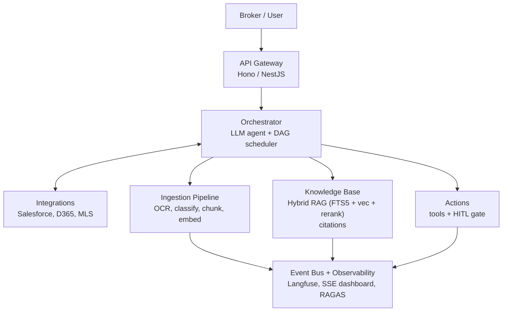
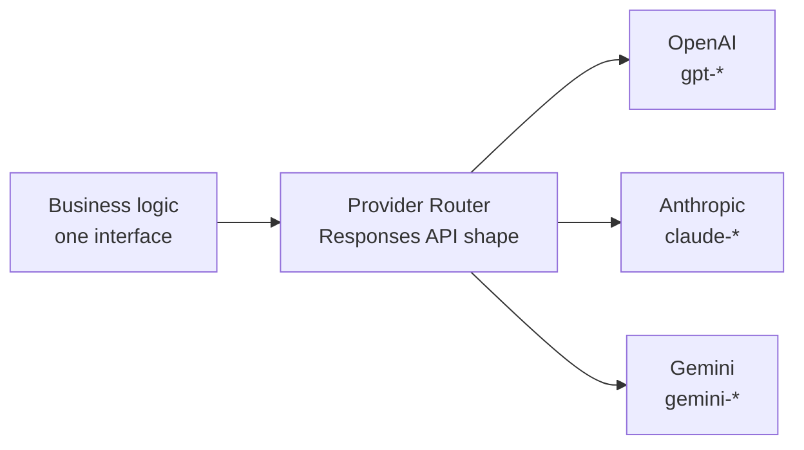
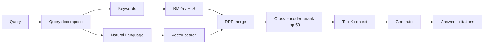
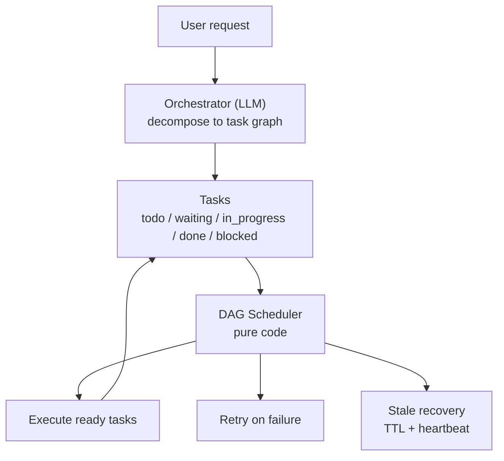
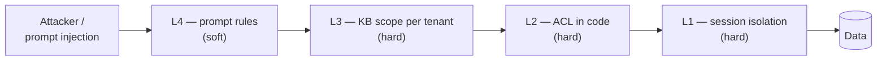
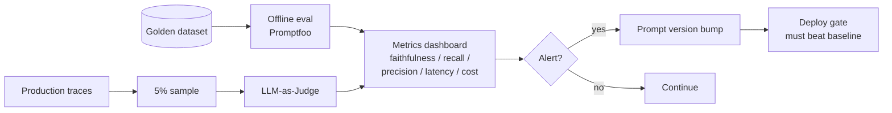

# AI System Design Interview — Cheatsheet (PL, nakładka Alex Xu)

> **Użycie:** Referencja na sam dzień. Klasyczny framework 4-krokowy z `System Design Interview` (Alex Xu), przepisany pod priors AI-systemów. Skimuj tuż przed sesją. PLAYBOOK.pl.md trzyma głębokie wzorce; ten plik trzyma *strukturę* poruszania się przez nie.
>
> **Terminologia techniczna po angielsku** (hybrid search, Provider Router, DAG scheduler, RAGAS, HITL itd.). **Interview snippets i zdania do wypowiedzenia verbatim po angielsku.**

---

## 4 kroki (Alex Xu, AI-aware)

1. **Clarify** — 5 do 10 minut. Pytania *przed* jakimikolwiek boxami. Pokazujesz że nie projektujesz bez znajomości constraintów. Interviewer-specific AI pytania poniżej.
2. **Estimate** — capacity, throughput, koszt, latency. AI units są inne niż klasyczny web — zobacz poniżej.
3. **High-level design** — narysuj JEDEN diagram. AI-aware template w sekcji 3.
4. **Deep dive** — interviewerzy wybierają 2–3 komponenty. Bądź gotów na tradeoffs na każdym.

**Meta-rule:** Narracja na głos. Oceniają proces i komunikację, nie diagram.

---

## Krok 1 — Clarify (pytania, które zadajesz najpierw)

Rozdziel pytania clarifying na **functional, non-functional, i AI-specific**. Zadaj co najmniej jedno z każdego bucketa zanim dotkniesz whiteboarda.

### Functional
- **Kim są userzy?** Brokerzy, asset managerowie, tenant repy, inwestorzy, property managerowie?
- **Core job-to-be-done?** Ekstrahować dane z dokumentu? Odpowiadać na pytania o dokument? Szukać po portfolio? Draftować coś?
- **Co user robi z outputem?** Idzie do CRM-a? Email? PDF report? Do innego agenta?
- **Jakie dokumenty/dane są w scope?** Tylko lease'y? + OM-y? + rent rolls? + emails? Historyczne czy live?
- **Jaki expected volume?** Docs/day, per month, per portfolio?

### Non-functional
- **Latency budget?** Czy to interaktywne (broker copilot, <5s) czy batch (overnight, minuty OK)?
- **Accuracy SLO?** Jaki jest acceptable error rate? Kto ponosi ryzyko gdy model się myli?
- **Audit-trail requirements?** Czy potrzebujemy clause-level citations? Na jak długo? Kto jest audit audience (internal, legal, regulator)?
- **Data residency / compliance?** US-only? EU? HIPAA-adjacent? Jakiekolwiek PII?
- **Multi-tenant isolation requirements?** Jeden tenant jedna baza? Shared DB z tenant column? Separate API keys?
- **Integration points?** Salesforce, Dynamics 365, MLS, email, Slack?

### AI-specific (te sygnalizują seniority)
- **Kto płaci za błędną odpowiedź?** (Determines ile HITL potrzebujemy.)
- **Jaki jest cost ceiling per transaction / per user / per month?** (Determines model tier, caching, routing.)
- **Czy mamy labeled training data dla eval?** (Determines eval strategy i PoC timeline.)
- **Co jest ground truth?** (Domain expert? Legal team? Existing CRM data?)
- **Czy jesteśmy OK z tym że model powie "nie wiem"?** (Determines fallback strategy. Dla legal docs: TAK — abstain > hallucinate.)
- **Jak wygląda "done" dla PoC?** (Wymusza konkretne success criteria.)
- **Jakieś wcześniejsze AI attempts tutaj?** Co działało, co nie? (Unikaj wejścia w znaną ślepą uliczkę.)

**Opening move phrase:**
*"Before I draw anything, I want to make sure I understand the problem. Can I ask a few clarifying questions, then state my assumptions back to you?"*

---

## Krok 2 — Estimate (AI-specific units)

Klasyczny system design estymuje QPS, storage, bandwidth. AI systems mają dodatkowe units.

### Classic units (nadal potrzebne)
- Users, DAU/MAU, requests/second, peak multiplier
- Storage: documents × avg size, metadata, indexes
- Bandwidth: in/out, batch windows

### AI units (co jest inne)
- **Tokens per request (input / output):** `chars / 4 * 1.2` rough. Adjust z `response.usage` w prod.
- **Requests per document:** 50-stronicowy lease może dotknąć model 5–15 razy (classify, extract per clause, validate, enrich).
- **Cost per transaction:** `tokens_in * price_in + tokens_out * price_out`. Tool responses zwykle dominują (~2/3 spendu).
- **Latency budget breakdown:** retrieval latency + LLM latency + tool latency + network. Każdy ma p50/p95/p99.
- **Embedding storage:** `docs * chunks_per_doc * dim * bytes_per_dim`. 1536-dim float32 embedding to 6KB. 10k docs × 100 chunks × 6KB ≈ 6 GB.
- **Index size (FTS):** zazwyczaj 0.5–1.5x source text size.
- **Eval dataset size:** dla PoC 50–200 labeled examples per task type. Dla production 500–2000+.

### Sample back-of-envelope (Ascendix-flavored)
- 10 brokerages × 50 brokerów × 20 lease'ów/broker/miesiąc = 10,000 lease'ów/miesiąc
- 10,000 lease'ów × 50 stron × 2,000 chars/strona = 1 GB raw text/miesiąc
- Input tokens/lease ≈ 12,000; output ≈ 2,000. Przy $5/$15 per M tokens: `$0.09/lease` → **$900/miesiąc LLM cost dla wszystkich brokerów**.
- Embedding: 10k lease'ów × 100 chunks × 1536 dim × 4 bytes ≈ **6 GB** index.
- Powiedz priors na głos; demonstruje że myślisz w pieniądzach i bajtach, nie tylko w diagramach.

---

## Krok 3 — High-level design (AI-aware template)

Sięgnij po ten template jako **default backbone** w każdym document-heavy scenariuszu. Adaptuj boxy do konkretnego business question.

**Zawsze dodaj te boxy, nawet jeśli interviewer nie pyta:**
- Provider Router (multi-LLM)
- Prompt cache (stabilny system, dynamic data w user msg)
- Defense Stack (L1 session isolation, L2 ACL, L3 KB scope, L4 prompt)
- Observability + Eval (Langfuse + Promptfoo + RAGAS)
- Cost tracking per tenant / doc type / prompt version
- HITL gate na każdej critical action

**Narracja podczas rysowania:**
*"I'll start with the ingestion path, then RAG, then the agent layer, then observability as a cross-cutting concern. I'll draw the happy path first and we can dig into failure modes in the deep dive."*

---

## Krok 4 — Deep dives (co będą drillować)

Wybierz 2–3, na które masz być gotowy. Interviewerzy zwykle wybierają ten, gdzie Twoje wybory wyglądają na najbardziej load-bearing.

### Deep-dive: RAG
- Chunking strategy (structural units, 200–500 słów)
- Hybrid retrieval (FTS + embeddings + RRF + cross-encoder rerank)
- Contextual embeddings (technika Anthropic)
- Metadata do filtra + citation
- Infra tier choice (SQLite → Postgres → dedicated vector store)
- Eval: faithfulness, answer relevancy, context precision, context recall (RAGAS)
- **Gotcha question:** *"Why not pure vector?"* → Answer: clause numbers i exact terms failują.
- **Gotcha question:** *"Why not fine-tune instead?"* → Answer: sources się zmieniają, citations wymagane.

### Deep-dive: Agent orchestration
- Orchestrator (LLM) vs DAG scheduler (kod) split
- Heartbeat pattern, stale recovery, TTL claims
- Agent Isolation Model (foldery, nie RPC)
- HITL gates na każdej critical action
- MAX_TURNS hard limit
- **Gotcha question:** *"What if one agent crashes?"* → Heartbeat + TTL + scheduler retries.
- **Gotcha question:** *"How do agents share state?"* → Shared workspace / blackboard, nie direct messages.

### Deep-dive: Cost and latency
- Prompt cache (stabilny system + tools)
- Model routing wg task shape (cheap dla extraction, expensive dla reasoning)
- Tool response shaping (summary + `next_action`, nie raw payload)
- Async-first, sync tylko dla hot path
- Token estimation przed dispatchem; reject oversize early
- **Gotcha question:** *"What if LLM costs 10x?"* → Per-tenant hard limits, cost anomaly alerts, routing do tańszych modeli.

### Deep-dive: Observability and eval
- Hierarchical tracing (Session → Trace → Agent → Generation|Tool)
- Offline + online evals (Promptfoo + LLM-as-judge)
- Prompt versioning powiązane z metrykami
- RAGAS metrics (zapamiętaj 4)
- Noise floor threshold (DSPy/AX)
- Eval alignment matrix (pilnuj false positives *i* false negatives)
- **Gotcha question:** *"How do you know a prompt change is actually better?"* → Noise floor + holdout set.

### Deep-dive: Safety and multi-tenancy
- 4-layer Defense Stack
- Zablokuj response editing (many-shot jailbreak)
- Deterministic confirmations (button clicks, nie text)
- Code-level whitelisty, nie prompt rules
- Sandboxed code execution
- Tenant isolation: workspace + ACL + KB scope
- Audit-trail immutability (branchuj, nie mutuj)
- **Gotcha question:** *"What stops prompt injection from a hostile lease PDF?"* → Architecture: least privilege tools, sandbox, ACL. *"Prompt injection has no fix at the prompt level — we defend in code."*

---

## Tradeoffs cheat table

Zapamiętaj framings. Używaj gdy zmuszony do wyboru.

| Wymiar | Cheap / Fast | Expensive / Safe | Kiedy co wybierać |
|---|---|---|---|
| Retrieval | FTS / grep | Hybrid + rerank | Zawsze hybrid dla legal-adjacent |
| Chunking | Fixed size | Structural | Zawsze structural dla legal docs |
| Embedding | Off-the-shelf | Custom fine-tune | Off-the-shelf dopóki eval nie udowodni gap |
| Model | Small (4o-mini, Haiku) | Large (o3, Opus) | Small dla structured extraction; large dla clause interpretation |
| Routing | Single model | Multi-vendor | Multi-vendor dla production — avoid lock-in |
| Execution | Sync | Async / queue | Async by default, sync tylko dla hot path |
| State | Single-agent in-context | Shared workspace / blackboard | Workspace gdy >1 agent lub >200 turn |
| Orchestration | Agent self-manages | Orchestrator LLM + DAG code | Split gdy tylko są dependencies |
| Tools | 1:1 API wrappers | Konsolidowane z hints + dry-run | Zawsze konsolidowane |
| Safety | Prompt rules | Code-level ACL + sandbox | Kod wygrywa — prompt to teatr |
| Observability | Logs after-the-fact | Tracing + event bus od dnia 1 | Dzień 1, zawsze |
| Eval | Vibe check | Offline golden + online sample + RAGAS | Oba, od dnia 1 |
| Memory | Full history | Observer + Reflector rolling summary | Rolling gdy >30% window |
| Knowledge | Fine-tune | RAG | RAG, prawie zawsze, w CRE |
| Infra | Postgres + Qdrant + ES | SQLite + FTS5 + sqlite-vec | SQLite dla PoC, graduate później |
| Multi-tenant | Shared DB tenant column | Isolated workspace per tenant | Workspace isolation dla legal-adjacent |

---

## RAGAS vocabulary (zapamiętaj — gap z poprzedniego interview)

Cztery metryki, odpowiadają na *"czy nasz RAG faktycznie działa?"*

| Metryka | Pytanie na które odpowiada | Na co patrzeć |
|---|---|---|
| **Faithfulness** | Czy answer jest supported by retrieved context? | High faithfulness = low hallucination |
| **Answer relevancy** | Czy answer jest on-topic do pytania? | Low relevancy = off-topic answers |
| **Context precision** | Czy pobraliśmy tylko to czego potrzebowaliśmy? | Low precision = noisy retrieval |
| **Context recall** | Czy pobraliśmy wszystko czego potrzebowaliśmy? | Low recall = missing evidence |

**Powiedz to tak:** *"For any RAG system, we measure four things: faithfulness — is the answer grounded in retrieved context; answer relevancy — is it on-topic; context precision — did we retrieve only what we needed; and context recall — did we retrieve everything we needed. That's the RAGAS framework. Those four together tell us where to optimize: low faithfulness means the model is hallucinating, low recall means we need better retrieval."*

**Sąsiednie metryki warte wspomnienia jeśli dyskusja idzie w tę stronę:**
- **Answer correctness** (ground-truth comparison, gdy labels istnieją)
- **Answer similarity** (semantic similarity do ground truth)
- **Context utilization** (ile retrieved contextu model faktycznie użył)

---

## Red flags = senior signals (powiedz te unprompted)

To są zdania, które oddzielają mid od senior. Rzucaj jedno przy każdym nowym temacie.

- *"Let me state my assumptions explicitly so we can disagree if we need to."*
- *"What's the cost ceiling per transaction?"*
- *"Who absorbs the risk when the model is wrong?"*
- *"We need observability and evals from day one — this is enterprise."*
- *"I'd start with the smallest infra that works and graduate when eval proves we need to."*
- *"Prompt injection has no fix at the prompt level — we defend in code."*
- *"Let me separate reasoning from scheduling — the model decides what, code decides when."*
- *"The schema validates shape; our code validates business values."*
- *"I'd reserve fine-tuning for style or tool-calling format, not domain knowledge."*
- *"For the PoC, I'd process two or three high-value portfolios end-to-end — prove ROI on a real deal, not a demo."*
- *"Tool responses usually dominate token spend — that's where I'd optimize first."*
- *"LLMs are non-deterministic — one improved run isn't a win, it has to beat the noise floor."*

---

## Opening move — pierwsze 90 sekund

Dokładna fraza, którą możesz użyć verbatim, żeby kupić czas i zakotwiczyć rozmowę.

> *"Thanks. Before I draw anything, I want to make sure I understand the problem, then state my assumptions. Can I ask a few clarifying questions — who the users are, what the output is used for, and what the audit-trail requirements look like? And while we're at it, I'll share the priors I'm bringing to the problem so we can disagree if your priors are different."*

Potem zadaj 4–5 pytań z Kroku 1. Potem powiedz 7 priors z PLAYBOOK.pl.md § Opening priors. Potem rysuj.

---

## Rzeczy do unikania

- *"We'd use LangChain…"* — znany anti-pattern dla tego teamu; poprzednia praca Marcina to production RAG zbudowany *bez* LangChaina. Nie sygnalizuj czegoś przeciwnego.
- *"We'd fine-tune on their lease data…"* — chyba że explicitnie pushują; RAG jest priorsem.
- *"We'd use GPT-4 for everything…"* — pokazuje brak cost awareness i brak routing thinking.
- *"We'd use ChromaDB/Pinecone…"* — nie błędne per se, ale commit do konkretnego vector store bez uzasadnienia jest słaby. Powiedz *"a vector store, starting with sqlite-vec for PoC"* zamiast.
- *"We could make it a chatbot…"* — zła ramka dla broker workflows. Structured output → CRM, nie chat window.
- *"MCP is just for Claude Desktop."* — to protokół tool interop. Musisz wiedzieć.
- *"I would need to research…"* — OK raz, nie dwa razy. Over-deferral zabija signal. Lepiej: podejmij decyzję, oznacz że to decyzja, wyjaśnij bazę.

---

## Rzeczy do narysowania (micro-diagrams, każdy w 30 sekund)

Zapamiętaj te 5 rysowalnych kształtów. Deploy którykolwiek pasuje do scenariusza.

### 1. Provider Router box — jeden interfejs, wielu providerów

### 2. Hybrid RAG flow — dwa zapytania, merge, rerank, generate

### 3. Orchestrator + DAG Scheduler — rozdziel reasoning od execution

### 4. Defense Stack — 4 warstwy, attacker odbija się od hard layers

### 5. Eval loop — offline gate + online sample + regression alert

---

## Domain vocabulary (CRE)

Nie musisz być ekspertem CRE. Musisz rozpoznawać słowa i zadawać follow-upy. Nie blefuj.

| Termin | Zapytaj o |
|---|---|
| **Lease** | Main contract między landlordem a tenantem. Length, rent schedule, options, defaults. |
| **LOI** (Letter of Intent) | Non-binding term sheet przed lease'em. |
| **OM** (Offering Memorandum) | Marketing package dla property na sprzedaż. |
| **Rent roll** | Schedule wszystkich tenantów w budynku + co płacą. |
| **SNDA** | Subordination, Non-Disturbance, Attornment — jak lease się ma do mortgage landlorda. |
| **Estoppel** | Tenant-signed statement of lease terms, używany w sales/refi. |
| **Cap rate** | NOI / property value. Core CRE valuation metric. |
| **NOI** | Net Operating Income. |
| **Class A / B / C** | Building grade. |
| **Tenant improvement (TI)** | Allowance na buildout. |
| **Broker, tenant rep, landlord rep** | Player, dla którego budujesz. Zapytaj który. |
| **CRE vs residential** | Jesteś w CRE. Inne workflows, dłuższe cycles, więcej paperwork. Nie mieszaj. |

**Jeśli usłyszysz CRE termin, którego nie znasz:** *"Can you help me understand what [X] looks like in the workflow? I want to make sure I'm designing for the right interaction."* — pytanie bije blef.

---

## Time-box (sesja 60–90 min)

- 0–5 min: handshake, scenario intro
- 5–15 min: clarifying questions + state priors
- 15–25 min: estimate na głos
- 25–45 min: high-level design, z narracją
- 45–75 min: deep dive na 2–3 komponenty (oni wybierają)
- 75–85 min: failure modes, edge cases, co brakuje
- 85–90 min: Twoje pytania do nich

**Sprawdzaj zegar w okolicach 40 min.** Jeśli nadal jesteś w high-level, pivotuj do wrap-up — bardziej ich interesuje deep dive na jednym komponencie niż kompletny diagram.

---

## Final reminder

Nie jesteś oceniany za skończenie diagramu. Jesteś oceniany za to **jak myślisz na głos**. Każdy tradeoff narrated, każde assumption stated, każde *"I'd want to verify X before committing"* — to są senior signals.
