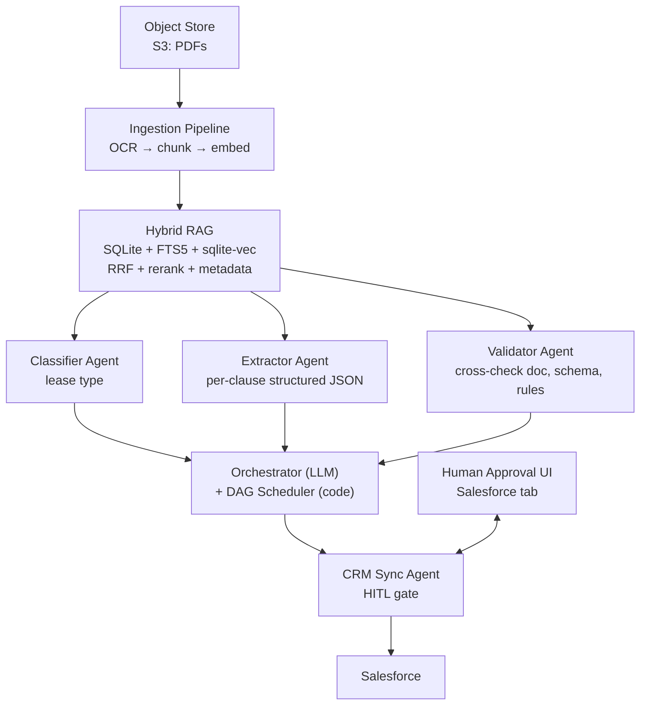
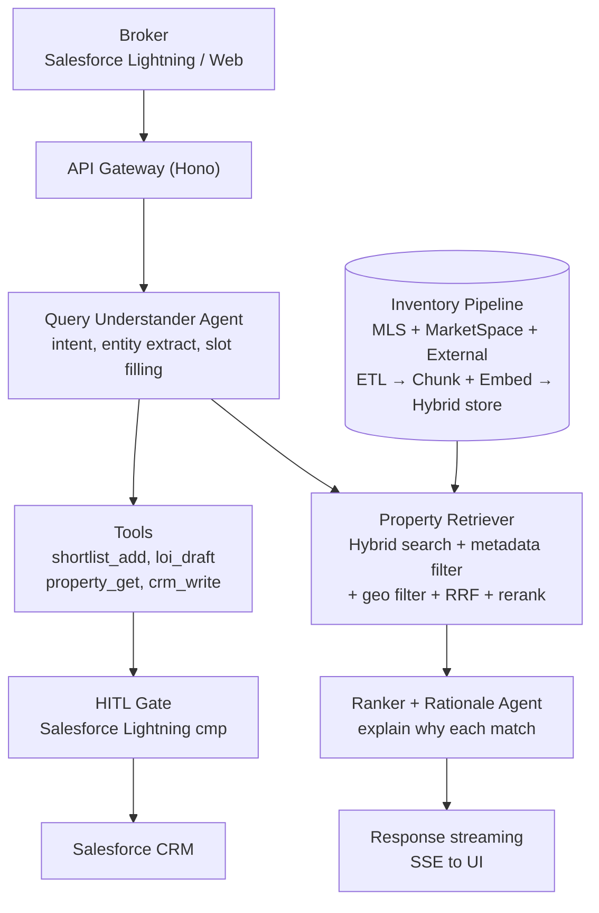
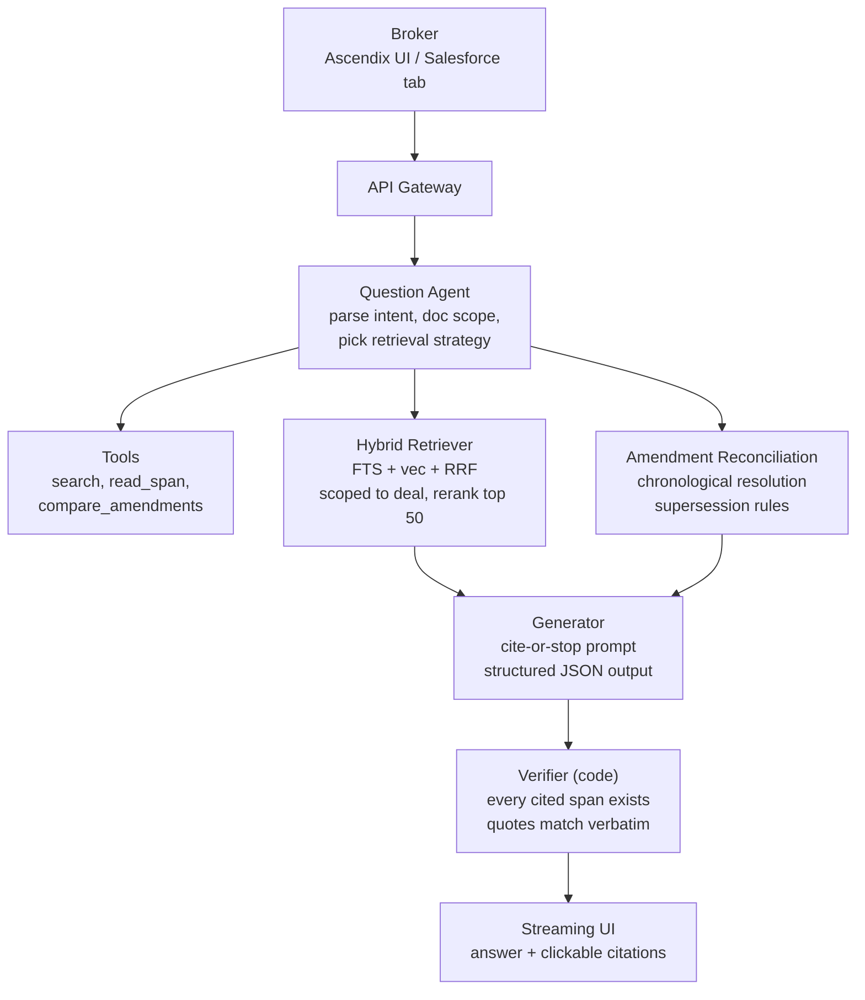

# Mock Whiteboard Cases — Ascendix AI Solution Architect

> **Use:** Three realistic business scenarios that Karolina and Vadim could reasonably put in front of you on Thursday 2026-04-16. Practice each out loud at a whiteboard at least once before the session. Time-box to **45 minutes** per run (they have 60–90; the extra 15–45 is buffer for back-and-forth).
>
> **Each case follows the Alex Xu 4-step framework** plus Ascendix-specific priors. Interview snippets are in English; analysis notes in Polish.

---

## Case 1 — Lease Abstraction Pipeline

### Scenario (as Karolina/Vadim might state it)

> *"One of our enterprise clients is a large brokerage firm with a portfolio of roughly 50,000 commercial leases. They currently have junior analysts manually extracting key terms from each lease into their Salesforce CRM — parties, rent schedule, options, defaults, assignment provisions. It takes each analyst about 45 minutes per lease, and the error rate is meaningful. They want an AI-powered pipeline that abstracts leases automatically and writes the structured results into their CRM. How would you design this system?"*

### Step 1 — Clarify (first 5–10 minutes)

**Functional questions to ask out loud:**
- Which CRM fields are the mandatory output? (Names, dates, amounts, enumerations, free-text summaries?)
- Are the leases typed PDFs, scans, or a mix? How old are the oldest ones? (OCR quality matters.)
- Is there an existing golden dataset of correctly extracted leases we can use for eval?
- Which types of leases are in scope — office, industrial, retail, all? (Structure differs.)
- Are there standard templates (single landlord, repeated use) or is every lease bespoke?
- What happens today when a lease is ambiguous? Who adjudicates?

**Non-functional:**
- What's the accuracy SLO? *"Better than the junior analyst"* is not enough — we need a number.
- Latency budget per lease: hours, minutes, seconds? (Determines async vs sync.)
- Audit-trail requirements: clause-level citations? Hold period?
- Who has write access to the CRM? Can we get a sandbox tenant?
- Cost ceiling per lease: $0.10? $1? $5?

**AI-specific:**
- Who absorbs the risk when the model is wrong? (Determines how much HITL.)
- Are we okay with the model saying *"I don't know, flag for human review"*? (In CRE: YES — abstain > hallucinate.)
- What's the existing Salesforce schema for lease data? Any field enums we must respect?
- Any prior AI attempts here — what worked, what didn't?

**Opening move phrase:**
*"Before I draw anything, I want to understand three things: who owns the accuracy SLO, whether we have a labeled golden dataset, and what happens when the model is uncertain. Those three shape the architecture significantly."*

### Step 1.5 — State assumptions explicitly

- 50k leases, one-time backfill + ~500 new leases/month steady state
- Mix of typed PDF and scanned; 80/20 split
- 60+ CRM fields mandatory, of which ~15 are high-stakes (rent schedule, term, options, assignment)
- Accuracy SLO: 95%+ on high-stakes fields, 90%+ on low-stakes
- Latency: batch-acceptable for backfill; sub-10-min for new intake
- Cost ceiling: $1/lease (aggressive but achievable)
- HITL required for low-confidence extractions

### Step 2 — Estimate

- **Volume.** Backfill: 50,000 leases. Steady state: ~500/month.
- **Tokens per lease.** 50 pages × 2,500 chars/page = 125K chars ≈ 31K tokens input. With OCR errors and hierarchical chunking, effective ≈ 35–40K tokens across 10–15 LLM calls.
- **Cost per lease.** ~40K input tokens × ($5/M in + $15/M out). Output ~3K tokens. `40K × $5/M + 3K × $15/M ≈ $0.20 + $0.045 ≈ $0.25/lease`. Well within $1 ceiling.
- **Total backfill cost.** 50,000 × $0.25 = **~$12.5K** one-time. **~$125/month** steady state.
- **Storage.** Chunks: 50k × 100 chunks/lease = 5M chunks. At 1536-dim float32 embeddings, 5M × 6KB ≈ **30 GB**. Plus raw text + metadata.
- **Throughput.** Backfill over 4 weeks: 50k / (4 × 5 × 8 × 3600) ≈ **0.1 lease/sec** — trivially parallelizable.

### Step 3 — High-level architecture



**Cross-cutting:** Provider Router • Event Bus • Langfuse • Cost tracking per tenant

**Narration while drawing:**
*"I'll start at the bottom with ingestion: PDFs land in S3, OCR normalizes them, we chunk structurally — by section, not word count — embed each chunk with 1–2 sentences of context prepended, and persist to a hybrid store. I'll use SQLite + FTS5 + sqlite-vec for the PoC — one transaction, no sync — and graduate to Postgres + a dedicated vector store once we've proved value. Then four specialized agents — Classifier, Extractor, Validator, CRM Sync — each with its own tools and system prompt. An orchestrator LLM decomposes the work; a pure-code DAG scheduler executes. CRM writes go through a human approval UI embedded in Salesforce. Observability and cost tracking are cross-cutting."*

### Step 4 — Deep dives (be ready for 2–3)

**Deep dive A — RAG strategy**
- **Chunking:** Structural, by section / exhibit / schedule. Max 500 words. Contextual embedding prefix ("This chunk is from Section 4 of the lease between X and Y, covering rent escalation…") — Anthropic technique.
- **Retrieval:** Keywords query + Natural Language query → FTS + vec in parallel → RRF merge → top 50 → cross-encoder rerank → top 5 → generator.
- **Metadata:** `lease_id, section, page_range, clause_type, tenant, landlord, effective_date`.
- **Citation:** Every extracted value carries `{value, source_span, page, section}` — non-negotiable for legal defensibility.
- **Eval:** RAGAS (faithfulness, relevancy, context precision, recall) on a golden set of 100 labeled leases.

**Deep dive B — Model routing and cost**
- **Classifier:** Haiku or GPT-4o-mini. Output is an enum — cheap model wins.
- **Extractor:** Sonnet or GPT-4o. Structured output with JSON Schema. High-stakes fields (rent, term, assignment) get a second-pass with a larger model.
- **Validator:** Mini model + programmatic rules.
- **Prompt cache:** Stable system prompt + tool definitions across the entire pipeline. Property metadata cached per portfolio.
- **Cost tracking:** Per lease, per prompt version, per tenant. Hard per-tenant monthly cap.

**Deep dive C — Confidence and HITL**
- Every extraction returns a confidence score (derived from: model logprobs when available, schema-match score, cross-reference agreement).
- **High confidence → auto-write to staging**; broker confirms batch in Salesforce tab.
- **Low confidence → HITL review first**; broker sees side-by-side (source clause highlighted + proposed extraction).
- **Unknown / missing → agent abstains**. Schema has nullable fields with `confidence: "low"` marker.
- Human corrections flow back to eval dataset — that's the **data flywheel**.

### Failure modes + mitigations

| Failure | Mitigation |
|---|---|
| OCR drops critical text on scanned leases | Two-pass OCR (Tesseract + cloud OCR), reject on low confidence, route to human |
| Rent schedule spans multiple tables with merged cells | Structural chunking + table-aware parser (e.g., `unstructured` library); flag low-confidence parses |
| Model hallucinates a 2099 expiry date | Code-level cross-check: extracted date must appear verbatim in document |
| Non-standard clause numbering defeats BM25 | Keywords query generated dynamically per-lease; fallback to NL-only with lower confidence |
| Prompt injection from adversarial lease ("IGNORE PRIOR INSTRUCTIONS") | Defense Stack: tools have no email/external write; extractor is sandboxed; critical writes are human-gated |
| Silent drift after a model version update | Offline eval gate before deploy; online eval 5% sample; alert on accuracy drop > 2σ |
| CRM write conflicts with concurrent manual edit | Checksum + dry-run on every CRM write; HITL if conflict detected |

### Metrics & SLOs

- **Extraction accuracy per field type** (target: 95% high-stakes, 90% low-stakes)
- **Cost per lease** (target: < $0.30)
- **Time-to-publish** (target: <10 min new intake, <24h backfill batch)
- **HITL rate** (target: < 20% of leases flagged for review)
- **False-positive rate on auto-writes** (target: < 0.5%)
- **RAGAS scores** — faithfulness > 0.9, context recall > 0.85
- **Broker satisfaction (NPS on sampled leases)**

### 6-week PoC plan

| Week | Goal |
|---|---|
| 1 | Discovery + 50 labeled golden leases + schema mapping to Salesforce fields |
| 2 | Ingestion pipeline + hybrid RAG (SQLite+FTS5+vec) + structural chunking |
| 3 | Classifier + Extractor agents + JSON Schema + first offline eval baseline |
| 4 | Validator + CRM Sync agent + Salesforce HITL UI + Langfuse tracing |
| 5 | Iterate on eval gaps (prompt versioning, routing, contextual embeddings) + cost tracking |
| 6 | End-to-end run on 2 real portfolios + demo to stakeholders + ROI numbers |

**Success criteria for PoC:** 90%+ accuracy on high-stakes fields for the 2 portfolios, <$0.30/lease, demo-able in Salesforce.

### Interview gotcha questions + ready answers

- *"Why not fine-tune a model on their leases?"*
  → *"Three reasons. First, lease content changes — we'd be baking in stale data. Second, we need clause-level citations for legal defensibility, and fine-tuning makes that much harder. Third, fine-tuning costs more than a good RAG setup once you factor in the eval dataset we'd need anyway. I'd reserve fine-tuning for output style or tool-calling format, not domain knowledge."*
- *"Why SQLite for PoC — isn't that a toy?"*
  → *"For 50k leases in a 6-week PoC, SQLite with FTS5 and sqlite-vec is actually the right call. One transaction across full-text and vector search, no cross-store sync, no infra overhead. Postgres + dedicated vector store is the right production call once we've proved value — but choosing it on day one costs us two weeks of infra work we don't need to prove ROI."*
- *"What if a lease is 300 pages?"*
  → *"Two things. First, we split by structural units — exhibits and schedules are processed independently. Second, we use a rolling Observer+Reflector summary — context at each turn is system + summary + last N messages. That handles arbitrarily long documents. We also reject genuinely pathological outliers upfront and route them to human review."*
- *"What about multi-language leases?"*
  → *"Scope question — are they in scope for this phase? If yes, the classifier adds a language-detection step and routes to a translation pre-process or to a language-specific extractor. I'd want to see the volume and languages before designing for it; for US CRE it's likely English-dominant and a small Spanish tail."*

---

## Case 2 — Broker Copilot with Natural Language Search

### Scenario

> *"Brokers at a global firm like JLL spend hours searching for properties that match specific tenant requirements. Today they use clunky MLS-style filters. We want to build a broker copilot where a tenant rep can say 'I need a Class A office in downtown Dallas, 10 to 15 thousand square feet, available Q3 2026, near transit, LEED-certified', and the copilot returns ranked matches with a rationale — and can then draft an LOI or add the property to a shortlist in their CRM. How would you design this?"*

### Step 1 — Clarify

**Functional:**
- What data sources feed the property inventory? (Their own MLS, MarketSpace, public listings, syndicated feeds?)
- How fresh does the inventory need to be? (Real-time? Daily? Weekly?)
- What actions can the copilot take? (Return matches only? Add to shortlist? Draft LOI? Send email?)
- Is the copilot embedded in Salesforce, standalone, or both?
- Multi-tenant? (JLL's inventory and CRM vs Colliers'?)

**Non-functional:**
- Latency budget: interactive (<5s for first response)?
- Accuracy: what's the acceptable miss rate? What about false positives?
- Which integrations are in scope? MLS, Salesforce, email?
- Where does the tenant rep sit — browser, mobile, Salesforce?

**AI-specific:**
- When the copilot can't find a match, does it say so or does it find the closest? (Abstain vs best-effort.)
- Can it negotiate tradeoffs with the user? ("No downtown matches — would you consider Uptown?")
- Cost per query: tight (millions of queries/month) or loose (power-user tool)?
- Any prior copilot attempts? What failed?

**Opening move phrase:**
*"Before I draw: I want to know three things. First, what actions the copilot is allowed to take — just search or also act? Second, how fresh the inventory needs to be. Third, the interaction mode — is this chat, or is it structured UI with AI underneath. Those shape a lot."*

### Step 1.5 — Assumptions

- Data sources: internal MLS + Ascendix MarketSpace + one external syndicated feed
- Freshness: daily batch + same-day updates for listings marked "active"
- Actions: search, shortlist, draft LOI. Email sending is out of scope for PoC.
- Copilot lives in Salesforce as a Lightning Component + standalone web for power users
- Multi-tenant: tenant = brokerage firm
- Latency: first result <5s, full ranked list <15s
- Cost: $0.10/query as ceiling (brokers do ~20 queries/day → $2/broker/day → reasonable)

### Step 2 — Estimate

- **Inventory size.** 500K active properties across feeds. 1.5M historical (expired listings used for comps).
- **Embedding storage.** 500K × 10 chunks/property × 6KB ≈ **30 GB** for active. 1.5M × 10 × 6KB ≈ **90 GB** historical.
- **Queries.** 10k brokers × 20 queries/day = **200k queries/day**. Peak ~4x = 800k queries/day peak-hour-equivalent.
- **QPS.** 200k / (8 × 3600) ≈ **7 qps** average, ~28 qps peak. Not high.
- **Tokens per query.** Query understanding ~500 in; retrieval ~2K tokens context; generation ~500 out. ~3K tokens total.
- **Cost per query.** 3K × ~$5/M ≈ **$0.015**. Well below ceiling — headroom to add reasoning on ambiguous queries.
- **Latency budget.** 5s first response = 500ms embed + 800ms hybrid retrieve + 1.5s rerank + 1.5s generate + 500ms network + 200ms buffer.

### Step 3 — High-level architecture



**Cross-cutting:** Provider Router • Event Bus • Langfuse • RAGAS online eval sample

**Narration:**
*"Three agents: a Query Understander that parses the broker's natural-language request into slot-filled structured intent — class, size range, location, availability, amenities — a Property Retriever that does hybrid search with metadata and geo filters, and a Ranker that re-orders results and produces a rationale for each match. Actions — shortlist, LOI draft — are tools that require human confirmation in Salesforce. Inventory is ingested from MLS + MarketSpace + external feeds on a daily batch plus same-day deltas."*

### Step 4 — Deep dives

**Deep dive A — Query understanding as structured intent**
- Do NOT pass the raw NL query to the retriever. Parse it first into a structured intent:
  ```json
  {
    "property_class": ["A"],
    "size_sf_min": 10000, "size_sf_max": 15000,
    "submarket": "Downtown Dallas",
    "availability_month": "2026-09",
    "amenities": ["LEED-certified", "near_transit"],
    "hard_constraints": ["size_sf_min", "size_sf_max", "submarket"],
    "soft_preferences": ["LEED-certified", "near_transit"]
  }
  ```
- **Hard constraints** → metadata filter (SQL/FTS). Fails closed.
- **Soft preferences** → scoring boost during rerank. Fails open.
- Ambiguity → ask the broker a clarifying question ("Downtown — do you mean CBD or West End too?").

**Deep dive B — Hybrid retrieval with geo**
- **Metadata filter first:** class, size range, availability, tenant.
- **Then geo filter:** PostGIS or S2 cells for "downtown Dallas" + "near transit" — not just lat/long distance.
- **Then hybrid search:** semantic ("open floor plan, modern amenities") + BM25 ("LEED Platinum", "DART station").
- **Rerank:** cross-encoder on top 50, scored against the soft preferences.
- **Rationale:** Ranker generates per-property "why this matches" citing the exact feature that scored it.

**Deep dive C — Actions with HITL**
- Copilot generates `shortlist_add(property_id)`, `loi_draft(property_id, terms)`, `crm_write(...)`.
- Every action is a proposal that renders in the Lightning Component with "Confirm / Reject / Edit".
- The LLM never directly writes to Salesforce — it proposes; a service layer writes after human confirmation.
- The LOI draft is a structured document with clause-level editability, not a black-box text blob.

### Failure modes + mitigations

| Failure | Mitigation |
|---|---|
| Ambiguous query ("somewhere nice near downtown") | Query Understander asks a clarifier — one question, not ten |
| Zero matches | Soften constraints progressively; offer "closest alternatives" with explicit deviation notes |
| Stale listing data | Freshness tag + last-update timestamp on every match; reject listings >30 days stale unless broker opts in |
| Geo ambiguity ("Dallas" = city or metro?) | Disambiguate early; default to sub-market level if user used a sub-market name |
| Cross-tenant data leak | Workspace isolation + tenant_id in every metadata filter + L2 ACL in code |
| Prompt injection in listing description | Description fields stripped of control chars; LLM prompts treat descriptions as untrusted content |
| Biased rankings (always surfacing same few buildings) | Diversity penalty in rerank; telemetry on click-through per building |

### Metrics & SLOs

- **First result latency p95** (target: <5s)
- **Full ranked list latency p95** (target: <15s)
- **Slot-filling accuracy** (target: 95%)
- **Match precision @10** (target: >70% of top 10 are "acceptable" per broker)
- **HITL confirmation rate on LOI drafts** (signals whether drafts are usable)
- **Cost per query** (target: <$0.05)
- **Broker NPS**
- **Data freshness p95** (target: <24h for active listings)

### 6-week PoC plan

| Week | Goal |
|---|---|
| 1 | Discovery + sample queries from 5 brokers + schema mapping + ingestion plan |
| 2 | Ingestion ETL + structural chunking + hybrid index (SQLite PoC or Postgres if data scale forces) |
| 3 | Query Understander agent + slot filling + clarifier flow |
| 4 | Property Retriever + Ranker + rationale generation |
| 5 | Salesforce Lightning Component + HITL actions + Langfuse tracing |
| 6 | End-to-end with 5 brokers + A/B vs existing filter UI + NPS |

**Success criteria:** Brokers complete top-of-funnel search in <60s (vs ~15 min today); match-quality NPS > 40.

### Interview gotcha questions + ready answers

- *"Why not just pass the natural-language query straight to a vector search?"*
  → *"Two problems. First, 'Class A, 10-15k SF, downtown Dallas, Q3 2026' has hard constraints that must match exactly — property class, size, availability. Vector search fails open on those. Second, geo is not captured well in embeddings — 'downtown Dallas' needs a real geo filter. So we parse the query into structured intent first, apply metadata + geo filters, then hybrid search the rest."*
- *"What if the broker wants to refine — 'same thing but cheaper'?"*
  → *"That's multi-turn. We use Observer+Reflector memory — each turn the Query Understander diffs against the prior intent and applies the delta. State lives in the session, not just the conversation history."*
- *"What about hallucinated properties?"*
  → *"The Ranker can only cite properties returned by the retriever — its tool only knows those IDs. If it mentions a property, the ID must match a retrieved one. We validate in code before the response hits the UI."*

---

## Case 3 — Document Q&A with Audit Trail

### Scenario

> *"A tenant-rep broker at Colliers has uploaded a 120-page master lease with multiple amendments. They need to ask natural-language questions — 'What's the rent escalation after the first 5 years?', 'Can the tenant sublet?', 'What's the termination notice period?' — and get answers that they can defend to their client and, if needed, to legal. Every answer must cite the exact paragraph. How would you design this?"*

### Step 1 — Clarify

**Functional:**
- Is this one document or multiple (master lease + amendments + side letters)?
- Can questions span multiple documents? (Single-doc Q&A vs multi-doc synthesis.)
- What does "defend to legal" mean operationally — paragraph citation? Page number? Full clause quote?
- Does the broker need an exported report, or just in-app Q&A?
- Who else sees the answers — the client? The landlord's team? (Security implications.)

**Non-functional:**
- Latency: interactive (seconds) or acceptable as minutes for complex synthesis?
- How many concurrent docs per broker? (1? 10? 100?)
- Is there a retention requirement on the uploaded docs? (Legal hold?)
- Any data residency constraints?

**AI-specific:**
- Is "I don't know" acceptable? (For legal docs: absolutely yes — abstain > hallucinate.)
- Do we need the model to distinguish between the main lease and amendments when answering? (Yes — amendment supersedes main lease; this is crucial.)
- Confidence scores on answers?
- Can we pre-compute anything (frequent questions per doc) or is everything ad-hoc?

**Opening move phrase:**
*"This case hinges on citation defensibility. Before I draw, I want to confirm the citation format they need — exact paragraph and page, plus clause text — and whether amendments can be treated as superseding or need to be reconciled into an effective text."*

### Step 1.5 — Assumptions

- Master lease + up to 10 amendments per deal
- Cross-document Q&A (answer must reflect final effective terms after all amendments)
- Citation format: document name, page, section, verbatim quote
- Abstention allowed and expected when evidence is weak
- Interactive: first answer <8s, complex synthesis <30s
- Up to 20 concurrent documents per broker session
- Retention: 7 years, legal hold capable
- Multi-tenant isolation mandatory

### Step 2 — Estimate

- **Per-doc tokens.** 120 pages × 2,500 chars = 300K chars ≈ 75K tokens. With amendments, ~100K tokens per deal.
- **Chunks per deal.** ~200 chunks at 500 words each.
- **Queries per session.** Typical broker session: 10–20 questions. A deal sees 50–200 questions over its life.
- **Cost per question.** 2K context tokens + 1K output ≈ $0.015. **$3/deal lifetime.** Acceptable.
- **Embedding storage.** Per deal: 200 × 6KB = 1.2 MB. 10k active deals: 12 GB.
- **Latency.** Hybrid retrieve ~800ms + rerank ~300ms + generate (Sonnet with thinking) ~3s = **<5s first token**, 6–8s full answer.

### Step 3 — High-level architecture



**Per-deal isolation:** `deal_id` workspace with scoped KB + session
**Cross-cutting:** Provider Router • Event Bus • Langfuse • RAGAS online eval

**Narration:**
*"The key insight is that every answer must be cite-verifiable at the code level — not just prompted to cite, but programmatically verified. I'll have a Question Agent that parses the question and picks a retrieval strategy, a hybrid retriever scoped to this deal's documents, an Amendment Reconciliation step that resolves which provisions are effective, and a Generator that's forced into a cite-or-abstain pattern — JSON output with `answer`, `citations`, `confidence`. Then a code-level Verifier that checks every cited span actually exists in the source document and that the quoted text is verbatim. If verification fails, we abstain. Never ship an unverified citation."*

### Step 4 — Deep dives

**Deep dive A — Cite-or-abstain generation**
- Structured output schema: `{answer, citations: [{doc_id, page, section, quote}], confidence, abstained}`.
- System prompt: *"You must cite every factual claim with an exact quote from retrieved context. If no retrieved span supports the answer, set `abstained: true` and explain what's missing."*
- **Code Verifier:** after generation, for each citation, fetch the cited span from the source document and string-compare the quote (with normalized whitespace). Mismatch → re-generate once with a "quotes don't match" feedback → if still fails, abstain.
- This pattern turns "please cite" (soft) into "citations are verified" (hard). Essential for legal defensibility.

**Deep dive B — Amendment reconciliation**
- Amendments are chronologically ordered by execution date.
- For each question, retrieve candidate spans from all documents (master + amendments).
- A reconciliation step (small LLM + deterministic rules) resolves: does an amendment supersede, modify, or extend the main lease provision?
- The answer cites *both* the original and the amendment, noting the amendment controls.
- If reconciliation is uncertain, abstain and flag for legal review.
- **Gotcha:** simple "latest wins" isn't always right — some amendments explicitly carve out certain provisions. Respect the amendment text.

**Deep dive C — Eval and regression**
- Golden set: 50 questions per doc type, with known answers and citations.
- **RAGAS metrics:** faithfulness (is the answer supported by retrieved context?), context recall (did we retrieve the relevant paragraph?), context precision (did we retrieve only what was needed?), answer relevancy.
- **Domain-specific metric:** citation-exact-match rate. Every shipped answer's citation quote must match verbatim — target 100% (we verify, so it should be 100% or abstained).
- Online sample: 5% of questions randomly pulled for LLM-as-judge evaluation.
- Alert if faithfulness drops > 2σ from baseline or citation-match rate deviates from 100%.

### Failure modes + mitigations

| Failure | Mitigation |
|---|---|
| Model hallucinates a clause that sounds right | Code Verifier rejects unverifiable citations; abstain if verification fails |
| Wrong answer from ignoring an amendment | Amendment reconciliation step must see all amendments; retrieval scope enforces this |
| Correct answer, wrong citation | Code Verifier catches — citation must verbatim match source |
| Query ambiguity ("what's the rent?") | Agent clarifies: base rent? effective after escalations? per SF or total? |
| OCR error on scanned amendment | OCR confidence flag per chunk; low-confidence chunks tagged, model told to treat them as uncertain |
| Cross-deal data leak | Deal-scoped session + tenant-scoped workspace; tool calls filtered by deal_id |
| Prompt injection via lease content | Tools are read-only within deal scope; no external effects; sandboxed |
| Legal hold violation | Deletion gated by hold status; all reads audit-logged |

### Metrics & SLOs

- **First-token latency p95** (target: <3s)
- **Full-answer latency p95** (target: <8s)
- **Citation verification rate** (target: 100% — we abstain otherwise)
- **Faithfulness (RAGAS)** (target: >0.95)
- **Abstention rate** (target: <15% on golden set — too-high means retrieval is broken; too-low means model is over-confident)
- **Cost per question** (target: <$0.02)
- **Broker trust score** (periodic survey — "did the answer hold up when you checked the source?")

### 6-week PoC plan

| Week | Goal |
|---|---|
| 1 | Discovery + 3 real deals with legal team annotations + citation format spec |
| 2 | Per-deal ingestion + structural chunking + hybrid index + amendment metadata |
| 3 | Question Agent + Hybrid Retriever + cite-or-abstain prompt scaffold |
| 4 | Code Verifier + Amendment Reconciliation + first RAGAS eval baseline |
| 5 | UI with clickable citations + Langfuse tracing + legal review of sample answers |
| 6 | End-to-end on 3 deals + comparison with junior analyst answers + legal sign-off |

**Success criteria:** 100% verified citations on shipped answers, faithfulness >0.95, legal team approves for defensive use (not offensive advice).

### Interview gotcha questions + ready answers

- *"How do you know the model isn't making up citations?"*
  → *"We don't rely on the model to not make up citations — we verify every citation in code. After generation, for each cited span, we fetch the source text and do a verbatim match against the quote. If any citation fails, we re-generate once with feedback, and if it still fails, we abstain. The model can't ship an unverified citation."*
- *"What if the right answer requires synthesizing across documents?"*
  → *"That's the Amendment Reconciliation step. Retrieval pulls candidate spans from all documents in the deal, and a reconciliation pass resolves which provisions are effective — chronological + supersession rules. The final answer cites both the original and the amendment, noting which controls. If reconciliation is uncertain, we abstain and flag for legal."*
- *"Why abstain at all — can't you always give the closest answer?"*
  → *"For legal-adjacent work, a wrong answer costs the broker the client and potentially causes real legal exposure. Abstention isn't failure — it's the correct behavior when evidence is weak. We treat it like a senior lawyer would: 'I'd need to review more context before giving you a firm answer on that.' That's the behavior clients actually want; they can ask a follow-up or escalate."*
- *"How is this different from a generic RAG chatbot?"*
  → *"Three things. First, cite-or-abstain with code-level verification — no hallucinated citations ship. Second, amendment reconciliation — most chatbots treat each document independently and get the wrong answer. Third, legal-defensibility as a first-class concern: audit trail, immutability, confidence scores surfaced to the user."*

---

## Practice checklist (run through each case out loud)

- [ ] Case 1 — Lease Abstraction — practiced at whiteboard, timed to 45 min
- [ ] Case 2 — Broker Copilot — practiced at whiteboard, timed to 45 min
- [ ] Case 3 — Document Q&A — practiced at whiteboard, timed to 45 min
- [ ] Opening move (first 60s) rehearsed for each
- [ ] Priors recital (7 items from PLAYBOOK.md) rehearsed cold
- [ ] RAGAS 4 metrics memorized (faithfulness, answer relevancy, context precision, context recall)
- [ ] 5 micro-diagrams from CHEATSHEET.md rehearsed (Provider Router, Hybrid RAG, Orchestrator+DAG, Defense Stack, Eval loop)
- [ ] "Why not fine-tuning?" answer memorized
- [ ] "Why SQLite for PoC?" answer memorized
- [ ] "How do you stop prompt injection?" answer memorized
- [ ] "How do you know RAG is actually working?" → RAGAS answer memorized
- [ ] CRE vocabulary (lease, LOI, OM, SNDA, estoppel, cap rate, NOI, Class A/B/C, TI) skimmed

---

**Final note.** You don't need to nail every detail in this file. You need to sound like someone who has built this before, thinks in priors, tradeoffs, and numbers, and knows when to abstain. The interview is graded on process and communication. The content in these three cases is more than enough material — rehearsing them *out loud* is what converts it into recall under pressure.
