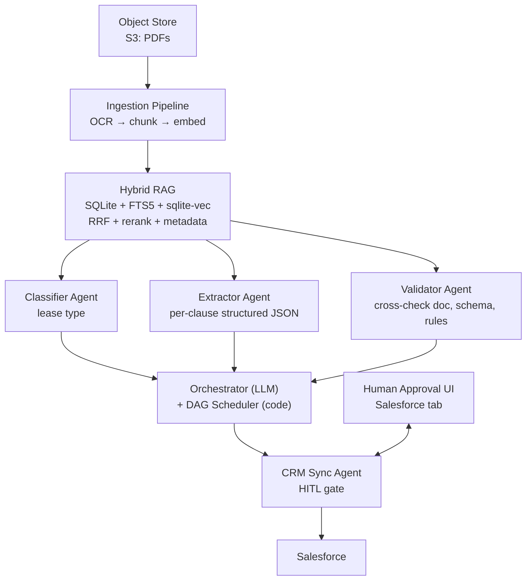
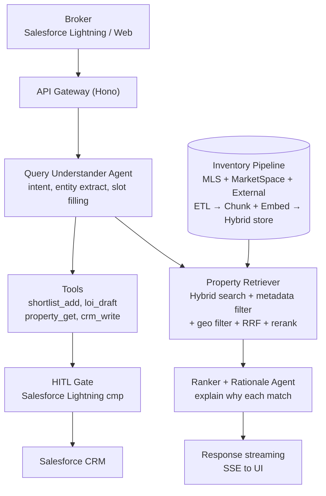
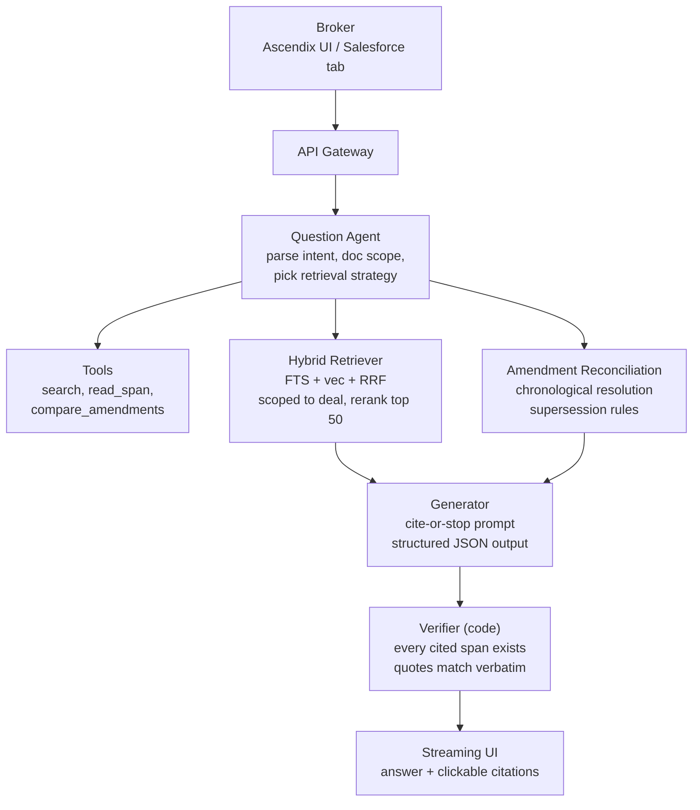

# Mock Whiteboard Cases — Ascendix AI Solution Architect (PL)

> **Użycie:** Trzy realistyczne business scenarios, które Karolina i Vadim mogliby Ci postawić w czwartek 2026-04-16. Ćwicz każdy **na głos** przy whiteboardzie co najmniej raz przed sesją. Time-box na **45 minut** per run (mają 60–90; nadwyżka to bufor na back-and-forth).
>
> **Każdy case trzyma się frameworka Alex Xu 4-krokowego** plus Ascendix-specific priors. **Terminologia techniczna po angielsku**, **interview snippets / gotcha answers verbatim po angielsku** (sesja jest po angielsku). Analiza i notatki po polsku.

---

## Case 1 — Lease Abstraction Pipeline

### Scenariusz (jak Karolina/Vadim mogliby go postawić, po angielsku)

> *"One of our enterprise clients is a large brokerage firm with a portfolio of roughly 50,000 commercial leases. They currently have junior analysts manually extracting key terms from each lease into their Salesforce CRM — parties, rent schedule, options, defaults, assignment provisions. It takes each analyst about 45 minutes per lease, and the error rate is meaningful. They want an AI-powered pipeline that abstracts leases automatically and writes the structured results into their CRM. How would you design this system?"*

**Tłumaczenie dla pierwszego czytania:** Klient enterprise — duża firma brokerska z ~50k commercial lease'ów. Junior analitycy manualnie ekstrahują kluczowe terms z każdego lease'a do Salesforce CRM (parties, rent schedule, options, defaults, assignment provisions). ~45 min per lease, meaningful error rate. Chcą AI pipeline do automatycznej ekstrakcji i zapisu do CRM.

### Krok 1 — Clarify (pierwsze 5–10 minut)

**Functional questions do zadania na głos:**
- Które CRM fields są mandatory jako output? (Names, dates, amounts, enumerations, free-text summaries?)
- Czy lease'y są typed PDFs, scans, czy mix? Jak stare są najstarsze? (OCR quality matters.)
- Czy jest istniejący golden dataset poprawnie ekstrahowanych lease'ów, którego możemy użyć do eval?
- Które typy lease'ów są w scope — office, industrial, retail, wszystko? (Struktura się różni.)
- Czy są standard templates (single landlord, powtarzalny) czy każdy lease jest bespoke?
- Co się dzieje dzisiaj gdy lease jest ambiguous? Kto adjudicate?

**Non-functional:**
- Jaki accuracy SLO? *"Lepszy niż junior analityk"* nie wystarczy — potrzebujemy liczby.
- Latency budget per lease: godziny, minuty, sekundy? (Determines async vs sync.)
- Audit-trail requirements: clause-level citations? Hold period?
- Kto ma write access do CRM? Czy dostaniemy sandbox tenant?
- Cost ceiling per lease: $0.10? $1? $5?

**AI-specific:**
- Kto ponosi ryzyko gdy model się myli? (Determines ile HITL.)
- Czy jesteśmy OK z tym że model powie *"I don't know, flag for human review"*? (W CRE: absolutnie TAK — abstain > hallucinate.)
- Jaki jest istniejący Salesforce schema dla lease data? Jakiekolwiek field enums, które musimy respektować?
- Jakieś wcześniejsze AI attempts tutaj — co działało, co nie?

**Opening move phrase:**
*"Before I draw anything, I want to understand three things: who owns the accuracy SLO, whether we have a labeled golden dataset, and what happens when the model is uncertain. Those three shape the architecture significantly."*

### Krok 1.5 — State assumptions explicitly

- 50k lease'ów, jednorazowy backfill + ~500 nowych lease'ów/miesiąc steady state
- Mix typed PDF i scanned; 80/20 split
- 60+ CRM fields mandatory, z czego ~15 to high-stakes (rent schedule, term, options, assignment)
- Accuracy SLO: 95%+ na high-stakes fields, 90%+ na low-stakes
- Latency: batch-acceptable dla backfill; sub-10-min dla nowego intake
- Cost ceiling: $1/lease (aggressive ale achievable)
- HITL wymagane dla low-confidence ekstrakcji

### Krok 2 — Estimate

- **Volume.** Backfill: 50,000 lease'ów. Steady state: ~500/miesiąc.
- **Tokens per lease.** 50 stron × 2,500 chars/strona = 125K chars ≈ 31K tokens input. Z OCR errors i hierarchical chunkingiem, effective ≈ 35–40K tokens przez 10–15 LLM calls.
- **Cost per lease.** ~40K input tokens × ($5/M in + $15/M out). Output ~3K tokens. `40K × $5/M + 3K × $15/M ≈ $0.20 + $0.045 ≈ $0.25/lease`. Dobrze poniżej ceiling $1.
- **Total backfill cost.** 50,000 × $0.25 = **~$12.5K** one-time. **~$125/miesiąc** steady state.
- **Storage.** Chunks: 50k × 100 chunks/lease = 5M chunks. Przy 1536-dim float32 embeddings, 5M × 6KB ≈ **30 GB**. Plus raw text + metadata.
- **Throughput.** Backfill przez 4 tygodnie: 50k / (4 × 5 × 8 × 3600) ≈ **0.1 lease/sec** — trywialnie parallelizable.

### Krok 3 — High-level architecture



**Cross-cutting:** Provider Router • Event Bus • Langfuse • Cost tracking per tenant

**Narracja podczas rysowania:**
*"I'll start at the bottom with ingestion: PDFs land in S3, OCR normalizes them, we chunk structurally — by section, not word count — embed each chunk with 1–2 sentences of context prepended, and persist to a hybrid store. I'll use SQLite + FTS5 + sqlite-vec for the PoC — one transaction, no sync — and graduate to Postgres + a dedicated vector store once we've proved value. Then four specialized agents — Classifier, Extractor, Validator, CRM Sync — each with its own tools and system prompt. An orchestrator LLM decomposes the work; a pure-code DAG scheduler executes. CRM writes go through a human approval UI embedded in Salesforce. Observability and cost tracking are cross-cutting."*

### Krok 4 — Deep dives (bądź gotów na 2–3)

**Deep dive A — RAG strategy**
- **Chunking:** Structural, by section / exhibit / schedule. Max 500 słów. Contextual embedding prefix ("This chunk is from Section 4 of the lease between X and Y, covering rent escalation…") — technika Anthropic.
- **Retrieval:** Keywords query + Natural Language query → FTS + vec równolegle → RRF merge → top 50 → cross-encoder rerank → top 5 → generator.
- **Metadata:** `lease_id, section, page_range, clause_type, tenant, landlord, effective_date`.
- **Citation:** Każda ekstrakcja niesie `{value, source_span, page, section}` — non-negotiable dla legal defensibility.
- **Eval:** RAGAS (faithfulness, relevancy, context precision, recall) na golden set 100 labeled lease'ów.

**Deep dive B — Model routing i cost**
- **Classifier:** Haiku lub GPT-4o-mini. Output to enum — tani model wygrywa.
- **Extractor:** Sonnet lub GPT-4o. Structured output z JSON Schema. High-stakes fields (rent, term, assignment) dostają second-pass z większym modelem.
- **Validator:** Mini model + programistyczne reguły.
- **Prompt cache:** Stabilny system prompt + tool definitions przez cały pipeline. Property metadata cached per portfolio.
- **Cost tracking:** Per lease, per prompt version, per tenant. Hard per-tenant monthly cap.

**Deep dive C — Confidence i HITL**
- Każda ekstrakcja zwraca confidence score (derivowany z: model logprobs gdy dostępne, schema-match score, cross-reference agreement).
- **High confidence → auto-write do staging**; broker potwierdza batch w Salesforce tab.
- **Low confidence → HITL review first**; broker widzi side-by-side (source clause highlighted + proposed extraction).
- **Unknown / missing → agent abstains**. Schema ma nullable fields z markerem `confidence: "low"`.
- Human corrections wracają do eval dataset — to jest **data flywheel**.

### Failure modes + mitigations

| Failure | Mitigation |
|---|---|
| OCR gubi krytyczny tekst na scanned lease'ach | Two-pass OCR (Tesseract + cloud OCR), reject na low confidence, route do człowieka |
| Rent schedule rozciąga się na wiele tabel z merged cells | Structural chunking + table-aware parser (np. biblioteka `unstructured`); flag low-confidence parses |
| Model halucynuje datę wygaśnięcia 2099 | Code-level cross-check: extracted date musi wystąpić verbatim w dokumencie |
| Non-standard clause numbering defeats BM25 | Keywords query generowane dynamicznie per-lease; fallback na NL-only z niższym confidence |
| Prompt injection z adversarial lease ("IGNORE PRIOR INSTRUCTIONS") | Defense Stack: tools nie mają email/external write; extractor jest sandboxed; critical writes są human-gated |
| Silent drift po model version update | Offline eval gate przed deploy; online eval 5% sample; alert na accuracy drop > 2σ |
| CRM write conflicts z concurrent manual edit | Checksum + dry-run na każdym CRM write; HITL jeśli conflict detected |

### Metrics & SLOs

- **Extraction accuracy per field type** (target: 95% high-stakes, 90% low-stakes)
- **Cost per lease** (target: < $0.30)
- **Time-to-publish** (target: <10 min new intake, <24h backfill batch)
- **HITL rate** (target: < 20% lease'ów flagged for review)
- **False-positive rate na auto-writes** (target: < 0.5%)
- **RAGAS scores** — faithfulness > 0.9, context recall > 0.85
- **Broker satisfaction (NPS na sampled leases)**

### 6-week PoC plan

| Tydzień | Cel |
|---|---|
| 1 | Discovery + 50 labeled golden leases + schema mapping do Salesforce fields |
| 2 | Ingestion pipeline + hybrid RAG (SQLite+FTS5+vec) + structural chunking |
| 3 | Classifier + Extractor agents + JSON Schema + pierwszy offline eval baseline |
| 4 | Validator + CRM Sync agent + Salesforce HITL UI + Langfuse tracing |
| 5 | Iteracja na eval gaps (prompt versioning, routing, contextual embeddings) + cost tracking |
| 6 | End-to-end run na 2 real portfoliach + demo dla stakeholderów + ROI numbers |

**Success criteria dla PoC:** 90%+ accuracy na high-stakes fields dla 2 portfolio, <$0.30/lease, demo-able w Salesforce.

### Interview gotcha questions + ready answers

- *"Why not fine-tune a model on their leases?"*
  → *"Three reasons. First, lease content changes — we'd be baking in stale data. Second, we need clause-level citations for legal defensibility, and fine-tuning makes that much harder. Third, fine-tuning costs more than a good RAG setup once you factor in the eval dataset we'd need anyway. I'd reserve fine-tuning for output style or tool-calling format, not domain knowledge."*
- *"Why SQLite for PoC — isn't that a toy?"*
  → *"For 50k leases in a 6-week PoC, SQLite with FTS5 and sqlite-vec is actually the right call. One transaction across full-text and vector search, no cross-store sync, no infra overhead. Postgres + dedicated vector store is the right production call once we've proved value — but choosing it on day one costs us two weeks of infra work we don't need to prove ROI."*
- *"What if a lease is 300 pages?"*
  → *"Two things. First, we split by structural units — exhibits and schedules are processed independently. Second, we use a rolling Observer+Reflector summary — context at each turn is system + summary + last N messages. That handles arbitrarily long documents. We also reject genuinely pathological outliers upfront and route them to human review."*
- *"What about multi-language leases?"*
  → *"Scope question — are they in scope for this phase? If yes, the classifier adds a language-detection step and routes to a translation pre-process or to a language-specific extractor. I'd want to see the volume and languages before designing for it; for US CRE it's likely English-dominant and a small Spanish tail."*

---

## Case 2 — Broker Copilot with Natural Language Search

### Scenariusz

> *"Brokers at a global firm like JLL spend hours searching for properties that match specific tenant requirements. Today they use clunky MLS-style filters. We want to build a broker copilot where a tenant rep can say 'I need a Class A office in downtown Dallas, 10 to 15 thousand square feet, available Q3 2026, near transit, LEED-certified', and the copilot returns ranked matches with a rationale — and can then draft an LOI or add the property to a shortlist in their CRM. How would you design this?"*

**Tłumaczenie dla pierwszego czytania:** Brokerzy w globalnych firmach (JLL) spędzają godziny na szukaniu property pasujących do wymagań tenanta. Dzisiaj używają clunky MLS-style filtrów. Chcą broker copilota — tenant rep mówi naturalnie "Klasa A, downtown Dallas, 10–15k SF, Q3 2026, near transit, LEED" — copilot zwraca ranked matches z rationale, i może następnie drafować LOI lub dodać property do shortlist w CRM.

### Krok 1 — Clarify

**Functional:**
- Jakie data sources zasilają property inventory? (Ich własny MLS, MarketSpace, public listings, syndicated feeds?)
- Jak świeże musi być inventory? (Real-time? Daily? Weekly?)
- Jakie akcje copilot może podjąć? (Tylko zwracać matches? Dodać do shortlist? Drafować LOI? Wysłać email?)
- Czy copilot jest embedded w Salesforce, standalone, czy obu?
- Multi-tenant? (JLL's inventory i CRM vs Colliers'?)

**Non-functional:**
- Latency budget: interaktywne (<5s dla pierwszej odpowiedzi)?
- Accuracy: jaki jest acceptable miss rate? Co z false positives?
- Które integracje są w scope? MLS, Salesforce, email?
- Gdzie siedzi tenant rep — browser, mobile, Salesforce?

**AI-specific:**
- Gdy copilot nie znajduje match, czy mówi to, czy znajduje najbliższe? (Abstain vs best-effort.)
- Czy może negocjować tradeoffs z userem? ("No downtown matches — would you consider Uptown?")
- Cost per query: tight (miliony queries/month) czy loose (power-user tool)?
- Jakieś wcześniejsze copilot attempts? Co failed?

**Opening move phrase:**
*"Before I draw: I want to know three things. First, what actions the copilot is allowed to take — just search or also act? Second, how fresh the inventory needs to be. Third, the interaction mode — is this chat, or is it structured UI with AI underneath. Those shape a lot."*

### Krok 1.5 — Assumptions

- Data sources: internal MLS + Ascendix MarketSpace + jeden external syndicated feed
- Freshness: daily batch + same-day updates dla listings "active"
- Actions: search, shortlist, draft LOI. Email sending out of scope dla PoC.
- Copilot żyje w Salesforce jako Lightning Component + standalone web dla power users
- Multi-tenant: tenant = brokerage firm
- Latency: pierwsza odpowiedź <5s, pełna ranked list <15s
- Cost: $0.10/query jako ceiling (brokerzy robią ~20 queries/day → $2/broker/day → reasonable)

### Krok 2 — Estimate

- **Inventory size.** 500K active properties across feeds. 1.5M historical (expired listings used dla comps).
- **Embedding storage.** 500K × 10 chunks/property × 6KB ≈ **30 GB** dla active. 1.5M × 10 × 6KB ≈ **90 GB** historical.
- **Queries.** 10k brokerów × 20 queries/day = **200k queries/day**. Peak ~4x = 800k queries/day peak-hour-equivalent.
- **QPS.** 200k / (8 × 3600) ≈ **7 qps** average, ~28 qps peak. Nie wysokie.
- **Tokens per query.** Query understanding ~500 in; retrieval ~2K tokens context; generation ~500 out. ~3K tokens total.
- **Cost per query.** 3K × ~$5/M ≈ **$0.015**. Dobrze poniżej ceiling — headroom na dodanie reasoning na ambiguous queries.
- **Latency budget.** 5s first response = 500ms embed + 800ms hybrid retrieve + 1.5s rerank + 1.5s generate + 500ms network + 200ms buffer.

### Krok 3 — High-level architecture



**Cross-cutting:** Provider Router • Event Bus • Langfuse • RAGAS online eval sample

**Narracja:**
*"Three agents: a Query Understander that parses the broker's natural-language request into slot-filled structured intent — class, size range, location, availability, amenities — a Property Retriever that does hybrid search with metadata and geo filters, and a Ranker that re-orders results and produces a rationale for each match. Actions — shortlist, LOI draft — are tools that require human confirmation in Salesforce. Inventory is ingested from MLS + MarketSpace + external feeds on a daily batch plus same-day deltas."*

### Krok 4 — Deep dives

**Deep dive A — Query understanding jako structured intent**
- Nie przekazuj raw NL query do retrievera. Parsuj najpierw do structured intent:
  ```json
  {
    "property_class": ["A"],
    "size_sf_min": 10000, "size_sf_max": 15000,
    "submarket": "Downtown Dallas",
    "availability_month": "2026-09",
    "amenities": ["LEED-certified", "near_transit"],
    "hard_constraints": ["size_sf_min", "size_sf_max", "submarket"],
    "soft_preferences": ["LEED-certified", "near_transit"]
  }
  ```
- **Hard constraints** → metadata filter (SQL/FTS). Fails closed.
- **Soft preferences** → scoring boost podczas rerank. Fails open.
- Ambiguity → zadaj brokerowi clarifying question ("Downtown — do you mean CBD or West End too?").

**Deep dive B — Hybrid retrieval z geo**
- **Metadata filter first:** class, size range, availability, tenant.
- **Potem geo filter:** PostGIS lub S2 cells dla "downtown Dallas" + "near transit" — nie tylko lat/long distance.
- **Potem hybrid search:** semantic ("open floor plan, modern amenities") + BM25 ("LEED Platinum", "DART station").
- **Rerank:** cross-encoder na top 50, scored against soft preferences.
- **Rationale:** Ranker generuje per-property "why this matches" cytując exact feature, który to zescorował.

**Deep dive C — Actions z HITL**
- Copilot generuje `shortlist_add(property_id)`, `loi_draft(property_id, terms)`, `crm_write(...)`.
- Każda akcja to proposal, który renderuje się w Lightning Component z "Confirm / Reject / Edit".
- LLM nigdy bezpośrednio nie pisze do Salesforce — proposuje; service layer pisze po human confirmation.
- LOI draft to structured document z clause-level editability, nie black-box text blob.

### Failure modes + mitigations

| Failure | Mitigation |
|---|---|
| Ambiguous query ("somewhere nice near downtown") | Query Understander pyta clarifier — jedno pytanie, nie dziesięć |
| Zero matches | Soften constraints progressively; zaoferuj "closest alternatives" z explicit deviation notes |
| Stale listing data | Freshness tag + last-update timestamp na każdym match; reject listings >30 days stale chyba że broker opt in |
| Geo ambiguity ("Dallas" = city czy metro?) | Disambiguate early; default do sub-market level jeśli user użył nazwy sub-marketu |
| Cross-tenant data leak | Workspace isolation + tenant_id w każdym metadata filter + L2 ACL w kodzie |
| Prompt injection w listing description | Description fields stripped of control chars; LLM prompts traktują descriptions jak untrusted content |
| Biased rankings (zawsze te same few buildings) | Diversity penalty w rerank; telemetry na click-through per building |

### Metrics & SLOs

- **First result latency p95** (target: <5s)
- **Full ranked list latency p95** (target: <15s)
- **Slot-filling accuracy** (target: 95%)
- **Match precision @10** (target: >70% top 10 są "acceptable" per broker)
- **HITL confirmation rate na LOI drafts** (sygnalizuje czy drafts są usable)
- **Cost per query** (target: <$0.05)
- **Broker NPS**
- **Data freshness p95** (target: <24h dla active listings)

### 6-week PoC plan

| Tydzień | Cel |
|---|---|
| 1 | Discovery + sample queries od 5 brokerów + schema mapping + ingestion plan |
| 2 | Ingestion ETL + structural chunking + hybrid index (SQLite PoC lub Postgres jeśli data scale wymusi) |
| 3 | Query Understander agent + slot filling + clarifier flow |
| 4 | Property Retriever + Ranker + rationale generation |
| 5 | Salesforce Lightning Component + HITL actions + Langfuse tracing |
| 6 | End-to-end z 5 brokerami + A/B vs istniejący filter UI + NPS |

**Success criteria:** Brokerzy kończą top-of-funnel search w <60s (vs ~15 min dzisiaj); match-quality NPS > 40.

### Interview gotcha questions + ready answers

- *"Why not just pass the natural-language query straight to a vector search?"*
  → *"Two problems. First, 'Class A, 10-15k SF, downtown Dallas, Q3 2026' has hard constraints that must match exactly — property class, size, availability. Vector search fails open on those. Second, geo is not captured well in embeddings — 'downtown Dallas' needs a real geo filter. So we parse the query into structured intent first, apply metadata + geo filters, then hybrid search the rest."*
- *"What if the broker wants to refine — 'same thing but cheaper'?"*
  → *"That's multi-turn. We use Observer+Reflector memory — each turn the Query Understander diffs against the prior intent and applies the delta. State lives in the session, not just the conversation history."*
- *"What about hallucinated properties?"*
  → *"The Ranker can only cite properties returned by the retriever — its tool only knows those IDs. If it mentions a property, the ID must match a retrieved one. We validate in code before the response hits the UI."*

---

## Case 3 — Document Q&A with Audit Trail

### Scenariusz

> *"A tenant-rep broker at Colliers has uploaded a 120-page master lease with multiple amendments. They need to ask natural-language questions — 'What's the rent escalation after the first 5 years?', 'Can the tenant sublet?', 'What's the termination notice period?' — and get answers that they can defend to their client and, if needed, to legal. Every answer must cite the exact paragraph. How would you design this?"*

**Tłumaczenie dla pierwszego czytania:** Tenant-rep broker w Colliers uploadował 120-stronicowy master lease z multiple amendments. Potrzebuje zadawać NL pytania — "rent escalation po pierwszych 5 latach", "czy tenant może sublet", "jaki termination notice period" — i dostawać odpowiedzi, które może defendować klientowi i, jeśli trzeba, legalowi. Każda odpowiedź musi cytować exact paragraph.

### Krok 1 — Clarify

**Functional:**
- Czy to jeden dokument czy wiele (master lease + amendments + side letters)?
- Czy pytania mogą spanować multiple dokumenty? (Single-doc Q&A vs multi-doc synthesis.)
- Co znaczy "defend to legal" operacyjnie — paragraph citation? Page number? Full clause quote?
- Czy broker potrzebuje exported report, czy just in-app Q&A?
- Kto inny widzi odpowiedzi — klient? Zespół landlorda? (Security implications.)

**Non-functional:**
- Latency: interaktywne (sekundy) czy minuty acceptable dla complex synthesis?
- Ile concurrent docs per broker? (1? 10? 100?)
- Czy jest retention requirement na uploaded docs? (Legal hold?)
- Jakieś data residency constraints?

**AI-specific:**
- Czy "I don't know" jest acceptable? (Dla legal docs: absolutnie tak — abstain > hallucinate.)
- Czy potrzebujemy modelu, żeby rozróżniał main lease i amendments przy odpowiadaniu? (Tak — amendment supersedes main lease; to kluczowe.)
- Confidence scores na odpowiedziach?
- Czy możemy pre-compute cokolwiek (częste pytania per doc) czy wszystko jest ad-hoc?

**Opening move phrase:**
*"This case hinges on citation defensibility. Before I draw, I want to confirm the citation format they need — exact paragraph and page, plus clause text — and whether amendments can be treated as superseding or need to be reconciled into an effective text."*

### Krok 1.5 — Assumptions

- Master lease + do 10 amendments per deal
- Cross-document Q&A (answer musi odzwierciedlać final effective terms po wszystkich amendments)
- Citation format: document name, page, section, verbatim quote
- Abstention allowed i expected gdy evidence jest weak
- Interactive: pierwsza odpowiedź <8s, complex synthesis <30s
- Do 20 concurrent documents per broker session
- Retention: 7 lat, legal hold capable
- Multi-tenant isolation mandatory

### Krok 2 — Estimate

- **Per-doc tokens.** 120 stron × 2,500 chars = 300K chars ≈ 75K tokens. Z amendments, ~100K tokens per deal.
- **Chunks per deal.** ~200 chunks przy 500 słów każdy.
- **Queries per session.** Typowa sesja brokera: 10–20 pytań. Deal widzi 50–200 pytań przez życie.
- **Cost per question.** 2K context tokens + 1K output ≈ $0.015. **$3/deal lifetime.** Acceptable.
- **Embedding storage.** Per deal: 200 × 6KB = 1.2 MB. 10k active deals: 12 GB.
- **Latency.** Hybrid retrieve ~800ms + rerank ~300ms + generate (Sonnet z thinking) ~3s = **<5s first token**, 6–8s full answer.

### Krok 3 — High-level architecture



**Per-deal isolation:** `deal_id` workspace z scoped KB + session
**Cross-cutting:** Provider Router • Event Bus • Langfuse • RAGAS online eval

**Narracja:**
*"The key insight is that every answer must be cite-verifiable at the code level — not just prompted to cite, but programmatically verified. I'll have a Question Agent that parses the question and picks a retrieval strategy, a hybrid retriever scoped to this deal's documents, an Amendment Reconciliation step that resolves which provisions are effective, and a Generator that's forced into a cite-or-abstain pattern — JSON output with `answer`, `citations`, `confidence`. Then a code-level Verifier that checks every cited span actually exists in the source document and that the quoted text is verbatim. If verification fails, we abstain. Never ship an unverified citation."*

### Krok 4 — Deep dives

**Deep dive A — Cite-or-abstain generation**
- Structured output schema: `{answer, citations: [{doc_id, page, section, quote}], confidence, abstained}`.
- System prompt: *"You must cite every factual claim with an exact quote from retrieved context. If no retrieved span supports the answer, set `abstained: true` and explain what's missing."*
- **Code Verifier:** po generacji, dla każdego citation, fetch cited span z source dokumentu i string-compare quote (z normalized whitespace). Mismatch → re-generate raz z feedbackiem "quotes don't match" → jeśli nadal fails, abstain.
- Ten pattern zamienia "please cite" (soft) na "citations are verified" (hard). Esencjalne dla legal defensibility.

**Deep dive B — Amendment reconciliation**
- Amendments są chronologicznie uporządkowane by execution date.
- Dla każdego pytania, retrieve candidate spans ze wszystkich dokumentów (master + amendments).
- Reconciliation step (mały LLM + deterministyczne rules) rozwiązuje: czy amendment supersedes, modifies, czy extends main lease provision?
- Answer cytuje *oba* — original i amendment — notując, że amendment controls.
- Jeśli reconciliation uncertain, abstain i flag for legal review.
- **Gotcha:** proste "latest wins" nie zawsze jest poprawne — niektóre amendments explicitnie carve out pewne provisions. Respektuj amendment text.

**Deep dive C — Eval i regression**
- Golden set: 50 pytań per doc type, z known answers i citations.
- **RAGAS metrics:** faithfulness, context recall, context precision, answer relevancy.
- **Domain-specific metric:** citation-exact-match rate. Każdy shipped answer's citation quote musi match verbatim — target 100% (weryfikujemy, więc powinno być 100% lub abstained).
- Online sample: 5% pytań losowo wyciąganych dla LLM-as-judge evaluation.
- Alert jeśli faithfulness spada > 2σ z baseline lub citation-match rate odbiega od 100%.

### Failure modes + mitigations

| Failure | Mitigation |
|---|---|
| Model halucynuje klauzulę, która brzmi prawidłowo | Code Verifier odrzuca unverifiable citations; abstain jeśli verification fails |
| Zła odpowiedź z ignorowania amendment | Amendment reconciliation step musi widzieć wszystkie amendments; retrieval scope wymusza to |
| Correct answer, wrong citation | Code Verifier łapie — citation musi verbatim match source |
| Query ambiguity ("what's the rent?") | Agent clarifies: base rent? effective po escalations? per SF czy total? |
| OCR error na scanned amendment | OCR confidence flag per chunk; low-confidence chunks tagged, model told to treat them as uncertain |
| Cross-deal data leak | Deal-scoped session + tenant-scoped workspace; tool calls filtered by deal_id |
| Prompt injection via lease content | Tools są read-only within deal scope; brak external effects; sandboxed |
| Legal hold violation | Deletion gated by hold status; wszystkie reads audit-logged |

### Metrics & SLOs

- **First-token latency p95** (target: <3s)
- **Full-answer latency p95** (target: <8s)
- **Citation verification rate** (target: 100% — inaczej abstain)
- **Faithfulness (RAGAS)** (target: >0.95)
- **Abstention rate** (target: <15% na golden set — za wysoka oznacza broken retrieval; za niska oznacza over-confident model)
- **Cost per question** (target: <$0.02)
- **Broker trust score** (periodyczny survey — "czy answer wytrzymał gdy sprawdziłeś source?")

### 6-week PoC plan

| Tydzień | Cel |
|---|---|
| 1 | Discovery + 3 real deals z legal team annotations + citation format spec |
| 2 | Per-deal ingestion + structural chunking + hybrid index + amendment metadata |
| 3 | Question Agent + Hybrid Retriever + cite-or-abstain prompt scaffold |
| 4 | Code Verifier + Amendment Reconciliation + pierwszy RAGAS eval baseline |
| 5 | UI z clickable citations + Langfuse tracing + legal review sample answers |
| 6 | End-to-end na 3 dealach + porównanie z odpowiedziami junior analityka + legal sign-off |

**Success criteria:** 100% verified citations na shipped answers, faithfulness >0.95, legal team approves for defensive use (not offensive advice).

### Interview gotcha questions + ready answers

- *"How do you know the model isn't making up citations?"*
  → *"We don't rely on the model to not make up citations — we verify every citation in code. After generation, for each cited span, we fetch the source text and do a verbatim match against the quote. If any citation fails, we re-generate once with feedback, and if it still fails, we abstain. The model can't ship an unverified citation."*
- *"What if the right answer requires synthesizing across documents?"*
  → *"That's the Amendment Reconciliation step. Retrieval pulls candidate spans from all documents in the deal, and a reconciliation pass resolves which provisions are effective — chronological + supersession rules. The final answer cites both the original and the amendment, noting which controls. If reconciliation is uncertain, we abstain and flag for legal."*
- *"Why abstain at all — can't you always give the closest answer?"*
  → *"For legal-adjacent work, a wrong answer costs the broker the client and potentially causes real legal exposure. Abstention isn't failure — it's the correct behavior when evidence is weak. We treat it like a senior lawyer would: 'I'd need to review more context before giving you a firm answer on that.' That's the behavior clients actually want; they can ask a follow-up or escalate."*
- *"How is this different from a generic RAG chatbot?"*
  → *"Three things. First, cite-or-abstain with code-level verification — no hallucinated citations ship. Second, amendment reconciliation — most chatbots treat each document independently and get the wrong answer. Third, legal-defensibility as a first-class concern: audit trail, immutability, confidence scores surfaced to the user."*

---

## Practice checklist (przejdź przez każdy case na głos)

- [ ] Case 1 — Lease Abstraction — ćwiczone na whiteboardzie, timed na 45 min
- [ ] Case 2 — Broker Copilot — ćwiczone na whiteboardzie, timed na 45 min
- [ ] Case 3 — Document Q&A — ćwiczone na whiteboardzie, timed na 45 min
- [ ] Opening move (pierwsze 60s) rehearsed dla każdego
- [ ] Priors recital (7 pozycji z PLAYBOOK.pl.md) rehearsed cold
- [ ] RAGAS 4 metryki zapamiętane (faithfulness, answer relevancy, context precision, context recall)
- [ ] 5 micro-diagramów z CHEATSHEET.pl.md rehearsed (Provider Router, Hybrid RAG, Orchestrator+DAG, Defense Stack, Eval loop)
- [ ] "Why not fine-tuning?" answer zapamiętana
- [ ] "Why SQLite for PoC?" answer zapamiętana
- [ ] "How do you stop prompt injection?" answer zapamiętana
- [ ] "How do you know RAG is actually working?" → RAGAS answer zapamiętana
- [ ] CRE vocabulary (lease, LOI, OM, SNDA, estoppel, cap rate, NOI, Class A/B/C, TI) skimowane

---

**Final note.** Nie musisz trafić każdy detal w tym pliku. Musisz brzmieć jak ktoś, kto zbudował to wcześniej, myśli w priors, tradeoffs, i liczbach, i wie kiedy abstain. Interview jest graded za process and communication. Treść w tych trzech cases jest więcej niż wystarczająca — rehearsowanie ich **na głos** to jest to, co zamienia to w recall pod presją.
