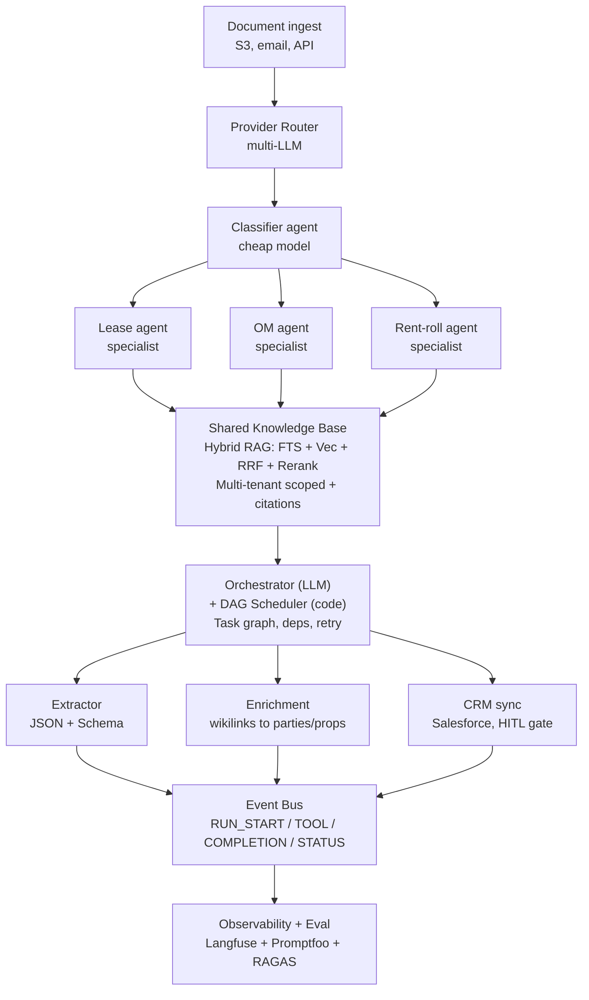

# AI System Design Playbook — CRE B2B Enterprise

> **Prep for:** Ascendix Technologies — AI Solution Architect whiteboard — Thursday 2026-04-16
> **Built from:** AI_devs 4 lesson summaries (S01–S05) distilled against the weighting priors below
> **How to use:** Skim Monday–Wednesday. Do NOT open this on the session. On the whiteboard you should have 2–3 sentences per block that come out naturally.

---

## Opening priors — recite in the first 60 seconds

State these aloud at the top of the session. They frame the whole conversation, signal seniority, and let interviewers push back if they have different priors. If they push back, steelman their view before defending yours.

1. **Document-heavy CRE is not a chat problem.** Output goes to the CRM, not a chat window. → Structured output + function calling >> conversational UX.
2. **Legal-adjacent means audit trail from day 1.** Every extraction cites file, page, clause. → RAG >> fine-tuning.
3. **Exact terms matter as much as intent.** Clause 4.2.1, SNDA, property IDs, addresses. → Hybrid search (BM25 + semantic + rerank) >> pure vector.
4. **Multi-tenant isolation from day 1**, never an afterthought.
5. **Observability and evals from day 1.** Enterprise = regression = lost client.
6. **Cost is a design constraint per request**, not a monthly surprise. B2B ROI is the PoC gate.
7. **Six-week PoC mindset.** We are not designing the five-year platform today — we're designing what proves value in six weeks and doesn't box us in.

---

## Block 1 — Model & Routing

**Principle.** A single mega-prompt to one model is the naive choice. Decompose → classify → route → specialize. Multi-vendor abstraction is an architectural decision, not a vendor strategy.

**Patterns.**
- **Provider Router.** One `Responses`-shaped interface; the provider is inferred from the model prefix (`gpt-*`, `claude-*`, `gemini-*`). Field mapping (`instructions→system`, `reasoning_effort→budget_tokens`, thought signatures) is translated once. Business logic never sees the provider.
- **Two-step classification → specialist.** First call classifies the document (lease vs LOI vs OM). Second call uses a system prompt specialized for that type. Cheaper, higher accuracy than one mega-prompt.
- **Cost tiers by task shape.** Small model for structured extraction (parties, dates, rent schedule). Big reasoning model for clause interpretation and edge cases. Route by query awareness: a precise broker query → cheap + tight context; a vague query → default tools + bigger model.
- **Prompt cache as priority #1.** Stable system prompt holds tools and general rules. Dynamic data (timestamp, tenant ID, user ID) always goes into the user message. Never the system message — a dynamic system prompt breaks cache silently on every turn.

**CRE application.**
- Classify first: lease / LOI / rent roll / SNDA / OM / estoppel. Route to the specialist.
- Cache the top-tier system prompt + tool definitions across the entire lease pipeline.
- Small model for "extract parties, dates, rent schedule" (structured). Big model for "is this rent escalation clause buyer-favorable, and why?"

**Interview snippets.**
- *"We use a single `Responses`-shaped LLM interface. The provider is determined by model prefix — no code change to swap OpenAI for Anthropic for Gemini. That lets us route by cost, latency, or reasoning need instead of being locked in."*
- *"We classify the document first in one cheap call — lease, LOI, rent roll — then route to a specialized prompt. Better accuracy, lower token cost than a single mega-prompt."*
- *"Our number-one token optimization is prompt cache. Static system prompt and tool defs, dynamic data in the user message. Never the other way."*

**Anti-pattern.** One mega-prompt to the biggest model "to be safe". You pay for every token, and the model's attention is split across unrelated concerns.

---

## Block 2 — Context & Memory

**Principle.** Context is a scarce resource. Memory is not a log — it's a hierarchy: session context, environment metadata, rolling summaries, persistent cross-session learnings.

**Patterns.**
- **Observer + Reflector rolling summary.** After each turn, Observer extracts prioritized observations (goal, delegations, resources). Reflector compresses older messages using a smaller `MEMORY_MODEL` when `COMPACT_AFTER_MESSAGES` / `COMPACT_AFTER_CHARS` triggers fire. Each new turn sees: `system prompt + summary + last N messages`. Handles arbitrarily long sessions without hitting the window.
- **Observational Memory log.** Time-ordered log of agent actions (observations + current-task + suggested-next-step). Both memory and audit trail. Benchmarks 94.87% on LongMemEval — outperforms pure vector recall on long-horizon sessions.
- **Agentic RAG, not top-K.** Don't pre-load. Instruct the agent to explore iteratively: scan structure → deepen query → explore → verify coverage. No "unknown unknowns".
- **Environment metadata injection.** Timestamp, user role, tenant ID, locale, document ID go into a `<metadata>` block injected programmatically at every step. Never trusted from user input.
- **Persistent cross-session learnings.** Agent writes "what I learned" to `instructions/*.md`. Next session loads them on boot. Cross-session learning without fine-tuning.
- **Compress at ~30% window usage.** Don't wait until 90%. Recompute the summary a few times rather than hit the wall.

**CRE application.**
- Each lease analysis = fresh session, clean slate. But `instructions/lease-parsing-discoveries.md` — accumulated across all prior transactions — loads on every session start. "How Cushman structures their rent rolls" becomes institutional knowledge.
- For a 500-page lease: split by logical sections (grant, term, rent schedule, defaults, assignments), process iteratively, cache property metadata that doesn't change between chunks.
- Rolling summary lets a broker work a complex deal across 200+ turns without losing context.

**Interview snippets.**
- *"We don't pre-load context; we instruct the agent to explore. Scan structure, deepen queries, verify coverage. Between turns, a compressed summary — not raw history — preserves what mattered. That cut hallucinations roughly in half on our last project."*
- *"Memory is time-ordered, not vector-based. Every observation is timestamped and sourced. That's how we can audit a lease analysis backward and show a broker exactly which paragraph the system cited."*
- *"We trigger compression at 30% window usage, not 90%. I'd rather recompute the summary a few times than hit the wall."*

**Anti-pattern.** Storing full conversation history in semantic vectors without compression. It works until turn 20, then silently forgets intent.

---

## Block 3 — Knowledge / RAG

**Principle.** Hybrid search (semantic + BM25 + rerank) is the default for legal-adjacent documents — not the advanced option. Pure vector fails on clause numbers, property IDs, exact phrasing. Pure BM25 fails on paraphrased concepts. You need both.

**Patterns.**
- **Hybrid retrieval with RRF.** Agent generates two parallel queries — a Keywords query (for BM25/FTS) and a Natural Language query (for embeddings). Both retrieve top-K in parallel. Merge with Reciprocal Rank Fusion (no normalization needed). Rerank the top 50 with a cross-encoder.
- **Structural chunking, not fixed size.** Chunks are logical units (section 4.2(b), Exhibit A, Schedule 3), not 1K-token slices. Separators-first hierarchical split: `##` → `###` → paragraph → sentence. Target 200–500 words.
- **Contextual embeddings (Anthropic technique).** Prefix each chunk with 1–2 sentences of context before embedding: "This chunk is from Section 4 of the 2024 lease between X and Y, covering rent escalation…". Dramatic recall improvement on legal language.
- **Metadata for filter + citation.** Every chunk carries `{source_file, section, chunk_index, lease_id, tenant, effective_date, clause_type}`. Retrieval filters by metadata first, then scores. Citations flow into the answer.
- **Smallest infra that works.** Tier your infra choice:
  1. Direct context load (no search) — when the docs fit.
  2. Filesystem + grep — when structure alone is enough.
  3. **SQLite + FTS5 + sqlite-vec — the 6-week PoC sweet spot. One transaction, no cross-store sync.**
  4. PostgreSQL + Algolia/Qdrant — when scale demands it. You pay with 3-store sync complexity.

**CRE application.**
- Chunk leases by structural units, not word count. Section 4.2(c) stays intact.
- Metadata on every chunk: `lease_id, property_id, tenant_id, landlord_id, effective_date, clause_type, section_number, page_range`.
- Query "what triggers termination?" → NL query finds "events of default" and "notice of default"; BM25 finds "Section 12.1" and "termination upon notice". RRF merges. Answer cites page + section verbatim. Broker can verify on paper.
- **Start small.** For the 6-week PoC, SQLite + FTS5 + sqlite-vec is usually enough for the first few portfolios. Resist premature infra.

**Interview snippets.**
- *"For document-heavy CRE, hybrid search is mandatory, not an upgrade. We generate two queries — keywords for BM25, natural language for embeddings — retrieve in parallel, merge with Reciprocal Rank Fusion, rerank the top 50. Pure semantic would miss 'Appendix F' and 'SNDA clause 3.2'. Pure BM25 would miss 'rent escalation' when the doc says 'inflation adjustment'."*
- *"We chunk by structural unit, not word count — section 4.2(c) stays intact. Then we prefix each chunk with 1–2 sentences of context before embedding. That's the Anthropic contextual-embeddings technique; recall improves dramatically on legal language."*
- *"For the 6-week PoC I'd start with SQLite plus FTS5 plus sqlite-vec. One transaction, no sync complexity. We graduate to Postgres plus a dedicated vector store once we've proved value."*

**Anti-pattern.** Jumping straight to Elasticsearch + Qdrant on day 1. You pay with 3-store synchronization complexity and slow iteration. And: loading the whole lease into the vector DB without chunking — embeddings "lose" exact phrases and clause numbers, and the agent hallucinates.

---

## Block 4 — Actions / Tools

**Principle.** A tool is a product, not an API wrapper. Its interface is designed like an API for a stranger with no docs: self-describing names, typed I/O, validation with suggestions, dry-run, checksum, and `next_action` hints baked into every response.

**Patterns.**
- **Consolidate, don't map 1:1.** Thirteen filesystem actions collapse to four tools (Search, Read, Write, Manage) with modes. Twenty+ tools pollute context; 4–6 well-designed tools fit. **Rule of thumb: no more than ~12 tools per agent; beyond that, specialize by role.**
- **Dynamic hints in every response.** Every tool response carries `next_action` (what the agent likely does next), `recovery` (what to do on failure), `diagnostics` (tokens, IDs). Example: *"Found rent in Section 4.3 but formats are mixed ($/SF vs annual). Want me to normalize?"*
- **Structured output + schema validation.** JSON Schema enforced on every tool output. **Schema validates shape. Code validates values.** Dates, amounts, property IDs cross-checked programmatically before they touch the CRM.
- **Exact-match references.** A tool like `add_comment` requires `block_id` + `quote` where `quote` must match the source verbatim. No paraphrased citations. This is how you prevent citation drift.
- **Least privilege per agent.** Each agent declares the tools it needs. A document-analysis agent gets `read/search`. Sending email or writing to Salesforce requires delegation to an authorized agent that pauses for human approval.
- **Checksum + dry-run on destructive actions.** Agent sees a preview before commit. Concurrent-write protection via checksum.
- **Code Mode for many MCP tools.** When an agent needs 100+ MCP tools, the tool definitions alone eat the context window. Instead, give the agent a sandbox (Deno) and let it write code that calls the MCPs directly. Context stays clean.

**CRE application.**
- `extract_lease_clause(document_id, clause_type, confidence_threshold)` → returns `{term, page_ref, source_quote, next_action, recovery}`. `source_quote` must match source verbatim. Output is typed JSON that maps directly to CRM fields.
- Document agent has `read/search/extract` only. Updating Salesforce requires `delegate(crm_sync_agent)` which pauses for broker approval.
- Destructive tools (`update_lease_status`, `send_offer`) always require dry-run + human button click.

**Interview snippets.**
- *"A tool isn't an API wrapper — it carries dynamic hints. When extraction finds mixed rent formats, the tool tells the agent 'I found these variations; would you like me to normalize?' That guidance is what makes agent extraction reliable, not brittle."*
- *"Every tool enforces a JSON Schema. The schema validates structure; our code validates business values — dates, amounts, property IDs. A model can hallucinate a 2099 expiry date that passes schema — code catches it."*
- *"Critical actions go through three layers: code-level whitelist, model preview, user button click. Text confirmations are fragile — a button click is deterministic."*
- *"When an agent needs many MCP tools, we switch to Code Mode — the agent writes code that calls the MCPs instead of carrying 100 tool definitions in context. Saves tokens, keeps attention focused."*

**Anti-pattern.** Mapping an API 1:1 → 20+ tools → context pollution → agent guesses. And: trusting JSON Schema as "data correctness" — it's only shape, never semantics.

---

## Block 5 — Agent Orchestration

**Principle.** Don't trust the agent to manage the plan. **Split reasoning from scheduling.** The agent (LLM) decides WHAT to do; code (DAG scheduler) decides WHEN and HOW. Agents communicate through shared surfaces, not direct messages.

**Patterns.**
- **Orchestrator + DAG Scheduler.** The Orchestrator is an LLM agent that decomposes a user request into a task graph (`create_actor`, `delegate_task`, dependencies). The DAG scheduler is pure code — no LLM — resolving task ordering, executing ready tasks, handling recovery on failure. Task status: `todo → waiting → in_progress → done|blocked`. Stale recovery: stuck `in_progress` tasks revert to `todo` at scheduler boot.
- **Heartbeat pattern.** A cyclic code loop (every 5–30 minutes) checks task state, resolves dependencies, dispatches `next_action` to agents. Agent executes, doesn't plan. Hooks (`beforeFinish`, `afterToolResult`) enforce workflow constraints (e.g., can't finish session until required steps are done).
- **Agent Isolation Model.** Pipeline agents communicate through folders (`inbox/ → ready/ → published/`), not direct RPC. Each agent: one job, one trigger, one surface to read, one to write. Loose coupling — adding an agent doesn't break the system.
- **Shared workspace blackboard.** `workspace/{userId}/{date}/{sessionId}/{agentId}/{inbox|outbox|notes}`. Orchestrator reads the plan, delegates, monitors escalations. Single source of truth.
- **Pipeline > Mesh.** Start with a linear pipeline + one orchestrator. Mesh and Swarm rarely justify the complexity.
- **Same agent code, different tools + prompt.** Roles emerge from tool sets and system prompts, not from custom classes. Flat implementation, hierarchical behavior.
- **HITL at high-stakes gates.** Full autonomy without human-in-the-loop = data-integrity failures. Put a human button at every CRM write, email send, or irreversible action.

**CRE application.**
- Lease intake pipeline: `IntakeAgent` (OCR + classify) → `inbox/new/` → `ExtractorAgent` (structured clause extraction) → `ready/validated/` → `EnrichmentAgent` (wikilink to known parties/properties) → `ready/enriched/` → `CRMSyncAgent` (Salesforce push, **human-approved**) → `published/`. A Monitor agent watches success rates, latency, queue depth.
- Deal lifecycle (7 phases): intake → due diligence → legal → pricing → compliance → presentation → archive. DAG Scheduler resolves cross-phase dependencies. One agent specializes per phase.
- The Orchestrator LLM decides "next we need a pricing review and a legal review in parallel". The DAG scheduler executes it — ensures legal completes before compliance, retries pricing on failure.

**Interview snippets.**
- *"Rather than trusting an agent to track a complex transaction, we split reasoning from scheduling. The orchestrator is an LLM — it decomposes the request into a task graph. The scheduler is pure code — it resolves dependencies, handles retries, recovers stalled tasks. The model reasons about what to do; code handles when and how."*
- *"Agents communicate through shared folders, not direct messages. Each agent has one trigger, one surface to read, one to write. Adding a new agent doesn't require rewriting anything — it's microservices, essentially."*
- *"Same agent code everywhere. Roles come from tool sets and system prompts. That gives us composability without class hierarchies."*
- *"High-stakes actions always go through a human. CRM writes, offer sends, lease status changes — code blocks the action, user clicks a button."*

**Anti-pattern.** Agent self-managing a TODO file. It'll forget to update it, lose ordering, skip steps. And: direct agent-to-agent messaging — introduces fragile coupling that cascades on any single failure.

---

## Block 6 — Quality, Eval & Observability

**Principle.** Observability is the foundation, evaluation is the superstructure. Both start on day 1, not after the first regression. *Silent drift* — errors compounding invisibly until a client notices — is the enterprise killer.

**Patterns.**
- **Hierarchical tracing.** `Session → Trace → Agent → Generation|Tool`. Every LLM call and every tool call is an event in a trace, tagged with `sessionId, userId, promptVersion, tenant, tags`. Langfuse or equivalent.
- **Event bus + SSE dashboard.** Typed events (`RUN_START`, `TOOL_INVOCATION`, `COMPLETION`, `TASK_STATUS_CHANGED`) streamed to an observability dashboard via SSE. Read-only path — doesn't affect execution. Visibility for alerts + debugging without instrumenting every step manually.
- **Offline + online evals.** **Offline** eval runs on a curated dataset before deployment. Promptfoo or similar. Gate: no prompt change ships unless it beats the baseline. **Online** eval runs asynchronously on production traces — LLM-as-Judge or programmatic scorer — scoring a random sample and alerting on drift.
- **Prompt versioning with metrics.** Each prompt version tied to its metrics (avg latency, cost per call, average score, token distribution). Git alone isn't enough — you need `version → {latency, cost, score}` and regression baselines.
- **RAGAS-style metrics for RAG** (memorize these four):
  1. **Faithfulness** — is the answer supported by retrieved context?
  2. **Answer relevancy** — is the answer on-topic to the question?
  3. **Context precision** — did we retrieve only what we needed?
  4. **Context recall** — did we retrieve everything we needed?
- **Eval Alignment Matrix.** A high eval score ≠ good output. Check false positives (scores agree but output is wrong) and false negatives (scores disagree but output is right). Alignment between evaluator and ground truth is itself a property to monitor.
- **Noise floor threshold.** LLMs are non-deterministic. A "4% improvement" may just be noise. Require improvement to beat ~50% of prior result spread. DSPy/AX frameworks automate this: baseline 60% → iter 6 94.3% → holdout 89.9% is a real win.
- **Self-Observing System.** A Monitor agent with LLM-as-judge runs periodically over the fleet — checks output volume, delivery rate, source availability, queue depth, repeated failures. Auto-actions: mark source unreachable, pause zero-output agent. Human gate: source offline 3+ days, accuracy suddenly drops.

**CRE application.**
- Every lease extraction traced with `tenant_id, lease_id, clause_type, extracted_value, confidence, source_span`. Broker can click through to see which paragraph the system cited.
- Eval set: 50+ labeled lease extractions (rent, escalation, term, renewal, assignment). Offline run before any prompt change. Online eval samples 5% of production extractions weekly; LLM-as-judge flags disagreements for human review.
- Prompt-version metrics: `v1 $0.015/lease at 85% → v2 $0.0011/lease at 94%` — the kind of win you track and demo.
- Alerts: rent-escalation accuracy < 92%, time-to-publish > SLO, retrieval latency spike.

**Interview snippets.**
- *"Observability traces from session down to each LLM call and tool call — session, trace, agent, generation. Every span is tagged with tenant, user, prompt version, and model. We can audit any extraction backward to the exact clause."*
- *"We run two kinds of evals: offline on a golden dataset before any prompt change ships, and online on a 5% sample of production traces. For RAG specifically, we measure faithfulness, answer relevancy, context precision, and context recall — those are the four you need to answer 'is retrieval actually working'."*
- *"LLMs are non-deterministic. We don't trust single-run improvements — we require them to beat the noise floor of prior results. Frameworks like DSPy automate that."*
- *"Prompt versioning isn't Git. Every version is tied to its metrics — latency, cost, eval score. You need the full history to catch silent drift."*

**Anti-pattern.** Adding observability after the first incident. By then you don't even know what used to work. And: trusting a single eval run — you've just measured the noise.

---

## Block 7 — Safety & Reliability

**Principle.** Security is code, not instruction. A **Defense Stack** of hard (code) and soft (prompt) layers. Even if the prompt fails, the architecture contains the blast radius.

**Patterns.**
- **4-layer Defense Stack.**
  - **L1 — isolated sessions** per tenant/user (hard)
  - **L2 — programmatic access lock** (mutex/ACL in code, not in prompt) (hard)
  - **L3 — knowledge-base scoping** by tenant/contact type (hard)
  - **L4 — prompt-level rules** ("don't mix client data") (soft)
  Layers 1–3 defend even if L4 fails. Prompt injection, if it lands, hits ACL before data.
- **Prompt injection has no fix.** Pliny-style attackers break every new model within 24 hours. Defense is architectural: least-privilege tools, sandboxed execution, whitelists, deterministic confirmations.
- **Block response editing.** Users cannot edit assistant responses — only create branches. Prevents the "many-shot jailbreak" where fabricated history becomes a precedent.
- **Deterministic confirmations.** Accept/Cancel buttons, not "type yes to confirm". A model cannot reinterpret a button click.
- **Code-level whitelists.** Email recipients, domains, CRM fields, allowed tool calls — whitelist in code, not prompt. Models hallucinate addresses; code won't.
- **Validate values, not just shapes.** JSON Schema validates structure; code validates business semantics (a 2099-12-31 expiry date is a red flag).
- **Sandboxed code execution.** Deno sandbox with granular read/write only to workspace. No raw shell. Code execution replaces "load 150K lines into context" — the model writes a script that does the work.
- **Graceful degradation.** If vector search is down → fall back to FTS. If embedding model is down → escalate to human. Never guess.
- **Audit-trail immutability.** Legal-adjacent CRE requires that history cannot be rewritten. No in-place edits. Branch, don't mutate.

**CRE application.**
- Each broker session is isolated (L1). Data access gated by `tenant_id + user_id + role` in code (L2). KB scoped per tenant (L3). Prompt reminds the agent (L4, redundant but cheap).
- Document agent cannot send email or update Salesforce directly. All external effects go through an authorized agent that pauses for human approval.
- Extracted `2099-12-31` expiry → code cross-checks against document context → flags anomaly → escalates to broker.
- Whisper voice-note transcription: filter "Thanks for watching!" and similar silent-audio hallucinations (VAD pre-filter).

**Interview snippets.**
- *"Prompt injection has no fix — Pliny breaks every new model in 24 hours. Our defense is the architecture. We isolate sessions, lock access in code (not in the prompt), sandbox any code execution. If an agent gets injected, the attacker hits our ACL before the data."*
- *"Critical actions go through three layers: code-level whitelist, model preview, user button click. A model can hallucinate an email address — code won't."*
- *"Users can't edit assistant responses, only branch them. That blocks the 'many-shot jailbreak' where fake history becomes a precedent. Combined with audit-trail immutability, that's how we stay legally defensible."*
- *"Structured output validates the shape. Our code validates the values — dates, amounts, property IDs cross-checked against document context."*

**Anti-pattern.** Relying on a second LLM as a "safety filter". That's security theater — remove the capability at the architecture level instead. And: raw shell access from a sandbox. Always typed API.

---

## Block 8 — Ops & Cost

**Principle.** Async by default, sync only for the hot path. Cost is a design constraint per request, not a monthly surprise. Multi-tenant isolation, cost tracking, and a credible PoC-to-production path are non-negotiable for enterprise.

**Patterns.**
- **Job queue + readiness scheduler.** Every user message is a Job. Scheduler cycles priorities: **(1) deliver results to waiting parents > (2) resume paused > (3) recover stale > (4) start new**. Readiness engine, not naive polling.
- **Heartbeat claim + TTL.** Worker claims a run with `expiresAt`. If heartbeat stops, another worker takes over. Prevents orphaned and duplicated tasks.
- **Exponential backoff.** `2^n * baseDelay` for retries. Prevents thundering herd after an outage.
- **MAX_TURNS hard limit** (20–80 depending on task complexity). No infinite loops.
- **Sync vs async decision.** **Sync** for human-in-the-loop interfaces (broker copilot, live chat). **Async** (cron/webhook/queue) for batch (overnight lease intake). Default to async.
- **Token estimation before dispatch.** `chars/4 * 1.2` as rough bound, adjust with actual `response.usage`. Reject documents larger than model window upfront.
- **Prompt anatomy reality check.** Typical spend distribution: system ~3.4%, tool definitions ~10.7%, conversation ~18%, **tool responses ~67.6%**. Tool responses dominate — that's where the money leaks. Shape them carefully (return `next_action` + summary, not full payload).
- **Cost-per-transaction tracking.** Per tenant, per document type, per prompt version. Hard spend limits per tenant. Alerts on anomalies ("extraction suddenly takes 2x tokens — investigate").
- **Multi-tenant isolation from day 1.** Workspace per tenant. Dedicated API key. Separate cost accounting.
- **6-week PoC → 3-month pilot → rollout.** PoC processes 2–3 high-value portfolios end-to-end. Pilot extends to 10 users. Rollout gated on ROI data. This is how you sell to enterprise.

**CRE application.**
- Lease PoC: 10 leases/day, async batch overnight, ~$0.30/document. Scale path: 1,000/day. Hot deals sync with sub-4h SLO; the rest batch at 2 AM.
- Multi-tenant: each brokerage firm has isolated workspace, dedicated OpenRouter key with monthly token cap, separate cost reports.
- Token estimation: 50-page lease ≈ 12K tokens input. Cache property metadata across documents from the same portfolio. Reuse embeddings for repeated boilerplate.
- Cost dashboard per tenant: `$/lease, leases/day, $ this month, projected MRR cost`.

**Interview snippets.**
- *"Jobs are queued and processed async. The scheduler priorities are: deliver to waiting parents, resume paused, recover stale, then start new. Heartbeat claims with TTL prevent orphaned tasks. Exponential backoff prevents thundering herd after an outage."*
- *"Start async, batch overnight. Switch to sync only for hot deals where a human is actively waiting. Most CRE document work is not time-critical by the minute."*
- *"We track cost per tenant, per document type, per prompt version. Hard spend limits per tenant — one broker can't burn the platform. Anomaly alerts when extraction suddenly takes 2x tokens."*
- *"For a 6-week PoC, we'd process 2–3 high-value portfolios end-to-end. Prove the ROI on a real deal, not a demo. Then pilot with 10 users. Then the full rollout."*
- *"The surprise in prompt anatomy is that tool responses usually dominate — about two-thirds of spend. That's where we optimize: responses return summaries and `next_actions`, not raw payloads."*

**Anti-pattern.** Sync for everything. You pay with latency, cost, and no recovery path. And: multi-tenancy as an afterthought — guaranteed rewrite.

---

## Reference architecture — CRE document pipeline

Use this as your starting diagram in any document-heavy scenario. Consolidated from S02/S04/S05.

**Cross-cutting (always on):**
- Prompt cache (stable system + tools, dynamic data in user message)
- Observer + Reflector rolling summary for long sessions
- Heartbeat + TTL recovery, exponential backoff
- 4-layer Defense Stack (session isolation → ACL → KB scope → prompt rules)
- Cost tracking per tenant / doc type / prompt version

---

## Pattern decision trees

**"Do I need vector DB, FTS, or both?"** → Both. Always hybrid. Never pure vector for legal-adjacent docs.

**"Do I need a custom embedding or off-the-shelf?"** → Off-the-shelf at PoC. Custom only if eval shows a reproducible gap.

**"Single agent or multi-agent?"** → Start single with specialized tools. Graduate to a pipeline (orchestrator + specialists via shared surfaces) only when a single agent can't hold the context or the dependencies.

**"Fine-tune or RAG?"** → RAG. Always, in this domain. Reserve fine-tuning for style or tool-calling format, never for domain knowledge that changes.

**"Sync or async?"** → Async. Sync only when a human is waiting on the other end of a sub-4-hour window.

**"MCP or custom tools?"** → MCP for standard capabilities (filesystem, search, calendar). Custom for domain-specific (lease extraction, Salesforce). Switch to Code Mode when you exceed ~12 MCP tools in one agent.

**"Postgres or SQLite for PoC?"** → SQLite + FTS5 + sqlite-vec for the 6-week PoC. One transaction, no sync. Graduate to Postgres when you've proved value.

**"Do I need a graph DB (relationships between entities)?"** → Rarely at PoC. Start with metadata + wikilinks in markdown/JSON. Graduate to a graph store only when query patterns prove it out.

**"How do I answer the 'fine-tuning?' question?"** → *"For this domain — legal-adjacent, citation-required, fast-changing sources — RAG is the right default. Fine-tuning would bake in content we need to update weekly and would kill our ability to cite exact clauses. I'd reserve fine-tuning for style or tool-calling format, not domain knowledge."*

---

## Closing reminder

On the whiteboard, you're graded on **process and communication**, not the final diagram. Narrate your decisions out loud. State priors explicitly. When you make a tradeoff, say *what* you're trading and *why*. When they push back, steelman their position before defending yours. Use the interview snippets as anchors, not as scripts — they should sound like your native thought, not a rehearsal.
