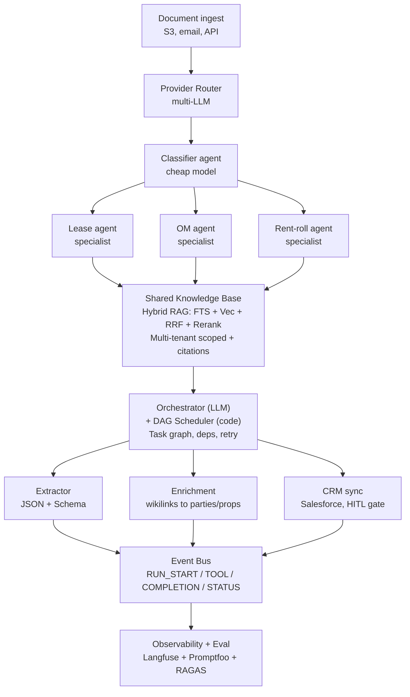

# AI System Design Playbook — CRE B2B Enterprise (PL)

> **Prep na:** Ascendix Technologies — AI Solution Architect whiteboard — czwartek 2026-04-16
> **Zbudowane z:** podsumowań lekcji AI_devs 4 (S01–S05) destylowanych pod priors wagowe poniżej
> **Jak używać:** Skimuj pon–śr. NIE otwieraj tego na sesji. Na whiteboardzie powinieneś mieć 2–3 zdania z każdego bloku, które wychodzą naturalnie.
>
> **Terminologia techniczna zachowana po angielsku** (hybrid search, Provider Router, DAG scheduler, RAGAS, HITL itd.), bo na sesji po angielsku i tak jej używasz. **Interview snippets zostają verbatim po angielsku** — są do wypowiedzenia.

---

## Opening priors — wypowiedz w pierwszych 60 sekundach

Powiedz to głośno na początku sesji. To ramuje całą rozmowę, sygnalizuje seniority, i pozwala interviewerom zakwestionować jeśli mają inne priors. Jeśli zakwestionują, **steelman** ich pozycję zanim obronisz swoją.

1. **Document-heavy CRE to nie jest problem chatbota.** Output idzie do CRM-a, nie do okna czatu. → Structured output + function calling >> conversational UX.
2. **Legal-adjacent znaczy audit trail od dnia 1.** Każda ekstrakcja cytuje plik, stronę, klauzulę. → RAG >> fine-tuning.
3. **Dokładne terminy liczą się tak samo jak intencja.** Clause 4.2.1, SNDA, property IDs, adresy. → Hybrid search (BM25 + semantic + rerank) >> pure vector.
4. **Multi-tenant isolation od dnia 1**, nigdy jako afterthought.
5. **Observability i evaluacje od dnia 1.** Enterprise = regresja = stracony klient.
6. **Koszt to design constraint per request**, nie miesięczna niespodzianka. B2B ROI to gate dla PoC.
7. **Six-week PoC mindset.** Nie projektujemy dziś 5-letniej platformy — projektujemy to, co dowiedzie wartość w 6 tygodni i nie zablokuje nas na przyszłość.

---

## Blok 1 — Model & Routing

**Zasada.** Pojedynczy mega-prompt do jednego modelu to wybór naiwny. Dekomponuj → klasyfikuj → routuj → specjalizuj. Multi-vendor abstraction to decyzja architektoniczna, nie strategia dostawcy.

**Wzorce.**
- **Provider Router.** Jeden interfejs w kształcie `Responses`; provider wnioskowany z prefiksu modelu (`gpt-*`, `claude-*`, `gemini-*`). Mapowanie pól (`instructions→system`, `reasoning_effort→budget_tokens`, thought signatures) tłumaczone raz. Business logic nigdy nie widzi providera.
- **Dwuetapowa klasyfikacja → specjalista.** Pierwszy call klasyfikuje dokument (lease vs LOI vs OM). Drugi używa system promptu wyspecjalizowanego pod ten typ. Taniej i z wyższą accuracy niż jeden mega-prompt.
- **Cost tiers per task shape.** Mały model do structured extraction (parties, dates, rent schedule). Duży reasoning model do interpretacji klauzul i edge cases. Routing wg query awareness: precyzyjne zapytanie brokera → tani + ciasny kontekst; vague zapytanie → default tool set + większy model.
- **Prompt cache jako priorytet #1.** Stabilny system prompt trzyma tools i ogólne reguły. Dynamiczne dane (timestamp, tenant ID, user ID) zawsze idą do user message. Nigdy do system message — dynamiczny system prompt łamie cache cicho na każdej turze.

**Zastosowanie w CRE / document-heavy B2B.**
- Klasyfikuj najpierw: lease / LOI / rent roll / SNDA / OM / estoppel. Routuj do specjalisty.
- Cache'uj top-tier system prompt + tool definitions przez cały lease pipeline.
- Mały model do "extract parties, dates, rent schedule" (structured). Duży model do "is this rent escalation clause buyer-favorable, and why?"

**Interview snippets.**
- *"We use a single `Responses`-shaped LLM interface. The provider is determined by model prefix — no code change to swap OpenAI for Anthropic for Gemini. That lets us route by cost, latency, or reasoning need instead of being locked in."*
- *"We classify the document first in one cheap call — lease, LOI, rent roll — then route to a specialized prompt. Better accuracy, lower token cost than a single mega-prompt."*
- *"Our number-one token optimization is prompt cache. Static system prompt and tool defs, dynamic data in the user message. Never the other way."*

**Anty-wzorzec.** Jeden mega-prompt do największego modelu "na wszelki wypadek". Płacisz za każdy token, a uwaga modelu jest rozproszona na niepowiązane concerns.

---

## Blok 2 — Context & Memory

**Zasada.** Kontekst to zasób ograniczony. Pamięć to nie log — to hierarchia: session context, environment metadata, rolling summaries, persistent cross-session learnings.

**Wzorce.**
- **Observer + Reflector rolling summary.** Po każdej turze Observer wyciąga priorytetyzowane obserwacje (goal, delegations, resources). Reflector kompresuje starsze wiadomości mniejszym `MEMORY_MODEL`, gdy triggery `COMPACT_AFTER_MESSAGES` / `COMPACT_AFTER_CHARS` się odpalą. Każda nowa tura widzi: `system prompt + summary + last N messages`. Obsługuje dowolnie długie sesje bez przekroczenia okna.
- **Observational Memory log.** Time-ordered log akcji agenta (observations + current-task + suggested-next-step). Zarówno pamięć jak i audit trail. Benchmark 94.87% na LongMemEval — wygrywa z pure vector recall na long-horizon sesjach.
- **Agentic RAG, nie top-K.** Nie pre-loaduj. Każ agentowi eksplorować iteracyjnie: scan structure → deepen query → explore → verify coverage. Brak "unknown unknowns".
- **Environment metadata injection.** Timestamp, user role, tenant ID, locale, document ID idą w bloku `<metadata>` wstrzykiwanym programistycznie na każdym kroku. Nigdy trusted z user input.
- **Persistent cross-session learnings.** Agent pisze "what I learned" do `instructions/*.md`. Następna sesja ładuje je na starcie. Cross-session learning bez fine-tuningu.
- **Kompresja przy ~30% zużycia okna.** Nie czekaj do 90%. Lepiej przeliczyć summary kilka razy niż uderzyć w ścianę.

**Zastosowanie w CRE / document-heavy B2B.**
- Każda analiza lease = świeża sesja, czysty slate. Ale `instructions/lease-parsing-discoveries.md` — nagromadzony przez wszystkie wcześniejsze transakcje — ładuje się na każdym starcie sesji. "Jak Cushman strukturyzuje swoje rent rolls" staje się wiedzą instytucjonalną.
- Dla 500-stronicowego lease: podziel na sekcje logiczne (grant, term, rent schedule, defaults, assignments), przetwarzaj iteracyjnie, cache'uj property metadata, które nie zmieniają się między chunkami.
- Rolling summary pozwala brokerowi prowadzić złożony deal przez 200+ tur bez utraty kontekstu.

**Interview snippets.**
- *"We don't pre-load context; we instruct the agent to explore. Scan structure, deepen queries, verify coverage. Between turns, a compressed summary — not raw history — preserves what mattered. That cut hallucinations roughly in half on our last project."*
- *"Memory is time-ordered, not vector-based. Every observation is timestamped and sourced. That's how we can audit a lease analysis backward and show a broker exactly which paragraph the system cited."*
- *"We trigger compression at 30% window usage, not 90%. I'd rather recompute the summary a few times than hit the wall."*

**Anty-wzorzec.** Trzymanie pełnej historii konwersacji w semantic vectors bez kompresji. Działa do tury 20, potem po cichu zapomina intent.

---

## Blok 3 — Knowledge / RAG

**Zasada.** Hybrid search (semantic + BM25 + rerank) to default dla legal-adjacent dokumentów — nie opcja zaawansowana. Pure vector zawodzi na clause numbers, property IDs, dokładnym phrasing. Pure BM25 zawodzi na parafrazowanych koncepcjach. Potrzebujesz obu.

**Wzorce.**
- **Hybrid retrieval z RRF.** Agent generuje dwa równoległe zapytania — Keywords query (dla BM25/FTS) i Natural Language query (dla embeddings). Oba pobierają top-K równolegle. Merge przez Reciprocal Rank Fusion (bez normalizacji). Rerank top 50 cross-encoderem.
- **Structural chunking, nie fixed size.** Chunki to jednostki logiczne (section 4.2(b), Exhibit A, Schedule 3), nie 1K-token slices. Separators-first hierarchical split: `##` → `###` → paragraph → sentence. Target 200–500 słów.
- **Contextual embeddings (technika Anthropic).** Prefix każdego chunka 1–2 zdaniami kontekstu przed embeddingiem: "This chunk is from Section 4 of the 2024 lease between X and Y, covering rent escalation…". Dramatyczny skok recall na legal language.
- **Metadata do filtra + citation.** Każdy chunk ma `{source_file, section, chunk_index, lease_id, tenant, effective_date, clause_type}`. Retrieval filtruje po metadata najpierw, potem score'uje. Citations płyną do odpowiedzi.
- **Najmniejsza infra, która działa.** Tieruj wybór:
  1. Direct context load (bez search) — gdy dokumenty mieszczą się w kontekście.
  2. Filesystem + grep — gdy struktura sama wystarcza.
  3. **SQLite + FTS5 + sqlite-vec — sweet spot dla 6-week PoC. Jedna transakcja, brak cross-store sync.**
  4. PostgreSQL + Algolia/Qdrant — gdy skala wymusza. Płacisz 3-store sync complexity.

**Zastosowanie w CRE / document-heavy B2B.**
- Chunkuj lease'y po structural units, nie word count. Section 4.2(c) zostaje w całości.
- Metadata na każdym chunku: `lease_id, property_id, tenant_id, landlord_id, effective_date, clause_type, section_number, page_range`.
- Zapytanie "what triggers termination?" → NL query znajduje "events of default" i "notice of default"; BM25 znajduje "Section 12.1" i "termination upon notice". RRF mergeuje. Odpowiedź cytuje stronę + sekcję verbatim. Broker weryfikuje na papierze.
- **Zacznij od małego.** Dla 6-tygodniowego PoC SQLite + FTS5 + sqlite-vec zwykle wystarcza dla pierwszych kilku portfolio. Odpierz pokusę premature infra.

**Interview snippets.**
- *"For document-heavy CRE, hybrid search is mandatory, not an upgrade. We generate two queries — keywords for BM25, natural language for embeddings — retrieve in parallel, merge with Reciprocal Rank Fusion, rerank the top 50. Pure semantic would miss 'Appendix F' and 'SNDA clause 3.2'. Pure BM25 would miss 'rent escalation' when the doc says 'inflation adjustment'."*
- *"We chunk by structural unit, not word count — section 4.2(c) stays intact. Then we prefix each chunk with 1–2 sentences of context before embedding. That's the Anthropic contextual-embeddings technique; recall improves dramatically on legal language."*
- *"For the 6-week PoC I'd start with SQLite plus FTS5 plus sqlite-vec. One transaction, no sync complexity. We graduate to Postgres plus a dedicated vector store once we've proved value."*

**Anty-wzorzec.** Skakanie od razu do Elasticsearch + Qdrant w dniu 1. Płacisz 3-store sync complexity i wolną iteracją. Oraz: ładowanie całego lease do vector DB bez chunkingu — embeddingi "gubią" exact phrases i clause numbers, agent halucynuje.

---

## Blok 4 — Actions / Tools

**Zasada.** Tool to produkt, nie wrapper wokół API. Interfejs zaprojektowany jak API dla obcej osoby bez dokumentacji: self-describing names, typed I/O, walidacja z sugestiami, dry-run, checksum, i `next_action` hints wbudowane w każdy response.

**Wzorce.**
- **Konsoliduj, nie mapuj 1:1.** Trzynaście akcji filesystem zwija się do czterech tooli (Search, Read, Write, Manage) z trybami. 20+ tooli zanieczyszcza kontekst; 4–6 dobrze zaprojektowanych tooli pasuje. **Rule of thumb: nie więcej niż ~12 tooli na agenta; powyżej — specjalizuj po roli.**
- **Dynamic hints w każdym response.** Każdy tool response niesie `next_action` (co agent prawdopodobnie zrobi dalej), `recovery` (co robić przy błędzie), `diagnostics` (tokens, IDs). Przykład: *"Found rent in Section 4.3 but formats are mixed ($/SF vs annual). Want me to normalize?"*
- **Structured output + schema validation.** JSON Schema wymuszone na każdym output tooli. **Schema waliduje shape. Kod waliduje values.** Daty, kwoty, property IDs cross-checkowane programistycznie zanim dotkną CRM-u.
- **Exact-match references.** Tool typu `add_comment` wymaga `block_id` + `quote`, gdzie `quote` musi się zgadzać z source verbatim. Bez parafrazowanych cytatów. Tak blokujesz citation drift.
- **Least privilege per agent.** Każdy agent deklaruje narzędzia, których potrzebuje. Agent analizujący dokument dostaje `read/search`. Wysłanie emaila albo zapis do Salesforce wymaga delegacji do authorized agenta, który pauzuje na human approval.
- **Checksum + dry-run na destructive actions.** Agent widzi preview przed commitem. Concurrent-write protection przez checksum.
- **Code Mode dla wielu MCP tools.** Gdy agent potrzebuje 100+ MCP tools, same tool definitions zjadają context window. Zamiast tego: daj agentowi sandbox (Deno) i niech pisze kod, który woła MCPs bezpośrednio. Kontekst zostaje czysty.

**Zastosowanie w CRE / document-heavy B2B.**
- `extract_lease_clause(document_id, clause_type, confidence_threshold)` → zwraca `{term, page_ref, source_quote, next_action, recovery}`. `source_quote` musi się zgadzać z source verbatim. Output to typowany JSON mapujący się na CRM fields.
- Agent dokumentowy ma tylko `read/search/extract`. Aktualizacja Salesforce wymaga `delegate(crm_sync_agent)`, który pauzuje na broker approval.
- Destructive tools (`update_lease_status`, `send_offer`) zawsze wymagają dry-run + human button click.

**Interview snippets.**
- *"A tool isn't an API wrapper — it carries dynamic hints. When extraction finds mixed rent formats, the tool tells the agent 'I found these variations; would you like me to normalize?' That guidance is what makes agent extraction reliable, not brittle."*
- *"Every tool enforces a JSON Schema. The schema validates structure; our code validates business values — dates, amounts, property IDs. A model can hallucinate a 2099 expiry date that passes schema — code catches it."*
- *"Critical actions go through three layers: code-level whitelist, model preview, user button click. Text confirmations are fragile — a button click is deterministic."*
- *"When an agent needs many MCP tools, we switch to Code Mode — the agent writes code that calls the MCPs instead of carrying 100 tool definitions in context. Saves tokens, keeps attention focused."*

**Anty-wzorzec.** Mapowanie API 1:1 → 20+ tooli → context pollution → agent zgaduje. Oraz: traktowanie JSON Schema jak "data correctness" — to tylko shape, nigdy semantics.

---

## Blok 5 — Agent Orchestration

**Zasada.** Nie ufaj agentowi w zarządzaniu planem. **Rozdziel reasoning od scheduling.** Agent (LLM) decyduje CO zrobić; kod (DAG scheduler) decyduje KIEDY i JAK. Agenty komunikują się przez shared surfaces, nie direct messages.

**Wzorce.**
- **Orchestrator + DAG Scheduler.** Orchestrator to LLM agent, który dekomponuje user request w task graph (`create_actor`, `delegate_task`, dependencies). DAG scheduler to czysty kod — bez LLM — rozwiązujący task ordering, uruchamiający ready tasks, obsługujący recovery przy failure. Task status: `todo → waiting → in_progress → done|blocked`. Stale recovery: stuck `in_progress` tasks wracają do `todo` na starcie schedulera.
- **Heartbeat pattern.** Cykliczna pętla kodu (co 5–30 minut) sprawdza stan tasków, rozwiązuje dependencies, dispatcheuje `next_action` do agentów. Agent wykonuje, nie planuje. Hooki (`beforeFinish`, `afterToolResult`) wymuszają workflow constraints (np. nie można zakończyć sesji dopóki required kroki są done).
- **Agent Isolation Model.** Pipeline agents komunikują się przez foldery (`inbox/ → ready/ → published/`), nie direct RPC. Każdy agent: jedna praca, jeden trigger, jedna surface do czytania, jedna do pisania. Loose coupling — dodanie agenta nie psuje systemu.
- **Shared workspace blackboard.** `workspace/{userId}/{date}/{sessionId}/{agentId}/{inbox|outbox|notes}`. Orchestrator czyta plan, deleguje, monitoruje eskalacje. Single source of truth.
- **Pipeline > Mesh.** Zacznij od liniowego pipeline + jeden orchestrator. Mesh i Swarm rzadko uzasadniają complexity.
- **Ten sam kod agenta, różne tools + prompt.** Role wynikają z tool setów i system promptów, nie z custom klas. Flat implementation, hierarchical behavior.
- **HITL przy high-stakes gates.** Pełna autonomia bez human-in-the-loop = data-integrity failures. Postaw human button na każdym CRM write, email send, irreversible action.

**Zastosowanie w CRE / document-heavy B2B.**
- Lease intake pipeline: `IntakeAgent` (OCR + classify) → `inbox/new/` → `ExtractorAgent` (structured clause extraction) → `ready/validated/` → `EnrichmentAgent` (wikilink do known parties/properties) → `ready/enriched/` → `CRMSyncAgent` (Salesforce push, **human-approved**) → `published/`. Monitor agent patrzy na success rates, latency, queue depth.
- Deal lifecycle (7 faz): intake → due diligence → legal → pricing → compliance → presentation → archive. DAG Scheduler rozwiązuje cross-phase dependencies. Jeden agent specjalizuje się na fazę.
- Orchestrator LLM decyduje "następnie potrzebujemy pricing review i legal review równolegle". DAG scheduler wykonuje — zapewnia że legal kończy przed compliance, retry'uje pricing przy failure.

**Interview snippets.**
- *"Rather than trusting an agent to track a complex transaction, we split reasoning from scheduling. The orchestrator is an LLM — it decomposes the request into a task graph. The scheduler is pure code — it resolves dependencies, handles retries, recovers stalled tasks. The model reasons about what to do; code handles when and how."*
- *"Agents communicate through shared folders, not direct messages. Each agent has one trigger, one surface to read, one to write. Adding a new agent doesn't require rewriting anything — it's microservices, essentially."*
- *"Same agent code everywhere. Roles come from tool sets and system prompts. That gives us composability without class hierarchies."*
- *"High-stakes actions always go through a human. CRM writes, offer sends, lease status changes — code blocks the action, user clicks a button."*

**Anty-wzorzec.** Agent samozarządzający plikiem TODO. Zapomni go zaktualizować, zgubi ordering, pominie kroki. Oraz: direct agent-to-agent messaging — wprowadza fragile coupling kaskadujące się na każdym single failure.

---

## Blok 6 — Quality, Eval & Observability

**Zasada.** Observability to fundament, ewaluacja to nadbudowa. Oba startują w dniu 1, nie po pierwszej regresji. *Silent drift* — błędy nawarstwiające się niewidocznie dopóki klient nie zauważy — to enterprise killer.

**Wzorce.**
- **Hierarchical tracing.** `Session → Trace → Agent → Generation|Tool`. Każdy LLM call i każdy tool call to event w trace, tagowany `sessionId, userId, promptVersion, tenant, tags`. Langfuse lub odpowiednik.
- **Event bus + SSE dashboard.** Typowane eventy (`RUN_START`, `TOOL_INVOCATION`, `COMPLETION`, `TASK_STATUS_CHANGED`) streamowane do observability dashboard przez SSE. Read-only path — nie wpływa na execution. Visibility dla alertów + debugowania bez ręcznego instrumentowania każdego kroku.
- **Offline + online evals.** **Offline** eval uruchamia się na curated dataset przed deploymentem. Promptfoo lub odpowiednik. Gate: żadna zmiana prompta nie idzie jeśli nie bije baseline. **Online** eval uruchamia się asynchronicznie na production traces — LLM-as-Judge lub programistyczny scorer — oceniając losową próbę i alerting na drift.
- **Prompt versioning z metrykami.** Każda wersja prompta powiązana z metrykami (avg latency, cost per call, average score, token distribution). Git sam nie wystarczy — potrzebujesz `version → {latency, cost, score}` i regression baselines.
- **RAGAS-style metryki dla RAG** (zapamiętaj te cztery):
  1. **Faithfulness** — czy odpowiedź jest supported by retrieved context?
  2. **Answer relevancy** — czy odpowiedź jest on-topic do pytania?
  3. **Context precision** — czy pobraliśmy tylko to, czego potrzebowaliśmy?
  4. **Context recall** — czy pobraliśmy wszystko, czego potrzebowaliśmy?
- **Eval Alignment Matrix.** Wysoki eval score ≠ dobry output. Sprawdź false positives (scores zgadzają się, output jest zły) i false negatives (scores nie zgadzają, output jest dobry). Alignment między evaluatorem a ground truth sam w sobie jest property do monitorowania.
- **Noise floor threshold.** LLM-y są non-deterministic. "4% improvement" może być szumem. Wymagaj improvement beat ~50% prior result spread. Frameworki DSPy/AX automatyzują to: baseline 60% → iter 6 94.3% → holdout 89.9% to prawdziwy win.
- **Self-Observing System.** Monitor agent z LLM-as-judge uruchamia się cyklicznie nad flotą — sprawdza output volume, delivery rate, source availability, queue depth, repeated failures. Auto-actions: mark source unreachable, pause zero-output agent. Human gate: source offline 3+ days, accuracy nagle spada.

**Zastosowanie w CRE / document-heavy B2B.**
- Każda lease extraction traced z `tenant_id, lease_id, clause_type, extracted_value, confidence, source_span`. Broker może kliknąć i zobaczyć który paragraph system zacytował.
- Eval set: 50+ labeled lease extractions (rent, escalation, term, renewal, assignment). Offline run przed każdą zmianą prompta. Online eval samples 5% production extractions weekly; LLM-as-judge flaguje disagreements do human review.
- Prompt-version metrics: `v1 $0.015/lease at 85% → v2 $0.0011/lease at 94%` — taki win trackujesz i demonstrujesz.
- Alerty: rent-escalation accuracy < 92%, time-to-publish > SLO, retrieval latency spike.

**Interview snippets.**
- *"Observability traces from session down to each LLM call and tool call — session, trace, agent, generation. Every span is tagged with tenant, user, prompt version, and model. We can audit any extraction backward to the exact clause."*
- *"We run two kinds of evals: offline on a golden dataset before any prompt change ships, and online on a 5% sample of production traces. For RAG specifically, we measure faithfulness, answer relevancy, context precision, and context recall — those are the four you need to answer 'is retrieval actually working'."*
- *"LLMs are non-deterministic. We don't trust single-run improvements — we require them to beat the noise floor of prior results. Frameworks like DSPy automate that."*
- *"Prompt versioning isn't Git. Every version is tied to its metrics — latency, cost, eval score. You need the full history to catch silent drift."*

**Anty-wzorzec.** Dodanie observability po pierwszym incydencie. Wtedy nie wiesz nawet co działało. Oraz: ufanie pojedynczemu eval run — właśnie zmierzyłeś szum.

---

## Blok 7 — Safety & Reliability

**Zasada.** Security to kod, nie instrukcja. **Defense Stack** warstw hard (kod) i soft (prompt). Nawet jeśli prompt zawiedzie, architektura ogranicza blast radius.

**Wzorce.**
- **4-layer Defense Stack.**
  - **L1 — isolated sessions** per tenant/user (hard)
  - **L2 — programmatic access lock** (mutex/ACL w kodzie, nie w prompcie) (hard)
  - **L3 — knowledge-base scoping** per tenant/contact type (hard)
  - **L4 — prompt-level rules** ("don't mix client data") (soft)
  Warstwy 1–3 bronią nawet jeśli L4 zawiedzie. Prompt injection, jeśli wyląduje, uderza w ACL przed danymi.
- **Prompt injection nie ma fix.** Pliny-style attackerzy łamią każdy nowy model w 24h. Obrona jest architektoniczna: least-privilege tools, sandboxed execution, whitelisty, deterministic confirmations.
- **Zablokuj response editing.** Users nie mogą edytować assistant responses — tylko tworzyć branche. Blokuje "many-shot jailbreak" gdzie sfabrykowana historia staje się precedensem.
- **Deterministic confirmations.** Accept/Cancel buttons, nie "type yes to confirm". Model nie może reinterpretować button click.
- **Code-level whitelisty.** Email recipients, domeny, CRM fields, allowed tool calls — whitelist w kodzie, nie w prompcie. Modele halucynują adresy; kod nie.
- **Waliduj values, nie tylko shapes.** JSON Schema waliduje strukturę; kod waliduje business semantics (data wygaśnięcia 2099-12-31 to red flag).
- **Sandboxed code execution.** Deno sandbox z granularnym read/write tylko do workspace. Brak raw shell. Code execution zastępuje "load 150K lines into context" — model pisze script, który wykonuje pracę.
- **Graceful degradation.** Jeśli vector search pada → fallback na FTS. Jeśli embedding model pada → eskalacja do człowieka. Nigdy nie zgaduj.
- **Audit-trail immutability.** Legal-adjacent CRE wymaga, że historia nie może być przepisana. Brak in-place edits. Branchuj, nie mutuj.

**Zastosowanie w CRE / document-heavy B2B.**
- Każda sesja brokera jest isolated (L1). Data access gated przez `tenant_id + user_id + role` w kodzie (L2). KB scoped per tenant (L3). Prompt przypomina agentowi (L4, redundant ale tanie).
- Document agent nie może wysyłać emaili ani bezpośrednio updatować Salesforce. Wszystkie external effects idą przez authorized agenta, który pauzuje na human approval.
- Ekstrahowana data `2099-12-31` → kod cross-checkuje przeciwko document context → flag anomaly → eskalacja do brokera.
- Whisper voice-note transcription: filtruj "Thanks for watching!" i podobne silent-audio hallucinations (VAD pre-filter).

**Interview snippets.**
- *"Prompt injection has no fix — Pliny breaks every new model in 24 hours. Our defense is the architecture. We isolate sessions, lock access in code (not in the prompt), sandbox any code execution. If an agent gets injected, the attacker hits our ACL before the data."*
- *"Critical actions go through three layers: code-level whitelist, model preview, user button click. A model can hallucinate an email address — code won't."*
- *"Users can't edit assistant responses, only branch them. That blocks the 'many-shot jailbreak' where fake history becomes a precedent. Combined with audit-trail immutability, that's how we stay legally defensible."*
- *"Structured output validates the shape. Our code validates the values — dates, amounts, property IDs cross-checked against document context."*

**Anty-wzorzec.** Poleganie na drugim LLM jako "safety filter". To security theater — usuń capability na poziomie architektury. Oraz: raw shell access z sandbox. Zawsze typed API.

---

## Blok 8 — Ops & Cost

**Zasada.** Async by default, sync tylko dla hot path. Koszt to design constraint per request, nie miesięczna niespodzianka. Multi-tenant isolation, cost tracking, i wiarygodna PoC-to-production path są non-negotiable dla enterprise.

**Wzorce.**
- **Job queue + readiness scheduler.** Każda user message to Job. Scheduler cyklicznie priorytetyzuje: **(1) deliver results to waiting parents > (2) resume paused > (3) recover stale > (4) start new**. Readiness engine, nie naive polling.
- **Heartbeat claim + TTL.** Worker claim'uje run z `expiresAt`. Jeśli heartbeat przestaje, inny worker przejmuje. Zapobiega orphaned i duplicated tasks.
- **Exponential backoff.** `2^n * baseDelay` dla retries. Zapobiega thundering herd po outage.
- **MAX_TURNS hard limit** (20–80 zależnie od task complexity). Brak infinite loops.
- **Sync vs async decision.** **Sync** dla human-in-the-loop interfejsów (broker copilot, live chat). **Async** (cron/webhook/queue) dla batch (overnight lease intake). Default to async.
- **Token estimation przed dispatchem.** `chars/4 * 1.2` jako rough bound, adjust z faktycznym `response.usage`. Odrzucaj dokumenty większe niż model window upfront.
- **Prompt anatomy reality check.** Typowa dystrybucja spend: system ~3,4%, tool definitions ~10,7%, conversation ~18%, **tool responses ~67,6%**. Tool responses dominują — tu ucieka kasa. Kształtuj je ostrożnie (zwracaj `next_action` + summary, nie pełny payload).
- **Cost-per-transaction tracking.** Per tenant, per document type, per prompt version. Hard spend limits per tenant. Alerty na anomalie ("ekstrakcja nagle zajmuje 2x tokenów — zbadaj").
- **Multi-tenant isolation od dnia 1.** Workspace per tenant. Dedicated API key. Separate cost accounting.
- **6-week PoC → 3-month pilot → rollout.** PoC przerabia 2–3 high-value portfolia end-to-end. Pilot rozszerza do 10 userów. Rollout gated na ROI data. Tak sprzedajesz enterprise.

**Zastosowanie w CRE / document-heavy B2B.**
- Lease PoC: 10 lease'ów/dzień, async batch overnight, ~$0.30/dokument. Scale path: 1,000/dzień. Hot deals sync z sub-4h SLO; reszta batch o 2 AM.
- Multi-tenant: każda brokerage firm ma isolated workspace, dedicated OpenRouter key z monthly token cap, separate cost reports.
- Token estimation: 50-stronicowy lease ≈ 12K tokens input. Cache property metadata między dokumentami tego samego portfolio. Reużyj embeddings dla repeated boilerplate.
- Cost dashboard per tenant: `$/lease, leases/day, $ this month, projected MRR cost`.

**Interview snippets.**
- *"Jobs are queued and processed async. The scheduler priorities are: deliver to waiting parents, resume paused, recover stale, then start new. Heartbeat claims with TTL prevent orphaned tasks. Exponential backoff prevents thundering herd after an outage."*
- *"Start async, batch overnight. Switch to sync only for hot deals where a human is actively waiting. Most CRE document work is not time-critical by the minute."*
- *"We track cost per tenant, per document type, per prompt version. Hard spend limits per tenant — one broker can't burn the platform. Anomaly alerts when extraction suddenly takes 2x tokens."*
- *"For a 6-week PoC, we'd process 2–3 high-value portfolios end-to-end. Prove the ROI on a real deal, not a demo. Then pilot with 10 users. Then the full rollout."*
- *"The surprise in prompt anatomy is that tool responses usually dominate — about two-thirds of spend. That's where we optimize: responses return summaries and `next_actions`, not raw payloads."*

**Anty-wzorzec.** Sync na wszystko. Płacisz latency, kosztem i brakiem recovery path. Oraz: multi-tenancy jako afterthought — guaranteed rewrite.

---

## Reference architecture — CRE document pipeline

Użyj jako startowego diagramu w każdym document-heavy scenariuszu. Skonsolidowany z S02/S04/S05.

**Cross-cutting (zawsze on):**
- Prompt cache (stabilny system + tools, dynamic data w user message)
- Observer + Reflector rolling summary dla długich sesji
- Heartbeat + TTL recovery, exponential backoff
- 4-layer Defense Stack (session isolation → ACL → KB scope → prompt rules)
- Cost tracking per tenant / doc type / prompt version

---

## Pattern decision trees

**"Czy potrzebuję vector DB, FTS, czy obu?"** → Obu. Zawsze hybrid. Nigdy pure vector dla legal-adjacent docs.

**"Custom embedding czy off-the-shelf?"** → Off-the-shelf na PoC. Custom tylko jeśli eval pokazuje reproducible gap.

**"Single agent czy multi-agent?"** → Zacznij od single z wyspecjalizowanymi toolami. Graduate do pipeline (orchestrator + specialists przez shared surfaces) tylko gdy pojedynczy agent nie utrzyma kontekstu lub dependencies.

**"Fine-tune czy RAG?"** → RAG. Zawsze, w tej domenie. Fine-tuning zostaw na styl lub tool-calling format, nigdy na domain knowledge która się zmienia.

**"Sync czy async?"** → Async. Sync tylko gdy człowiek czeka po drugiej stronie sub-4-godzinnego okna.

**"MCP czy custom tools?"** → MCP dla standardowych capabilities (filesystem, search, calendar). Custom dla domain-specific (lease extraction, Salesforce). Przełącz na Code Mode gdy przekroczysz ~12 MCP tools w jednym agencie.

**"Postgres czy SQLite dla PoC?"** → SQLite + FTS5 + sqlite-vec dla 6-tygodniowego PoC. Jedna transakcja, brak sync. Graduate do Postgres gdy udowodnisz wartość.

**"Czy potrzebuję graph DB (relationships between entities)?"** → Rzadko na PoC. Zacznij z metadata + wikilinks w markdown/JSON. Graduate do graph store dopiero gdy query patterns to uzasadnią.

**"Jak odpowiedzieć na pytanie 'fine-tuning?'"** → *"For this domain — legal-adjacent, citation-required, fast-changing sources — RAG is the right default. Fine-tuning would bake in content we need to update weekly and would kill our ability to cite exact clauses. I'd reserve fine-tuning for style or tool-calling format, not domain knowledge."*

---

## Closing reminder

Na whiteboardzie oceniają Cię za **process and communication**, nie za finalny diagram. Narracja Twoich decyzji na głos. Priors stated explicitly. Przy tradeoff powiedz *co* oddajesz i *dlaczego*. Gdy pushback — steelman ich pozycję zanim obronisz swoją. Używaj interview snippets jako kotwic, nie jako skryptów — mają brzmieć jak Twoja własna myśl, nie jak rehearsal.
