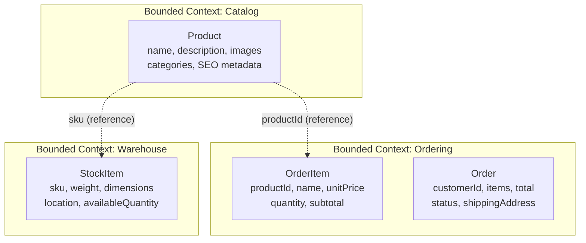
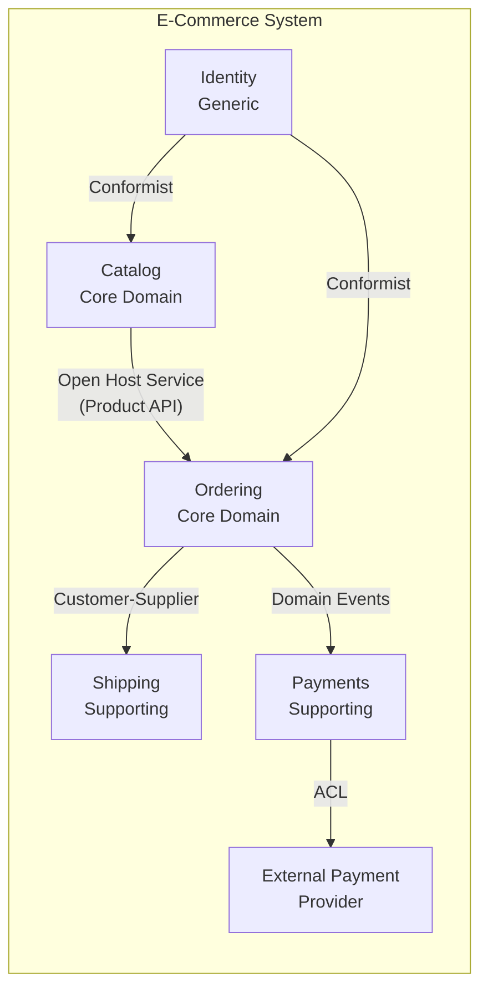
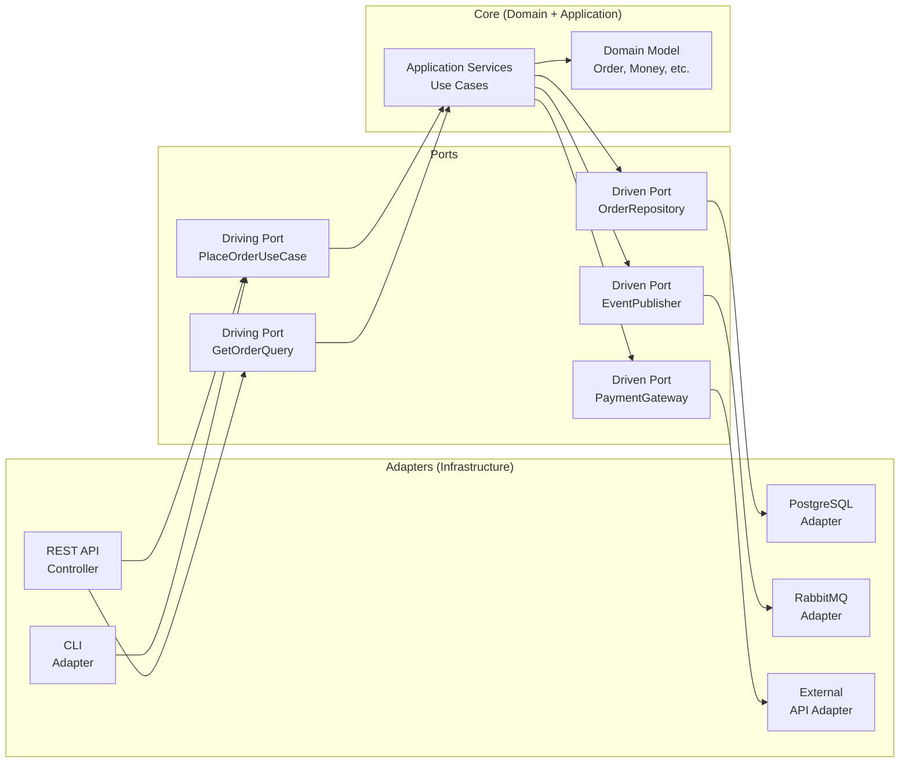
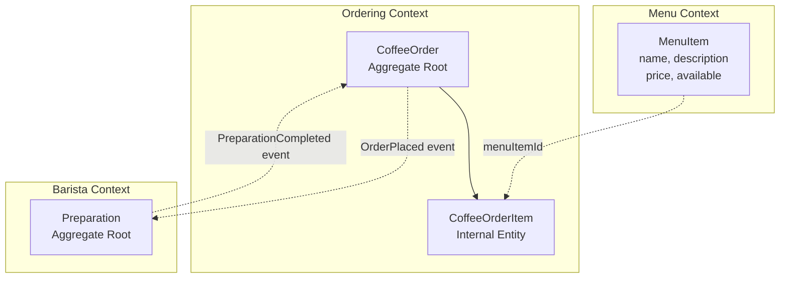

# Domain-Driven Design — przewodnik z TypeScript

---

## Spis treści

- [Część I — Strategiczne DDD](#część-i--strategiczne-ddd)
  - [1. Dlaczego DDD?](#1--dlaczego-ddd-problemy-które-rozwiązuje)
  - [2. Ubiquitous Language](#2--ubiquitous-language-język-wszechobecny)
  - [3. Bounded Context](#3--bounded-context-kontekst-ograniczony)
  - [4. Context Mapping](#4--context-mapping-mapa-kontekstów)
  - [5. Subdomains](#5--subdomains-poddomeny)
- [Część II — Taktyczne DDD](#część-ii--taktyczne-ddd-building-blocks)
  - [6. Value Objects](#6--value-objects-obiekty-wartości)
  - [7. Entities](#7--entities-encje)
  - [8. Aggregates](#8--aggregates-i-aggregate-root)
  - [9. Domain Events](#9--domain-events-zdarzenia-domenowe)
  - [10. Repositories](#10--repositories-repozytoria)
  - [11. Domain Services](#11--domain-services-serwisy-domenowe)
  - [12. Application Services](#12--application-services-serwisy-aplikacyjne)
  - [13. Factories](#13--factories-fabryki)
- [Część III — Architektura](#część-iii--architektura-i-zaawansowane-wzorce)
  - [14. Hexagonal Architecture](#14--layered--hexagonal-architecture)
  - [15. CQRS](#15--cqrs)
  - [16. Event Sourcing](#16--event-sourcing)
- [Część IV — Praktyka](#część-iv--praktyka)
  - [17. Kompletny przykład: CoffeeShop](#17--kompletny-przykład-end-to-end-coffeeshop)
  - [18. Checklista DDD](#18--checklista-ddd)

---

## Wspólne typy bazowe

Zanim przejdziemy do rozdziałów, zdefiniujmy typy, które będą używane w całym przewodniku:

```typescript
// shared/result.ts — Result monad zamiast wyjątków
export type Result<T, E = string> =
  | { readonly ok: true; readonly value: T }
  | { readonly ok: false; readonly error: E };

export const Ok = <T>(value: T): Result<T, never> => ({ ok: true, value });
export const Err = <E>(error: E): Result<never, E> => ({ ok: false, error });

// shared/brand.ts — Branded types dla type-safe ID
declare const __brand: unique symbol;
export type Brand<T, B extends string> = T & { readonly [__brand]: B };

// Przykładowe branded ID
export type OrderId = Brand<string, 'OrderId'>;
export type UserId = Brand<string, 'UserId'>;
export type ProductId = Brand<string, 'ProductId'>;

// Helper do tworzenia branded values
export const createId = <T extends Brand<string, string>>(value: string): T =>
  value as T;
```

---

# Część I — Strategiczne DDD

---

## 1. 🧭 Dlaczego DDD? Problemy, które rozwiązuje

### Złożoność przypadkowa vs istotna

Każdy system oprogramowania zmaga się z dwoma rodzajami złożoności:

- **Złożoność istotna (essential complexity)** — wynika z natury problemu biznesowego. System ubezpieczeniowy *musi* obsługiwać dziesiątki typów polis, klauzul i reguł wyceny, bo taki jest biznes. Tej złożoności nie da się usunąć.
- **Złożoność przypadkowa (accidental complexity)** — wynika z naszych decyzji technicznych: źle dobrane abstrakcje, wyciekający model bazy danych do UI, brak jasnych granic między modułami. Tę złożoność *sami* tworzymy i *możemy* ją eliminować.

DDD atakuje oba fronty. Strategiczne DDD (Bounded Contexts, Ubiquitous Language) pomaga **okiełznać złożoność istotną** — modelujesz domenę tak, jak myślą o niej eksperci. Taktyczne DDD (Aggregates, Value Objects) pomaga **minimalizować złożoność przypadkową** — dajesz kodowi strukturę, która chroni niezmienniki biznesowe.

### Kiedy DDD ma sens

DDD to narzędzie do **złożonych domen biznesowych**. Nie każdy system tego potrzebuje. Prosta apka CRUD z pięcioma endpointami nie skorzysta z Agregatów i Domain Events — to jak strzelanie z armaty do muchy.

DDD ma sens gdy:
- Reguły biznesowe są skomplikowane i zmieniają się często
- System będzie rozwijany latami przez wiele zespołów
- Eksperci domenowi mają głęboką wiedzę, którą trzeba przełożyć na kod
- Błędy w logice biznesowej mają poważne konsekwencje (finanse, medycyna, logistyka)

DDD **nie** ma sensu gdy:
- Budujesz proste CRUD API
- Domena jest trywialna (blog, landing page)
- Zespół jest jednoosobowy i projekt ma żyć 3 miesiące
- Nie masz dostępu do ekspertów domenowych

### DDD vs inne podejścia

```
┌─────────────────────────────────────────────────────────────────┐
│                    Spektrum podejść                              │
│                                                                 │
│  CRUD/Active Record ──── Anemic Domain ──── Rich Domain (DDD)  │
│                                                                 │
│  • Logika w kontrolerach  • Encje = struktury   • Encje = zachow.│
│  • Brak warstw            • Logika w serwisach  • Niezmienniki  │
│  • Szybki start           • Łatwy ORM mapping   • Bounded Ctx  │
│  • Trudne utrzymanie      • Rozproszony model   • Wyższy koszt  │
│    w skali                                        wejścia       │
└─────────────────────────────────────────────────────────────────┘
```

**Anemic Domain Model** — encje zawierają tylko dane (gettery/settery), a cała logika żyje w serwisach. Wygląda jak DDD, ale łamie jego fundamentalną zasadę: zachowanie powinno być przy danych. Wynik? Logika rozproszona po dziesiątkach serwisów, niemożliwa do zrozumienia bez czytania ich wszystkich.

```typescript
// ❌ Anemic Domain Model — encja to worek na dane
class Order {
  id: string;
  status: string;
  items: OrderItem[];
  totalAmount: number;

  // Tylko gettery i settery — zero logiki
}

class OrderService {
  // Cała logika biznesowa jest tu, oderwana od danych
  cancel(order: Order): void {
    if (order.status === 'shipped') {
      throw new Error('Cannot cancel shipped order');
    }
    order.status = 'cancelled';
    order.totalAmount = 0;
  }
}

// ✅ Rich Domain Model (DDD) — encja chroni swoje niezmienniki
class RichOrder {
  private constructor(
    readonly id: OrderId,
    private _status: OrderStatus,
    private readonly _items: ReadonlyArray<OrderItem>,
  ) {}

  cancel(): Result<void, string> {
    if (this._status === OrderStatus.Shipped) {
      return Err('Cannot cancel shipped order');
    }
    this._status = OrderStatus.Cancelled;
    return Ok(undefined);
  }

  get totalAmount(): Money {
    return this._items.reduce(
      (sum, item) => sum.add(item.subtotal),
      Money.zero('PLN'),
    );
  }
}
```

### Typowe błędy

1. **Wdrażanie DDD wszędzie** — stosowanie Agregatów i Domain Events do prostego CRUD-a. Wynik: 10x więcej kodu, zero korzyści.
2. **DDD bez ekspertów domenowych** — programiści wymyślają domenę sami. Wynik: model, który nie odpowiada rzeczywistości biznesowej.
3. **Taktyczne DDD bez strategicznego** — Value Objects i Aggregates bez Bounded Contexts. Wynik: jeden ogromny model, który próbuje być wszystkim.

### Kiedy NIE stosować

- Prototypy i MVP — najpierw zwaliduj pomysł, potem refaktoryzuj do DDD
- Systemy raportowe / read-heavy — CQRS read model wystarczy, pełne DDD jest zbędne
- Integracje i przepływ danych (ETL) — tu nie ma złożonej logiki domenowej
- Gdy zespół nie rozumie DDD — źle zastosowane DDD jest gorsze niż brak DDD

---

## 2. 🗣️ Ubiquitous Language (Język Wszechobecny)

### Czym jest Ubiquitous Language

Ubiquitous Language to **wspólny język** zespołu developerskiego i ekspertów domenowych. Nie jest to ani żargon techniczny programistów, ani potoczny język biznesu — to precyzyjny, uzgodniony zbiór terminów, który pojawia się **wszędzie**: w rozmowach, dokumentacji, kodzie, testach i nazwach klas.

Kluczowa zasada: **jeśli ekspert domenowy mówi "Zamówienie jest anulowane", w kodzie musi istnieć metoda `cancel()` na klasie `Order`, a nie `setStatus('inactive')`**. Każde odchylenie od języka to stracona informacja.

Ubiquitous Language nie jest statyczny — ewoluuje w miarę jak zespół lepiej rozumie domenę. Nowe odkrycia zmieniają terminologię, a terminologia zmienia kod. To zamknięta pętla.

### Jak budować wspólny język

1. **Event Storming** — warsztat z ekspertami, gdzie na karteczkach zapisujecie zdarzenia domenowe ("Zamówienie złożone", "Płatność zaakceptowana"). Z nich wyłania się język.
2. **Słownik domenowy (glossary)** — dokument z definicjami terminów. Nie musi być formalny — wiki lub plik Markdown.
3. **Code review pod kątem języka** — czy nazwy w kodzie pasują do tego, co mówi biznes?

### Jak język przekłada się na kod

```typescript
// ===== Bez Ubiquitous Language =====
// Programista wymyślił własne nazwy — ekspert nie rozpozna domeny

interface DataRecord {
  id: string;
  type: number;       // Co to jest "type 1" vs "type 2"?
  status: string;     // "active"? "pending"? Jakiej domeny?
  items: ItemDTO[];
  processData(flag: boolean): void;  // Co to za "process"?
}

class Manager {
  handleRequest(record: DataRecord): void {
    if (record.type === 1 && record.status === 'active') {
      record.processData(true);
    }
  }
}

// ===== Z Ubiquitous Language =====
// Kod czyta się jak opis biznesowy — ekspert zrozumie intencję

enum PolicyType {
  Individual = 'individual',
  Group = 'group',
}

enum PolicyStatus {
  Draft = 'draft',
  Active = 'active',
  Expired = 'expired',
  Cancelled = 'cancelled',
}

class InsurancePolicy {
  private constructor(
    readonly policyId: PolicyId,
    private readonly _type: PolicyType,
    private _status: PolicyStatus,
    private readonly _coverages: ReadonlyArray<Coverage>,
  ) {}

  activate(): Result<void, string> {
    if (this._status !== PolicyStatus.Draft) {
      return Err('Only draft policies can be activated');
    }
    if (this._coverages.length === 0) {
      return Err('Policy must have at least one coverage');
    }
    this._status = PolicyStatus.Active;
    return Ok(undefined);
  }

  addCoverage(coverage: Coverage): Result<void, string> {
    if (this._status !== PolicyStatus.Draft) {
      return Err('Cannot modify active policy');
    }
    // ... logika dodawania
    return Ok(undefined);
  }
}
```

Zwróć uwagę na różnice:
- `DataRecord` → `InsurancePolicy` — od razu wiesz, w jakiej domenie jesteś
- `type: number` → `PolicyType.Individual` — enum mówi sam za siebie
- `processData(true)` → `activate()` — metoda opisuje akcję biznesową
- `Manager.handleRequest()` → brak generic handlera — każda operacja jest jawna

### Typowe błędy

1. **Język techniczny zamiast domenowego** — `UserEntity`, `OrderDTO`, `handleEvent()`. Ekspert domenowy nie mówi "entity". Mówi "klient", "zamówienie", "złóż zamówienie".
2. **Synonimy** — w jednym miejscu `Client`, w innym `Customer`, w trzecim `User` na to samo pojęcie. Chaos gwarantowany.
3. **Tłumaczenie na siłę** — w polskim projekcie nie musisz mówić "Zamówienie" jeśli cały zespół naturalnie używa "Order". Ubiquitous Language to język *zespołu*, nie język *narodu*.

### Kiedy NIE stosować

- W kodzie czysto technicznym (infrastruktura, framework) — tu terminologia techniczna jest właściwa
- W generycznych bibliotekach — one nie mają domeny biznesowej
- Gdy ekspert domenowy nie istnieje lub nie jest dostępny — wtedy język będzie fikcją

---

## 3. 🔲 Bounded Context (Kontekst Ograniczony)

### Granice kontekstu

Bounded Context to **jawna granica**, wewnątrz której dany model domenowy jest spójny i ma sens. To nie jest moduł techniczny ani mikroserwis — to granica **językowa i konceptualna**.

Kluczowy insight: **ten sam termin oznacza co innego w różnych kontekstach**. "Produkt" w kontekście Katalogu to nazwa, opis i zdjęcia. "Produkt" w kontekście Magazynu to SKU, waga i lokalizacja na półce. "Produkt" w kontekście Zamówień to pozycja z ceną i ilością. Próba stworzenia jednego `Product` dla wszystkich to proszenie się o god object.

Bounded Context wyznaczamy odpowiadając na pytania:
- Kto używa tego modelu? (inny zespół = prawdopodobnie inny kontekst)
- Czy ten sam termin ma tu inne znaczenie? (tak = na pewno inny kontekst)
- Czy te elementy zmieniają się razem? (nie = kandydat na osobny kontekst)

### Przykład: e-commerce z trzema kontekstami



```typescript
// ========================================
// catalog/domain/product.ts
// Kontekst: Katalog — pełny opis produktu dla klientów
// ========================================

type CatalogProductId = Brand<string, 'CatalogProductId'>;

interface ProductImage {
  readonly url: string;
  readonly alt: string;
  readonly sortOrder: number;
}

class CatalogProduct {
  private constructor(
    readonly id: CatalogProductId,
    private _name: string,
    private _description: string,
    private readonly _images: ProductImage[],
    private readonly _categories: ReadonlyArray<string>,
  ) {}

  static create(props: {
    id: CatalogProductId;
    name: string;
    description: string;
  }): Result<CatalogProduct, string> {
    if (props.name.trim().length < 3) {
      return Err('Product name must be at least 3 characters');
    }
    return Ok(new CatalogProduct(
      props.id, props.name, props.description, [], [],
    ));
  }

  updateDescription(description: string): void {
    this._description = description;
  }

  addImage(image: ProductImage): void {
    this._images.push(image);
  }
}

// ========================================
// ordering/domain/order-item.ts
// Kontekst: Zamówienia — produkt to tylko pozycja z ceną
// ========================================

type OrderItemId = Brand<string, 'OrderItemId'>;

class OrderItem {
  private constructor(
    readonly id: OrderItemId,
    readonly productId: string,     // Referencja po ID, nie cały obiekt!
    readonly productName: string,   // Snapshot nazwy w momencie zamówienia
    private readonly _unitPrice: Money,
    private _quantity: number,
  ) {}

  static create(props: {
    productId: string;
    productName: string;
    unitPrice: Money;
    quantity: number;
  }): Result<OrderItem, string> {
    if (props.quantity < 1) {
      return Err('Quantity must be at least 1');
    }
    return Ok(new OrderItem(
      createId<OrderItemId>(crypto.randomUUID()),
      props.productId,
      props.productName,
      props.unitPrice,
      props.quantity,
    ));
  }

  get subtotal(): Money {
    return this._unitPrice.multiply(this._quantity);
  }
}

// ========================================
// warehouse/domain/stock-item.ts
// Kontekst: Magazyn — produkt to fizyczny obiekt na półce
// ========================================

type StockItemId = Brand<string, 'StockItemId'>;
type Sku = Brand<string, 'Sku'>;

interface Dimensions {
  readonly lengthCm: number;
  readonly widthCm: number;
  readonly heightCm: number;
}

class StockItem {
  private constructor(
    readonly id: StockItemId,
    readonly sku: Sku,
    private readonly _weightGrams: number,
    private readonly _dimensions: Dimensions,
    private _location: string,
    private _availableQuantity: number,
  ) {}

  reserve(quantity: number): Result<void, string> {
    if (quantity > this._availableQuantity) {
      return Err(
        `Cannot reserve ${quantity} items, only ${this._availableQuantity} available`,
      );
    }
    this._availableQuantity -= quantity;
    return Ok(undefined);
  }

  restock(quantity: number): void {
    this._availableQuantity += quantity;
  }

  relocate(newLocation: string): void {
    this._location = newLocation;
  }
}
```

Zwróć uwagę:
- `CatalogProduct` ma zdjęcia, kategorie, SEO — nic o stanach magazynowych
- `OrderItem` ma snapshot nazwy i ceny — nie referencję do żywego obiektu katalogu
- `StockItem` ma SKU, wagę, wymiary, lokalizację — nic o opisach marketingowych
- Konteksty komunikują się **po ID**, nie przez współdzielone obiekty

### Typowe błędy

1. **Jeden model na cały system** — god object `Product` z 50 polami, z których każdy kontekst używa 10 innych.
2. **Bounded Context = mikroserwis** — BC to granica logiczna, nie deployment unit. Jeden monorepo może mieć wiele BC jako moduły.
3. **Współdzielenie encji między kontekstami** — importowanie `Order` z kontekstu Zamówień do kontekstu Wysyłek. Zamiast tego: osobny model `Shipment` z `orderId`.

### Kiedy NIE stosować

- Gdy domena jest na tyle prosta, że jeden model ją obsługuje bez bólu
- Na początku projektu, gdy nie rozumiesz jeszcze granic — lepiej zacząć od jednego modelu i rozdzielić, gdy granice staną się widoczne
- W prototypach — BC dodaje strukturę, której prototyp nie potrzebuje

---

## 4. 🗺️ Context Mapping (Mapa Kontekstów)

### Wzorce relacji między kontekstami

Gdy masz wiele Bounded Contexts, muszą one jakoś współpracować. Context Map opisuje **relacje** i **zależności** między kontekstami. Nie jest to diagram techniczny (kto woła czyje API), ale diagram **organizacyjny i konceptualny**.

Główne wzorce:

| Wzorzec | Relacja | Opis |
|---------|---------|------|
| **Shared Kernel** | Partnerska | Oba konteksty współdzielą mały model. Zmiany wymagają zgody obu zespołów. |
| **Customer-Supplier** | Upstream-Downstream | Supplier (upstream) dostarcza model, Customer (downstream) go konsumuje. Customer może negocjować. |
| **Conformist** | Upstream-Downstream | Jak Customer-Supplier, ale downstream akceptuje model upstream bez negocjacji. |
| **Anti-Corruption Layer** | Ochronna | Downstream tłumaczy model upstream na swój własny — nie pozwala obcemu modelowi „wlać się" do swojej domeny. |
| **Open Host Service** | Publiczna | Upstream wystawia dobrze zdefiniowane API (kontrakt) dla wielu downstream. |
| **Published Language** | Standardowa | Wspólny format danych (JSON Schema, Protocol Buffers). Często łączony z OHS. |
| **Separate Ways** | Brak | Konteksty nie integrują się — każdy rozwiązuje problem samodzielnie. |

### Diagram mapy kontekstów



### Implementacja Anti-Corruption Layer

ACL to najważniejszy wzorzec w praktyce. Chroni Twój model domenowy przed „zanieczyszczeniem" obcymi modelami — szczególnie gdy integrujesz się z zewnętrznymi API, legacy systemami lub kontekstami nad którymi nie masz kontroli.

```typescript
// ========================================
// Zewnętrzne API płatności — model, którego NIE kontrolujemy
// ========================================

// To jest format danych z zewnętrznego providera płatności
interface ExternalPaymentResponse {
  readonly transaction_id: string;
  readonly amount_cents: number;
  readonly currency_code: string;
  readonly status: 'SUCCESS' | 'FAILURE' | 'PENDING' | 'REFUNDED';
  readonly processor_message: string;
  readonly created_at: string;
  readonly metadata: Record<string, unknown>;
}

// ========================================
// Nasz model domenowy — to jest NASZ język
// ========================================

// payments/domain/types.ts
type PaymentId = Brand<string, 'PaymentId'>;

enum PaymentStatus {
  Pending = 'pending',
  Confirmed = 'confirmed',
  Failed = 'failed',
  Refunded = 'refunded',
}

class Payment {
  private constructor(
    readonly id: PaymentId,
    readonly orderId: OrderId,
    private readonly _amount: Money,
    private _status: PaymentStatus,
    private readonly _confirmedAt: Date | null,
  ) {}

  static fromGatewayResponse(
    orderId: OrderId,
    gatewayPayment: GatewayPaymentResult,
  ): Payment {
    return new Payment(
      gatewayPayment.paymentId,
      orderId,
      gatewayPayment.amount,
      gatewayPayment.status,
      gatewayPayment.confirmedAt,
    );
  }

  get isConfirmed(): boolean {
    return this._status === PaymentStatus.Confirmed;
  }
}

// ========================================
// Anti-Corruption Layer — tłumaczy obcy model na nasz
// ========================================

// payments/infrastructure/acl/payment-gateway-acl.ts

// Port (interfejs w domenie) — nasz kontrakt
interface GatewayPaymentResult {
  readonly paymentId: PaymentId;
  readonly amount: Money;
  readonly status: PaymentStatus;
  readonly confirmedAt: Date | null;
}

interface PaymentGateway {
  charge(orderId: OrderId, amount: Money): Promise<Result<GatewayPaymentResult, string>>;
}

// Adapter (implementacja w infrastrukturze) — tłumaczy z obcego na nasz
class StripePaymentGatewayAdapter implements PaymentGateway {
  constructor(private readonly stripeClient: ExternalStripeClient) {}

  async charge(
    orderId: OrderId,
    amount: Money,
  ): Promise<Result<GatewayPaymentResult, string>> {
    // Wywołanie zewnętrznego API
    const externalResponse = await this.stripeClient.createCharge({
      amount_cents: amount.cents,
      currency_code: amount.currency,
      metadata: { order_id: orderId },
    });

    // ↓↓↓ TU JEST ACL — tłumaczenie z obcego modelu na nasz ↓↓↓
    return Ok(this.translate(externalResponse));
  }

  private translate(response: ExternalPaymentResponse): GatewayPaymentResult {
    return {
      paymentId: createId<PaymentId>(response.transaction_id),
      amount: Money.fromCents(response.amount_cents, response.currency_code),
      status: this.mapStatus(response.status),
      confirmedAt: response.status === 'SUCCESS'
        ? new Date(response.created_at)
        : null,
    };
  }

  private mapStatus(externalStatus: ExternalPaymentResponse['status']): PaymentStatus {
    const mapping: Record<ExternalPaymentResponse['status'], PaymentStatus> = {
      SUCCESS: PaymentStatus.Confirmed,
      FAILURE: PaymentStatus.Failed,
      PENDING: PaymentStatus.Pending,
      REFUNDED: PaymentStatus.Refunded,
    };
    return mapping[externalStatus];
  }
}

// Dummy type for compilation
interface ExternalStripeClient {
  createCharge(params: {
    amount_cents: number;
    currency_code: string;
    metadata: Record<string, unknown>;
  }): Promise<ExternalPaymentResponse>;
}
```

Dzięki ACL:
- Zmiana providera płatności (Stripe → PayU) wymaga napisania nowego adaptera, **zero zmian w domenie**
- Obcy model (`transaction_id`, `amount_cents`) nie zaśmieca naszego kodu
- Mapowanie statusów jest jawne i w jednym miejscu

### Typowe błędy

1. **Brak ACL przy integracji z zewnętrznymi API** — używanie typów z zewnętrznej biblioteki bezpośrednio w domenie. Gdy provider zmieni API, Twoja domena się sypie.
2. **Za duży Shared Kernel** — jeśli współdzielony model rośnie, to sygnał, że konteksty są źle podzielone.
3. **Conformist gdy powinien być ACL** — akceptujesz obcy model bez tłumaczenia, bo "po co pisać tyle kodu". Potem model upstream się zmienia i Twoja domena eksploduje.

### Kiedy NIE stosować

- Wewnątrz jednego Bounded Context — tu nie ma "obcych" modeli
- Gdy integracja jest trywialna (jedno pole, jeden status) — ACL dla jednego pola to przesada
- Gdy kontrolujesz oba konteksty i model jest stabilny — Shared Kernel może wystarczyć

---

## 5. 📊 Subdomains (Poddomeny)

### Typy poddomen

Nie każda część systemu zasługuje na taką samą ilość uwagi. DDD dzieli domenę na **poddomeny** według ich strategicznego znaczenia:

**Core Domain** — to jest serce Twojego biznesu, to co odróżnia Cię od konkurencji. Tu inwestujesz najlepszych ludzi, tu stosujesz pełne DDD, tu nie idziesz na skróty. Dla Ubera core domain to matching kierowców z pasażerami. Dla Spotify to rekomendacje muzyki.

**Supporting Subdomain** — wspiera Core Domain, ale nie jest unikalna. Ma logikę biznesową, ale nie stanowi przewagi konkurencyjnej. Można ją zbudować wewnętrznie lub zlecić. Przykład: moduł zarządzania zamówieniami w firmie, której core to algorytm wyceny.

**Generic Subdomain** — rozwiązanie standardowe, identyczne w każdej firmie. Autentykacja, wysyłka maili, generowanie PDF-ów. Tu używasz gotowych rozwiązań (Auth0, SendGrid) — nie wynajduj koła na nowo.

```
┌─────────────────────────────────────────────────────────────┐
│                  Priorytetyzacja wysiłku                     │
│                                                             │
│  Core Domain          ████████████████████  DDD, najlepsi   │
│  (algorytm wyceny)                          ludzie, testy   │
│                                                             │
│  Supporting           ██████████           DDD lite lub     │
│  (zarządzanie         ██████████           solidny CRUD     │
│   polisami)                                                 │
│                                                             │
│  Generic              ████                 Gotowe           │
│  (auth, mail,         ████                 rozwiązania      │
│   PDF)                                                      │
└─────────────────────────────────────────────────────────────┘
```

### Przykład identyfikacji poddomen

```typescript
// System dla firmy ubezpieczeniowej

// ─── CORE DOMAIN: Underwriting (wycena ryzyka) ───
// Tu jest unikalna logika — algorytmy, reguły, modele ryzyka
// Pełne DDD: Aggregates, Domain Events, Value Objects

class RiskAssessment {
  private constructor(
    readonly id: RiskAssessmentId,
    private readonly _factors: ReadonlyArray<RiskFactor>,
    private _score: RiskScore,
    private _premium: Money,
  ) {}

  recalculate(updatedFactors: ReadonlyArray<RiskFactor>): Result<void, string> {
    // Złożona logika wyceny — serce biznesu
    const newScore = this.evaluateRisk(updatedFactors);
    if (!newScore.ok) return newScore;
    this._score = newScore.value;
    this._premium = this.calculatePremium(newScore.value);
    return Ok(undefined);
  }

  private evaluateRisk(factors: ReadonlyArray<RiskFactor>): Result<RiskScore, string> {
    // Skomplikowane reguły wyceny ryzyka...
    return Ok({ level: 'medium', numericScore: 65 } as RiskScore);
  }

  private calculatePremium(score: RiskScore): Money {
    // Złożona kalkulacja składki...
    return Money.of(1200, 'PLN');
  }
}

// ─── SUPPORTING: Policy Management ───
// Standardowa logika CRUD+ z kilkoma regułami biznesowymi
// DDD lite — encje z walidacją, ale bez złożonych agregatów

interface PolicyRecord {
  readonly id: string;
  readonly policyNumber: string;
  readonly holderId: string;
  readonly startDate: Date;
  readonly endDate: Date;
  readonly status: 'draft' | 'active' | 'expired' | 'cancelled';
  readonly premiumAmount: number;
}

// ─── GENERIC: Notifications ───
// Wysyłka maili i SMS — kupione rozwiązanie
// Brak DDD — prosta integracja z zewnętrznym serwisem

interface NotificationService {
  sendEmail(to: string, subject: string, body: string): Promise<void>;
  sendSms(phone: string, message: string): Promise<void>;
}

// Implementacja: wrapper na SendGrid/Twilio — zero logiki domenowej

// Dummy types for compilation
type RiskAssessmentId = Brand<string, 'RiskAssessmentId'>;
type RiskFactor = { readonly name: string; readonly value: number };
type RiskScore = { readonly level: string; readonly numericScore: number };
```

### Typowe błędy

1. **Traktowanie wszystkiego jako Core Domain** — stosowanie DDD do generowania PDF-ów. Jeśli nie daje przewagi konkurencyjnej, nie jest core.
2. **Outsourcing Core Domain** — oddanie najważniejszej części systemu firmie zewnętrznej. Core Domain to Twoja przewaga — nie oddawaj jej.
3. **Brak priorytetyzacji** — jednakowy wysiłek na wszystkie poddomeny. Wynik: core domain jest niedoinwestowane, a generyczny moduł maili ma trzy warstwy abstrakcji.

### Kiedy NIE stosować

Podział na poddomeny jest zawsze przydatny do myślenia strategicznego. Ale formalna kategoryzacja nie ma sensu w:
- Projektach z jedną poddomeną (mały produkt z jednym kontekstem)
- Bardzo wczesnej fazie projektu, gdy nie wiesz jeszcze, co jest core

---

# Część II — Taktyczne DDD (building blocks)

---

## 6. 💎 Value Objects (Obiekty Wartości)

### Czym jest Value Object

Value Object to obiekt definiowany przez swoje **atrybuty**, nie przez tożsamość. Dwa Value Objects z takimi samymi wartościami są **identyczne** — tak jak dwa banknoty 100 zł nie mają indywidualnej tożsamości, liczy się tylko nominał i waluta.

Fundamentalne cechy:
- **Niemutowalność** — po utworzeniu nie zmienia się. Operacje zwracają nowe instancje.
- **Porównywanie przez wartość** — `Money(100, 'PLN').equals(Money(100, 'PLN'))` → `true`
- **Brak tożsamości** — nie ma ID, nie żyje samodzielnie w bazie danych
- **Samo-walidacja** — nie można utworzyć niepoprawnego Value Object (walidacja w konstruktorze/factory method)

Value Objects to **najważniejszy building block DDD**, choć często niedoceniany. Zastępują prymitywne typy (`string`, `number`) bogato typowanymi, samo-walidującymi się obiektami. To eliminuje całą klasę bugów: nieprawidłowe emaile, ujemne kwoty, daty w złym formacie.

### Implementacja

```typescript
// ========================================
// value-objects/base.ts — Klasa bazowa
// ========================================

export abstract class ValueObject<T extends Record<string, unknown>> {
  protected readonly props: Readonly<T>;

  protected constructor(props: T) {
    this.props = Object.freeze(props);
  }

  equals(other: ValueObject<T>): boolean {
    if (other === null || other === undefined) return false;
    if (other.constructor !== this.constructor) return false;

    const thisKeys = Object.keys(this.props);
    const otherKeys = Object.keys(other.props);
    if (thisKeys.length !== otherKeys.length) return false;

    return thisKeys.every(
      (key) => this.props[key] === other.props[key],
    );
  }
}

// ========================================
// value-objects/money.ts
// ========================================

type Currency = 'PLN' | 'EUR' | 'USD';

interface MoneyProps {
  readonly amount: number;    // W groszach/centach — unikamy float
  readonly currency: Currency;
}

export class Money extends ValueObject<MoneyProps> {
  private constructor(props: MoneyProps) {
    super(props);
  }

  static of(amountInMajorUnits: number, currency: Currency): Money {
    return new Money({
      amount: Math.round(amountInMajorUnits * 100),
      currency,
    });
  }

  static fromCents(cents: number, currency: string): Money {
    return new Money({
      amount: cents,
      currency: currency as Currency,
    });
  }

  static zero(currency: Currency): Money {
    return new Money({ amount: 0, currency });
  }

  get cents(): number {
    return this.props.amount;
  }

  get currency(): Currency {
    return this.props.currency;
  }

  get displayAmount(): number {
    return this.props.amount / 100;
  }

  add(other: Money): Money {
    this.assertSameCurrency(other);
    return new Money({
      amount: this.props.amount + other.props.amount,
      currency: this.props.currency,
    });
  }

  subtract(other: Money): Result<Money, string> {
    this.assertSameCurrency(other);
    const result = this.props.amount - other.props.amount;
    if (result < 0) {
      return Err('Subtraction would result in negative amount');
    }
    return Ok(new Money({ amount: result, currency: this.props.currency }));
  }

  multiply(factor: number): Money {
    return new Money({
      amount: Math.round(this.props.amount * factor),
      currency: this.props.currency,
    });
  }

  isGreaterThan(other: Money): boolean {
    this.assertSameCurrency(other);
    return this.props.amount > other.props.amount;
  }

  toString(): string {
    return `${this.displayAmount.toFixed(2)} ${this.props.currency}`;
  }

  private assertSameCurrency(other: Money): void {
    if (this.props.currency !== other.props.currency) {
      throw new Error(
        `Currency mismatch: ${this.props.currency} vs ${other.props.currency}`,
      );
    }
  }
}

// ========================================
// value-objects/email-address.ts
// ========================================

interface EmailProps {
  readonly value: string;
}

export class EmailAddress extends ValueObject<EmailProps> {
  private static readonly EMAIL_REGEX = /^[^\s@]+@[^\s@]+\.[^\s@]+$/;

  private constructor(props: EmailProps) {
    super(props);
  }

  static create(email: string): Result<EmailAddress, string> {
    const normalized = email.trim().toLowerCase();
    if (!EmailAddress.EMAIL_REGEX.test(normalized)) {
      return Err(`Invalid email address: ${email}`);
    }
    return Ok(new EmailAddress({ value: normalized }));
  }

  get value(): string {
    return this.props.value;
  }

  get domain(): string {
    return this.props.value.split('@')[1];
  }

  toString(): string {
    return this.props.value;
  }
}

// ========================================
// value-objects/date-range.ts
// ========================================

interface DateRangeProps {
  readonly start: number;  // timestamp
  readonly end: number;    // timestamp
}

export class DateRange extends ValueObject<DateRangeProps> {
  private constructor(props: DateRangeProps) {
    super(props);
  }

  static create(start: Date, end: Date): Result<DateRange, string> {
    if (end.getTime() <= start.getTime()) {
      return Err('End date must be after start date');
    }
    return Ok(new DateRange({
      start: start.getTime(),
      end: end.getTime(),
    }));
  }

  get start(): Date {
    return new Date(this.props.start);
  }

  get end(): Date {
    return new Date(this.props.end);
  }

  get durationInDays(): number {
    return Math.ceil(
      (this.props.end - this.props.start) / (1000 * 60 * 60 * 24),
    );
  }

  contains(date: Date): boolean {
    const ts = date.getTime();
    return ts >= this.props.start && ts <= this.props.end;
  }

  overlaps(other: DateRange): boolean {
    return this.props.start < other.props.end
      && this.props.end > other.props.start;
  }
}

// ========================================
// value-objects/address.ts
// ========================================

interface AddressProps {
  readonly street: string;
  readonly city: string;
  readonly postalCode: string;
  readonly country: string;
}

export class Address extends ValueObject<AddressProps> {
  private constructor(props: AddressProps) {
    super(props);
  }

  static create(props: AddressProps): Result<Address, string> {
    if (!props.street.trim()) return Err('Street is required');
    if (!props.city.trim()) return Err('City is required');
    if (!props.postalCode.trim()) return Err('Postal code is required');
    if (!props.country.trim()) return Err('Country is required');
    return Ok(new Address({
      street: props.street.trim(),
      city: props.city.trim(),
      postalCode: props.postalCode.trim(),
      country: props.country.trim(),
    }));
  }

  get fullAddress(): string {
    return `${this.props.street}, ${this.props.postalCode} ${this.props.city}, ${this.props.country}`;
  }
}

// ========================================
// Użycie — kontrast z prymitywnymi typami
// ========================================

// ❌ Primitive obsession — string to za mało na email
function sendInvoiceBad(
  email: string,      // Może być "not-an-email", "", null
  amount: number,     // Może być ujemne, w jakiej walucie?
  currency: string,   // "PLN"? "pln"? "zł"?
) {
  // Musisz walidować TUTAJ, i WSZĘDZIE INDZIEJ gdzie te dane przepływają
}

// ✅ Value Objects — walidacja i spójność wbudowana
function sendInvoiceGood(
  email: EmailAddress,  // Zawsze poprawny — walidacja w factory method
  amount: Money,        // Zawsze spójny: kwota + waluta razem, w centach
) {
  // Nie musisz nic walidować — typy gwarantują poprawność
  console.log(`Sending ${amount} invoice to ${email}`);
}
```

### Typowe błędy

1. **Mutowalność** — tworzenie setterów na Value Object. Jeśli adres się zmienia, tworzysz nowy `Address`, nie modyfikujesz istniejący.
2. **Value Object z ID** — jeśli obiekt ma identyfikator, to jest Entity, nie Value Object.
3. **Zbyt duży Value Object** — jeśli Value Object ma 15 pól i złożoną logikę, prawdopodobnie powinien być Encją lub Agregatem.

### Kiedy NIE stosować

- Gdy prymitywny typ naprawdę wystarczy (np. `boolean` flag)
- W kodzie infrastrukturalnym (konfiguracja, routing) — tu DDD building blocks nie mają sensu
- Gdy obiekt potrzebuje tożsamości (musi być śledzony niezależnie od wartości)

---

## 7. 🏷️ Entities (Encje)

### Czym jest Encja

Encja to obiekt z **tożsamością**, która przetrwa zmiany jej atrybutów. Użytkownik, który zmieni nazwisko, email i adres, wciąż jest tym samym użytkownikiem — bo ma ten sam ID. To fundamentalna różnica od Value Object.

Cechy Encji:
- **Tożsamość** — porównywanie po ID, nie po atrybutach
- **Cykl życia** — encja jest tworzona, modyfikowana, ewentualnie usuwana
- **Kontrolowana mutowalność** — zmiana stanu odbywa się przez metody domenowe z walidacją, NIE przez publiczne settery
- **Zachowanie przy danych** — metody encji wyrażają operacje biznesowe

### Implementacja

```typescript
// ========================================
// entities/base.ts — Klasa bazowa Entity
// ========================================

export abstract class Entity<ID extends Brand<string, string>> {
  protected constructor(readonly id: ID) {}

  equals(other: Entity<ID>): boolean {
    if (other === null || other === undefined) return false;
    if (!(other instanceof Entity)) return false;
    return this.id === other.id;
  }
}

// ========================================
// entities/user.ts — Przykładowa encja User
// ========================================

type UserId = Brand<string, 'UserId'>;

enum UserStatus {
  Active = 'active',
  Suspended = 'suspended',
  Deactivated = 'deactivated',
}

class User extends Entity<UserId> {
  private constructor(
    id: UserId,
    private _email: EmailAddress,
    private _name: string,
    private _status: UserStatus,
    private _failedLoginAttempts: number,
    private readonly _createdAt: Date,
  ) {
    super(id);
  }

  static register(props: {
    id: UserId;
    email: EmailAddress;
    name: string;
  }): Result<User, string> {
    if (props.name.trim().length < 2) {
      return Err('Name must be at least 2 characters');
    }
    return Ok(new User(
      props.id,
      props.email,
      props.name.trim(),
      UserStatus.Active,
      0,
      new Date(),
    ));
  }

  // Metody domenowe — NIE settery!

  changeEmail(newEmail: EmailAddress): Result<void, string> {
    if (this._status === UserStatus.Deactivated) {
      return Err('Cannot change email of deactivated user');
    }
    this._email = newEmail;
    return Ok(undefined);
  }

  recordFailedLogin(): void {
    this._failedLoginAttempts += 1;
    if (this._failedLoginAttempts >= 5) {
      this._status = UserStatus.Suspended;
    }
  }

  resetFailedLogins(): void {
    this._failedLoginAttempts = 0;
  }

  suspend(reason: string): Result<void, string> {
    if (this._status === UserStatus.Deactivated) {
      return Err('Cannot suspend deactivated user');
    }
    this._status = UserStatus.Suspended;
    return Ok(undefined);
  }

  reactivate(): Result<void, string> {
    if (this._status !== UserStatus.Suspended) {
      return Err('Only suspended users can be reactivated');
    }
    this._status = UserStatus.Active;
    this._failedLoginAttempts = 0;
    return Ok(undefined);
  }

  deactivate(): void {
    this._status = UserStatus.Deactivated;
  }

  // Gettery — read-only dostęp
  get email(): EmailAddress { return this._email; }
  get name(): string { return this._name; }
  get status(): UserStatus { return this._status; }
  get isActive(): boolean { return this._status === UserStatus.Active; }
}
```

### Entity vs Value Object — decision matrix

```
┌──────────────────────┬───────────────────┬──────────────────┐
│ Pytanie              │ Entity            │ Value Object     │
├──────────────────────┼───────────────────┼──────────────────┤
│ Czy ma tożsamość?    │ ✅ Tak (ID)       │ ❌ Nie           │
│ Porównywanie         │ Po ID             │ Po wartościach   │
│ Mutowalność          │ Kontrolowana      │ Niemutowalne     │
│ Cykl życia           │ Tak               │ Nie              │
│ Przykłady            │ User, Order,      │ Money, Email,    │
│                      │ Product           │ Address, Color   │
│ Przechowywanie       │ Własna tabela/    │ Kolumny w tabeli │
│                      │ dokument          │ encji            │
│ Kiedy dwie instancje │ Ten sam ID =      │ Te same wartości │
│ są "takie same"?     │ ta sama encja     │ = to samo       │
└──────────────────────┴───────────────────┴──────────────────┘
```

Heurystyka: **jeśli zastępujesz instancję identyczną kopią i nikt nie zauważy różnicy — to Value Object. Jeśli zauważy — to Entity.**

### Typowe błędy

1. **Publiczne settery** — `user.status = 'active'` omija reguły biznesowe. Zamiast tego: `user.reactivate()` z walidacją.
2. **Anemic Entity** — encja z samymi getterami/setterami, logika w serwisach. To nie jest DDD.
3. **Entity zamiast Value Object** — nadawanie ID obiektom, które go nie potrzebują. `Address` prawie nigdy nie potrzebuje ID — jest częścią `User`, nie żyje samodzielnie.

### Kiedy NIE stosować

- Gdy obiekt nie ma tożsamości — użyj Value Object
- W raportach i widokach read-only — tam nie potrzebujesz bogatego modelu, wystarczy DTO
- W prostych CRUD-ach — encja z jednym polem i zerową logiką to overhead

---

## 8. 🧱 Aggregates i Aggregate Root

### Czym jest Aggregate

Aggregate to **klaster powiązanych obiektów** (encji i value objectów) traktowany jako **jedna jednostka** pod kątem zmian danych. Aggregate Root to **jedyny punkt wejścia** do agregatu — świat zewnętrzny komunikuje się wyłącznie przez root.

Dlaczego Aggregate jest kluczowy:
- **Granica transakcyjna** — jedna transakcja = jeden agregat. Nie modyfikujesz dwóch agregatów w jednej transakcji.
- **Granica spójności** — aggregate root gwarantuje, że wszystkie niezmienniki biznesowe są zachowane po każdej operacji.
- **Granica ładowania** — repozytorium ładuje i zapisuje cały agregat jako jednostkę.

Zasady:
1. Zewnętrzny kod odwołuje się do agregatu tylko przez root
2. Między agregatami — referencje tylko po ID, nie po obiektach
3. Wewnętrzne encje (np. `OrderLine`) nie są dostępne bezpośrednio z zewnątrz
4. Jeden agregat = jedna transakcja
5. Małe agregaty > duże agregaty (mniej konfliktów, lepszy performance)

### Implementacja

```typescript
// ========================================
// Aggregate: Order (Root) + OrderLine (wewnętrzna encja)
// ========================================

type OrderId = Brand<string, 'OrderId'>;
type OrderLineId = Brand<string, 'OrderLineId'>;

enum OrderStatus {
  Draft = 'draft',
  Placed = 'placed',
  Confirmed = 'confirmed',
  Shipped = 'shipped',
  Delivered = 'delivered',
  Cancelled = 'cancelled',
}

// Wewnętrzna encja — NIE jest dostępna z zewnątrz
class OrderLine extends Entity<OrderLineId> {
  private constructor(
    id: OrderLineId,
    readonly productId: string,
    readonly productName: string,
    private readonly _unitPrice: Money,
    private _quantity: number,
  ) {
    super(id);
  }

  static create(props: {
    productId: string;
    productName: string;
    unitPrice: Money;
    quantity: number;
  }): Result<OrderLine, string> {
    if (props.quantity < 1) {
      return Err('Quantity must be at least 1');
    }
    if (props.quantity > 100) {
      return Err('Cannot order more than 100 of a single item');
    }
    return Ok(new OrderLine(
      createId<OrderLineId>(crypto.randomUUID()),
      props.productId,
      props.productName,
      props.unitPrice,
      props.quantity,
    ));
  }

  get subtotal(): Money {
    return this._unitPrice.multiply(this._quantity);
  }

  get quantity(): number {
    return this._quantity;
  }

  updateQuantity(newQuantity: number): Result<void, string> {
    if (newQuantity < 1) return Err('Quantity must be at least 1');
    if (newQuantity > 100) return Err('Cannot order more than 100 of a single item');
    this._quantity = newQuantity;
    return Ok(undefined);
  }
}

// Aggregate Root — jedyny punkt wejścia
class Order extends Entity<OrderId> {
  private readonly _domainEvents: DomainEvent[] = [];

  private constructor(
    id: OrderId,
    private readonly _customerId: string,
    private readonly _lines: OrderLine[],
    private _status: OrderStatus,
    private _shippingAddress: Address | null,
    private readonly _createdAt: Date,
  ) {
    super(id);
  }

  static create(props: {
    orderId: OrderId;
    customerId: string;
  }): Order {
    return new Order(
      props.orderId,
      props.customerId,
      [],
      OrderStatus.Draft,
      null,
      new Date(),
    );
  }

  // ─── Metody domenowe (business operations) ───

  addLine(props: {
    productId: string;
    productName: string;
    unitPrice: Money;
    quantity: number;
  }): Result<void, string> {
    if (this._status !== OrderStatus.Draft) {
      return Err('Can only add items to draft orders');
    }
    if (this._lines.length >= 20) {
      return Err('Order cannot have more than 20 line items');
    }

    // Sprawdź czy produkt już jest w zamówieniu
    const existing = this._lines.find(l => l.productId === props.productId);
    if (existing) {
      return Err('Product already in order — update quantity instead');
    }

    const line = OrderLine.create(props);
    if (!line.ok) return line;
    this._lines.push(line.value);
    return Ok(undefined);
  }

  removeLine(lineId: OrderLineId): Result<void, string> {
    if (this._status !== OrderStatus.Draft) {
      return Err('Can only remove items from draft orders');
    }
    const index = this._lines.findIndex(l => l.id === lineId);
    if (index === -1) return Err('Line not found');
    this._lines.splice(index, 1);
    return Ok(undefined);
  }

  place(shippingAddress: Address): Result<void, string> {
    if (this._status !== OrderStatus.Draft) {
      return Err('Order is not in draft status');
    }
    if (this._lines.length === 0) {
      return Err('Cannot place empty order');
    }

    this._status = OrderStatus.Placed;
    this._shippingAddress = shippingAddress;

    // Zdarzenie domenowe — komunikacja z innymi agregatami
    this.addDomainEvent({
      type: 'OrderPlaced',
      occurredAt: new Date(),
      payload: {
        orderId: this.id,
        customerId: this._customerId,
        totalAmount: this.totalAmount.cents,
        currency: this.totalAmount.currency,
        lineCount: this._lines.length,
      },
    });

    return Ok(undefined);
  }

  confirm(): Result<void, string> {
    if (this._status !== OrderStatus.Placed) {
      return Err('Only placed orders can be confirmed');
    }
    this._status = OrderStatus.Confirmed;
    return Ok(undefined);
  }

  ship(): Result<void, string> {
    if (this._status !== OrderStatus.Confirmed) {
      return Err('Only confirmed orders can be shipped');
    }
    this._status = OrderStatus.Shipped;
    this.addDomainEvent({
      type: 'OrderShipped',
      occurredAt: new Date(),
      payload: { orderId: this.id },
    });
    return Ok(undefined);
  }

  cancel(reason: string): Result<void, string> {
    const cancellableStatuses = [OrderStatus.Draft, OrderStatus.Placed, OrderStatus.Confirmed];
    if (!cancellableStatuses.includes(this._status)) {
      return Err(`Cannot cancel order in status: ${this._status}`);
    }
    this._status = OrderStatus.Cancelled;
    this.addDomainEvent({
      type: 'OrderCancelled',
      occurredAt: new Date(),
      payload: { orderId: this.id, reason },
    });
    return Ok(undefined);
  }

  // ─── Gettery (read-only) ───

  get totalAmount(): Money {
    return this._lines.reduce(
      (sum, line) => sum.add(line.subtotal),
      Money.zero('PLN'),
    );
  }

  get status(): OrderStatus { return this._status; }
  get lineCount(): number { return this._lines.length; }
  get customerId(): string { return this._customerId; }
  get shippingAddress(): Address | null { return this._shippingAddress; }

  // Zwraca kopię linii — zewnętrzny kod nie może modyfikować
  get lines(): ReadonlyArray<Readonly<{ productId: string; productName: string; quantity: number; subtotal: Money }>> {
    return this._lines.map(l => ({
      productId: l.productId,
      productName: l.productName,
      quantity: l.quantity,
      subtotal: l.subtotal,
    }));
  }

  // ─── Domain Events ───

  get domainEvents(): ReadonlyArray<DomainEvent> {
    return [...this._domainEvents];
  }

  clearDomainEvents(): void {
    this._domainEvents.length = 0;
  }

  private addDomainEvent(event: DomainEvent): void {
    this._domainEvents.push(event);
  }
}
```

### Dobieranie wielkości agregatu

```
┌────────────────────────────────────────────────────────────────┐
│   Za duży agregat                  │   Za mały agregat        │
│   ─────────────────                │   ──────────────────     │
│   • Konflikty przy zapisie         │   • Brak ochrony         │
│   • Wolne ładowanie                │     niezmienników        │
│   • Transakcje na zbyt             │   • Konieczność          │
│     wielu danych                   │     rozproszonej         │
│   • Zmiana jednego pola            │     transakcji           │
│     blokuje cały agregat           │   • Spójność eventual    │
│                                    │     zamiast silnej       │
├────────────────────────────────────┴──────────────────────────┤
│   Heurystyka: agregat obejmuje dokładnie te obiekty, które    │
│   MUSZĄ być spójne w ramach jednej transakcji. Nic więcej.    │
│                                                               │
│   ✅ Order + OrderLines — linie MUSZĄ się sumować do total    │
│   ❌ Order + Customer — zmiana nazwy klienta nie wymaga       │
│      transakcji z zamówieniem                                 │
└───────────────────────────────────────────────────────────────┘
```

### Typowe błędy

1. **Referencja obiektowa między agregatami** — `Order` trzyma `Customer` zamiast `customerId`. Wynik: musisz ładować klienta za każdym razem, gdy ładujesz zamówienie.
2. **Modyfikacja wewnętrznych encji z zewnątrz** — pobieranie `OrderLine` z `Order` i modyfikowanie jej bezpośrednio. Omija niezmienniki root-a.
3. **Dwa agregaty w jednej transakcji** — narusza granicę transakcyjną. Użyj Domain Events do koordynacji.

### Kiedy NIE stosować

- Gdy nie ma niezmienników do ochrony — prosty CRUD nie potrzebuje agregatów
- Systemy read-heavy — agregaty są do zapisu; odczyt może mieć własny model (CQRS)
- Obiekty bez powiązań — samotna encja bez wewnętrznych obiektów to po prostu encja

---

## 9. 📢 Domain Events (Zdarzenia Domenowe)

### Czym jest Domain Event

Domain Event to zapis **czegoś, co się stało** w domenie. Nie jest to techniczna wiadomość kolejkowa — to **koncept biznesowy** wyrażony w Ubiquitous Language. "Zamówienie zostało złożone", "Płatność została zaakceptowana", "Klient zmienił adres".

Kluczowe cechy:
- **Przeszły czas** — `OrderPlaced`, nie `PlaceOrder` (to byłby Command)
- **Niemutowalny** — zdarzenie się wydarzyło, nie można go cofnąć
- **Zawiera dane potrzebne do obsługi** — ale nie cały stan agregatu
- **Komunikacja między agregatami** — agregat A emituje zdarzenie, agregat B reaguje

Domain Events rozwiązują krytyczny problem: jak koordynować zmiany między agregatami bez łamania reguły "jeden agregat = jedna transakcja"?

### Implementacja

```typescript
// ========================================
// domain-events/base.ts
// ========================================

interface DomainEvent {
  readonly type: string;
  readonly occurredAt: Date;
  readonly payload: Record<string, unknown>;
}

// Konkretne zdarzenia

interface OrderPlacedEvent extends DomainEvent {
  readonly type: 'OrderPlaced';
  readonly payload: {
    readonly orderId: OrderId;
    readonly customerId: string;
    readonly totalAmount: number;
    readonly currency: string;
    readonly lineCount: number;
  };
}

interface PaymentReceivedEvent extends DomainEvent {
  readonly type: 'PaymentReceived';
  readonly payload: {
    readonly paymentId: PaymentId;
    readonly orderId: OrderId;
    readonly amount: number;
    readonly currency: string;
  };
}

interface OrderShippedEvent extends DomainEvent {
  readonly type: 'OrderShipped';
  readonly payload: {
    readonly orderId: OrderId;
    readonly trackingNumber?: string;
  };
}

// ========================================
// domain-events/dispatcher.ts
// ========================================

type EventHandler<T extends DomainEvent = DomainEvent> = (event: T) => Promise<void>;

class DomainEventDispatcher {
  private readonly handlers = new Map<string, EventHandler[]>();

  register<T extends DomainEvent>(
    eventType: string,
    handler: EventHandler<T>,
  ): void {
    const existing = this.handlers.get(eventType) ?? [];
    existing.push(handler as EventHandler);
    this.handlers.set(eventType, existing);
  }

  async dispatch(event: DomainEvent): Promise<void> {
    const handlers = this.handlers.get(event.type) ?? [];
    await Promise.all(handlers.map(handler => handler(event)));
  }

  async dispatchAll(events: ReadonlyArray<DomainEvent>): Promise<void> {
    for (const event of events) {
      await this.dispatch(event);
    }
  }
}

// ========================================
// Pełny flow: Order → Event → Handler
// ========================================

// Handlery reagujące na zdarzenia
class OrderPlacedHandler {
  constructor(
    private readonly inventoryService: InventoryReservationService,
    private readonly notificationService: NotificationService,
  ) {}

  async handle(event: OrderPlacedEvent): Promise<void> {
    // Rezerwacja w magazynie
    await this.inventoryService.reserveForOrder(
      event.payload.orderId,
      event.payload.lineCount,
    );

    // Powiadomienie klienta
    await this.notificationService.sendOrderConfirmation(
      event.payload.customerId,
      event.payload.orderId,
    );
  }
}

class PaymentReceivedHandler {
  constructor(private readonly orderRepository: OrderRepository) {}

  async handle(event: PaymentReceivedEvent): Promise<void> {
    const order = await this.orderRepository.findById(event.payload.orderId);
    if (!order) return;

    const result = order.confirm();
    if (result.ok) {
      await this.orderRepository.save(order);
    }
  }
}

// Rejestracja handlerów
function setupEventHandlers(
  dispatcher: DomainEventDispatcher,
  deps: {
    inventoryService: InventoryReservationService;
    notificationService: NotificationService;
    orderRepository: OrderRepository;
  },
): void {
  const orderPlacedHandler = new OrderPlacedHandler(
    deps.inventoryService,
    deps.notificationService,
  );
  dispatcher.register<OrderPlacedEvent>(
    'OrderPlaced',
    (e) => orderPlacedHandler.handle(e),
  );

  const paymentHandler = new PaymentReceivedHandler(deps.orderRepository);
  dispatcher.register<PaymentReceivedEvent>(
    'PaymentReceived',
    (e) => paymentHandler.handle(e),
  );
}

// Użycie w Application Service
class PlaceOrderService {
  constructor(
    private readonly orderRepository: OrderRepository,
    private readonly eventDispatcher: DomainEventDispatcher,
  ) {}

  async execute(orderId: OrderId, shippingAddress: Address): Promise<Result<void, string>> {
    const order = await this.orderRepository.findById(orderId);
    if (!order) return Err('Order not found');

    const result = order.place(shippingAddress);
    if (!result.ok) return result;

    // Zapisz agregat
    await this.orderRepository.save(order);

    // Wyślij zdarzenia PO zapisie
    await this.eventDispatcher.dispatchAll(order.domainEvents);
    order.clearDomainEvents();

    return Ok(undefined);
  }
}

// Dummy types for compilation
interface InventoryReservationService {
  reserveForOrder(orderId: OrderId, lineCount: number): Promise<void>;
}
```

### Synchroniczna vs asynchroniczna obsługa

```
┌──────────────────────────────────────────────────────────────┐
│                     Synchroniczna                            │
│  Order.place() → save → dispatch → handler                  │
│  ✅ Prosta implementacja                                    │
│  ✅ Natychmiastowa spójność                                 │
│  ❌ Awaria handlera = awaria operacji                       │
│  ❌ Wolne handlery blokują główny flow                      │
│  📌 Używaj: w monolicie, gdy handlery są szybkie i krytyczne│
├──────────────────────────────────────────────────────────────┤
│                    Asynchroniczna                             │
│  Order.place() → save → outbox → broker → handler           │
│  ✅ Awaria handlera nie blokuje głównego flow               │
│  ✅ Skalowalność — handlery mogą być na innych maszynach    │
│  ❌ Eventual consistency                                     │
│  ❌ Bardziej złożona infrastruktura (outbox, broker)         │
│  📌 Używaj: w systemach rozproszonych, mikroserwisach       │
└──────────────────────────────────────────────────────────────┘
```

### Typowe błędy

1. **Dispatch przed save** — zdarzenie zostało wysłane, ale zapis do bazy failnął. Handlery zareagowały na coś, co się nie stało.
2. **Za dużo danych w zdarzeniu** — zdarzenie zawiera cały stan agregatu. To tworzy coupling — konsumenci zależą od struktury producenta.
3. **Zdarzenia techniczne zamiast domenowych** — `EntityUpdated`, `RecordSaved`. To nie są zdarzenia domenowe — ekspert nie wie co to znaczy.

### Kiedy NIE stosować

- Proste operacje w obrębie jednego agregatu — metoda na agregacie wystarczy
- Gdy synchroniczna spójność jest wymagana między obiektami — domain events = eventual consistency
- W prostych CRUD-ach — overhead nie jest uzasadniony

---

## 10. 🗄️ Repositories (Repozytoria)

### Czym jest Repository

Repository to abstrakcja nad **persistence** — ukrywa szczegóły przechowywania (baza danych, plik, API) za interfejsem operującym na agregatach. Interfejs żyje w **warstwie domeny**, implementacja w **warstwie infrastruktury**.

Kluczowe zasady:
- Repository operuje na **agregatach**, nie na pojedynczych encjach czy value objectach
- Jeden agregat = jeden repository
- Interfejs w domenie, implementacja w infrastrukturze (dependency inversion)
- Repository symuluje **kolekcję w pamięci** — `save()`, `findById()`, `remove()`

### Implementacja

```typescript
// ========================================
// domain/repositories/order-repository.ts
// Interfejs — żyje w domenie, nie zna bazy danych
// ========================================

interface OrderRepository {
  findById(id: OrderId): Promise<Order | null>;
  findByCustomerId(customerId: string): Promise<ReadonlyArray<Order>>;
  save(order: Order): Promise<void>;
  remove(id: OrderId): Promise<void>;
  nextId(): OrderId;
}

// ========================================
// infrastructure/repositories/in-memory-order-repository.ts
// Implementacja in-memory — idealna do testów i prototypowania
// ========================================

class InMemoryOrderRepository implements OrderRepository {
  private readonly orders = new Map<string, Order>();

  async findById(id: OrderId): Promise<Order | null> {
    return this.orders.get(id) ?? null;
  }

  async findByCustomerId(customerId: string): Promise<ReadonlyArray<Order>> {
    return Array.from(this.orders.values())
      .filter(order => order.customerId === customerId);
  }

  async save(order: Order): Promise<void> {
    this.orders.set(order.id, order);
  }

  async remove(id: OrderId): Promise<void> {
    this.orders.delete(id);
  }

  nextId(): OrderId {
    return createId<OrderId>(crypto.randomUUID());
  }
}

// ========================================
// infrastructure/repositories/postgres-order-repository.ts
// Szkielet produkcyjnej implementacji
// ========================================

interface DatabaseClient {
  query<T>(sql: string, params: unknown[]): Promise<T[]>;
  execute(sql: string, params: unknown[]): Promise<void>;
}

class PostgresOrderRepository implements OrderRepository {
  constructor(private readonly db: DatabaseClient) {}

  async findById(id: OrderId): Promise<Order | null> {
    // Ładujemy cały agregat: Order + OrderLines
    const rows = await this.db.query<OrderRow>(
      `SELECT o.*, json_agg(ol.*) as lines
       FROM orders o
       LEFT JOIN order_lines ol ON ol.order_id = o.id
       WHERE o.id = $1
       GROUP BY o.id`,
      [id],
    );

    if (rows.length === 0) return null;
    return this.toDomain(rows[0]);
  }

  async findByCustomerId(customerId: string): Promise<ReadonlyArray<Order>> {
    const rows = await this.db.query<OrderRow>(
      `SELECT o.*, json_agg(ol.*) as lines
       FROM orders o
       LEFT JOIN order_lines ol ON ol.order_id = o.id
       WHERE o.customer_id = $1
       GROUP BY o.id`,
      [customerId],
    );

    return rows.map(row => this.toDomain(row));
  }

  async save(order: Order): Promise<void> {
    // Zapisujemy cały agregat w transakcji
    await this.db.execute('BEGIN', []);
    try {
      await this.db.execute(
        `INSERT INTO orders (id, customer_id, status, shipping_address, created_at)
         VALUES ($1, $2, $3, $4, $5)
         ON CONFLICT (id) DO UPDATE SET status = $3, shipping_address = $4`,
        [order.id, order.customerId, order.status, order.shippingAddress, new Date()],
      );

      // Najpierw usuwamy stare linie, potem wstawiamy aktualne
      await this.db.execute('DELETE FROM order_lines WHERE order_id = $1', [order.id]);
      for (const line of order.lines) {
        await this.db.execute(
          `INSERT INTO order_lines (order_id, product_id, product_name, quantity, subtotal_cents)
           VALUES ($1, $2, $3, $4, $5)`,
          [order.id, line.productId, line.productName, line.quantity, line.subtotal.cents],
        );
      }

      await this.db.execute('COMMIT', []);
    } catch (error) {
      await this.db.execute('ROLLBACK', []);
      throw error;
    }
  }

  async remove(id: OrderId): Promise<void> {
    await this.db.execute('DELETE FROM orders WHERE id = $1', [id]);
  }

  nextId(): OrderId {
    return createId<OrderId>(crypto.randomUUID());
  }

  private toDomain(row: OrderRow): Order {
    // Rekonstrukcja agregatu z danych bazy
    // W praktyce potrzebujesz metody reconstitute na Order
    return Order.create({
      orderId: createId<OrderId>(row.id),
      customerId: row.customer_id,
    });
  }
}

// Dummy type
interface OrderRow {
  id: string;
  customer_id: string;
  status: string;
  lines: unknown[];
}
```

### Typowe błędy

1. **Repository dla wewnętrznej encji** — `OrderLineRepository` nie powinien istnieć. `OrderLine` jest częścią agregatu `Order` i jest ładowany/zapisywany razem z nim.
2. **Logika domenowa w repository** — filtrowanie, walidacja, kalkulacje w zapytaniach SQL. Repository TYLKO przechowuje i odtwarza, nie myśli.
3. **Generic repository** — `Repository<T>` z metodami `find`, `save`, `delete` dla każdej klasy. Wygląda elegancko, ale każdy agregat ma inne potrzeby (inne zapytania, inne optymalizacje).

### Kiedy NIE stosować

- Dla Value Objects — nie mają własnego cyklu życia w bazie
- Dla prostych operacji odczytu — zapytania raportowe mogą iść bezpośrednio do bazy (CQRS)
- Gdy ORM daje wystarczającą abstrakcję i nie masz złożonych agregatów

---

## 11. ⚙️ Domain Services (Serwisy Domenowe)

### Czym jest Domain Service

Domain Service zawiera logikę biznesową, która **nie należy naturalnie do żadnej encji ani value objectu**. Typowe sygnały:
- Operacja wymaga współpracy wielu agregatów
- Logika nie pasuje do jednego agregatu (komu ją przypisać?)
- Obliczenie wymaga zewnętrznych danych (ale samo jest regułą domenową)

Domain Service jest **bezstanowy** — nie trzyma danych, operuje na tym co dostanie.

### Implementacja

```typescript
// ========================================
// domain/services/pricing-service.ts
// Logika wyceny — zależy od wielu danych, nie należy do Order
// ========================================

interface PricingRule {
  readonly minQuantity: number;
  readonly discountPercent: number;
}

interface CustomerTier {
  readonly tierId: string;
  readonly name: string;
  readonly discountPercent: number;
}

class PricingService {
  private readonly bulkRules: ReadonlyArray<PricingRule> = [
    { minQuantity: 10, discountPercent: 5 },
    { minQuantity: 50, discountPercent: 10 },
    { minQuantity: 100, discountPercent: 15 },
  ];

  calculateOrderTotal(
    lines: ReadonlyArray<{ unitPrice: Money; quantity: number }>,
    customerTier: CustomerTier | null,
  ): Money {
    const subtotal = lines.reduce(
      (sum, line) => sum.add(line.unitPrice.multiply(line.quantity)),
      Money.zero('PLN'),
    );

    const totalQuantity = lines.reduce((sum, l) => sum + l.quantity, 0);

    // Rabat ilościowy
    const bulkDiscount = this.findBulkDiscount(totalQuantity);

    // Rabat za tier klienta
    const tierDiscount = customerTier?.discountPercent ?? 0;

    // Bierz wyższy rabat (nie sumują się)
    const maxDiscount = Math.max(bulkDiscount, tierDiscount);
    const discountMultiplier = (100 - maxDiscount) / 100;

    return subtotal.multiply(discountMultiplier);
  }

  private findBulkDiscount(totalQuantity: number): number {
    const applicable = this.bulkRules
      .filter(rule => totalQuantity >= rule.minQuantity)
      .sort((a, b) => b.discountPercent - a.discountPercent);
    return applicable[0]?.discountPercent ?? 0;
  }
}

// ========================================
// domain/services/transfer-service.ts
// Transfer między kontami — operacja na dwóch agregatach
// ========================================

type AccountId = Brand<string, 'AccountId'>;

class Account extends Entity<AccountId> {
  private _balance: Money;

  private constructor(id: AccountId, balance: Money) {
    super(id);
    this._balance = balance;
  }

  static create(id: AccountId, initialBalance: Money): Account {
    return new Account(id, initialBalance);
  }

  get balance(): Money { return this._balance; }

  debit(amount: Money): Result<void, string> {
    const result = this._balance.subtract(amount);
    if (!result.ok) return Err('Insufficient funds');
    this._balance = result.value;
    return Ok(undefined);
  }

  credit(amount: Money): void {
    this._balance = this._balance.add(amount);
  }
}

class MoneyTransferService {
  transfer(
    from: Account,
    to: Account,
    amount: Money,
  ): Result<void, string> {
    // Ta logika nie należy ani do Account "from" ani "to"
    // — dotyczy relacji między nimi

    if (from.id === to.id) {
      return Err('Cannot transfer to the same account');
    }

    const debitResult = from.debit(amount);
    if (!debitResult.ok) return debitResult;

    to.credit(amount);
    return Ok(undefined);
  }
}
```

### Domain Service vs metoda na agregacie — decision matrix

```
┌────────────────────────────────────┬────────────────────────────┐
│ Pytanie                           │ Odpowiedź                  │
├────────────────────────────────────┼────────────────────────────┤
│ Operacja dotyczy jednego agregatu │ → Metoda na agregacie      │
│ i jego wewnętrznych danych?       │                            │
│                                   │                            │
│ Operacja wymaga wielu agregatów?  │ → Domain Service           │
│                                   │                            │
│ Logika wymaga zewnętrznych danych │ → Domain Service (dane     │
│ (np. kurs waluty, tier klienta)?  │   wstrzyknięte jako param) │
│                                   │                            │
│ Operacja to obliczenie bez        │ → Domain Service           │
│ side-effects na żadnym agregacie? │   (lub Value Object)       │
└────────────────────────────────────┴────────────────────────────┘
```

### Typowe błędy

1. **Anemic Domain Model ukryty w serwisach** — cała logika w serwisach, encje to worki na dane. Domain Service jest wyjątkiem, nie regułą.
2. **Domain Service z zależnościami infrastrukturalnymi** — Domain Service nie powinien znać bazy danych, HTTP, czy systemu plików. To jest rola Application Service.
3. **Za dużo Domain Services** — jeśli masz 10 serwisów na 3 encje, Twój model jest anemiczny.

### Kiedy NIE stosować

- Gdy logika naturalnie pasuje do jednego agregatu — wrzuć ją tam
- Gdy "serwis" to CRUD wrapper na repozytorium — to Application Service, nie Domain
- W prostych domenach — dodatkowa warstwa abstrakcji bez potrzeby

---

## 12. 📋 Application Services (Serwisy Aplikacyjne)

### Czym jest Application Service

Application Service **orkiestruje** use case — łączy domenę z infrastrukturą. To cienka warstwa, która:
1. Przyjmuje dane wejściowe (command/query)
2. Ładuje potrzebne agregaty z repository
3. Wywołuje metody domenowe
4. Zapisuje zmiany
5. Wysyła domain events
6. Zwraca wynik

Application Service **nie zawiera logiki biznesowej** — deleguje ją do domeny. Jest jak reżyser: mówi aktorom co robić, ale sam nie gra.

### Implementacja

```typescript
// ========================================
// application/commands.ts — Definicje komend
// ========================================

interface PlaceOrderCommand {
  readonly orderId: string;
  readonly shippingAddress: {
    readonly street: string;
    readonly city: string;
    readonly postalCode: string;
    readonly country: string;
  };
}

interface AddOrderLineCommand {
  readonly orderId: string;
  readonly productId: string;
  readonly productName: string;
  readonly unitPrice: number;
  readonly currency: string;
  readonly quantity: number;
}

// ========================================
// application/place-order-use-case.ts
// ========================================

class PlaceOrderUseCase {
  constructor(
    private readonly orderRepository: OrderRepository,
    private readonly eventDispatcher: DomainEventDispatcher,
  ) {}

  async execute(command: PlaceOrderCommand): Promise<Result<void, string>> {
    // 1. Walidacja wejścia / tworzenie Value Objects
    const orderId = createId<OrderId>(command.orderId);
    const addressResult = Address.create(command.shippingAddress);
    if (!addressResult.ok) return addressResult;

    // 2. Załaduj agregat
    const order = await this.orderRepository.findById(orderId);
    if (!order) return Err('Order not found');

    // 3. Deleguj do domeny (ZERO logiki biznesowej tutaj)
    const result = order.place(addressResult.value);
    if (!result.ok) return result;

    // 4. Zapisz
    await this.orderRepository.save(order);

    // 5. Wyślij eventy
    await this.eventDispatcher.dispatchAll(order.domainEvents);
    order.clearDomainEvents();

    // 6. Zwróć wynik
    return Ok(undefined);
  }
}

// ========================================
// application/add-order-line-use-case.ts
// ========================================

class AddOrderLineUseCase {
  constructor(
    private readonly orderRepository: OrderRepository,
  ) {}

  async execute(command: AddOrderLineCommand): Promise<Result<void, string>> {
    const orderId = createId<OrderId>(command.orderId);

    const order = await this.orderRepository.findById(orderId);
    if (!order) return Err('Order not found');

    const result = order.addLine({
      productId: command.productId,
      productName: command.productName,
      unitPrice: Money.of(command.unitPrice, command.currency as Currency),
      quantity: command.quantity,
    });

    if (!result.ok) return result;

    await this.orderRepository.save(order);
    return Ok(undefined);
  }
}

// ========================================
// application/get-order-query.ts — Query (read side)
// ========================================

interface OrderDTO {
  readonly id: string;
  readonly customerId: string;
  readonly status: string;
  readonly totalAmount: string;
  readonly lineCount: number;
}

class GetOrderQuery {
  constructor(private readonly orderRepository: OrderRepository) {}

  async execute(orderId: string): Promise<Result<OrderDTO, string>> {
    const order = await this.orderRepository.findById(
      createId<OrderId>(orderId),
    );
    if (!order) return Err('Order not found');

    // Mapowanie z domeny na DTO
    return Ok({
      id: order.id,
      customerId: order.customerId,
      status: order.status,
      totalAmount: order.totalAmount.toString(),
      lineCount: order.lineCount,
    });
  }
}
```

### Application Service vs Domain Service

```
┌──────────────────────────────┬──────────────────────────────────┐
│ Application Service          │ Domain Service                   │
├──────────────────────────────┼──────────────────────────────────┤
│ Orkiestracja (jak reżyser)   │ Logika biznesowa (jak aktor)     │
│ Zna infrastrukturę           │ NIE zna infrastruktury           │
│ (repo, eventy, transakcje)   │ (operuje na danych w pamięci)    │
│ Cienki — mało kodu           │ Może być złożony                 │
│ 1 na use case                │ 1 na koncepcję domenową          │
│ Nie testuj logiki tu         │ Testuj intensywnie                │
│                              │                                  │
│ "Załaduj Order z bazy,       │ "Oblicz cenę na podstawie        │
│  wywołaj order.place(),      │  ilości, tieru klienta           │
│  zapisz, wyślij event"       │  i aktualnych promocji"          │
└──────────────────────────────┴──────────────────────────────────┘
```

### Typowe błędy

1. **Logika biznesowa w Application Service** — `if (order.status === 'draft') { ... }` w use case zamiast w agregacie. Use case powinien tylko wywołać `order.place()`.
2. **Application Service bez dependency injection** — twarde zależności od implementacji zamiast interfejsów. Nie da się testować.
3. **Brak transakcyjności** — zapis agregatu i dispatch eventów bez atomowości. Może skończyć się niespójnym stanem.

### Kiedy NIE stosować

- Gdy use case to jeden CRUD bez logiki — wtedy Application Service jest prawie pusty. Rozważ prostszą architekturę.
- Gdy masz framework, który orkiestruje za Ciebie (np. Nest.js z interceptorami) — nie duplikuj warstwy

---

## 13. 🏭 Factories (Fabryki)

### Czym jest Factory

Factory to obiekt lub metoda odpowiedzialna za **tworzenie złożonych agregatów**. Gdy utworzenie agregatu wymaga wielu kroków, walidacji, lub zależy od wielu danych wejściowych, Factory enkapsuluje tę złożoność.

Dwa warianty:
- **Factory Method** na agregacie — `Order.create(...)`, `Order.fromExistingCustomer(...)`. Używaj gdy logika jest prosta.
- **Osobna klasa Factory** — `OrderFactory.createFromCheckout(...)`. Używaj gdy tworzenie wymaga zewnętrznych danych lub jest złożone.

### Implementacja

```typescript
// ========================================
// Factory Method na agregacie — prosty przypadek
// ========================================

class Order extends Entity<OrderId> {
  // ... pola jak wcześniej

  // Factory method — prosta kreacja
  static create(props: {
    orderId: OrderId;
    customerId: string;
  }): Order {
    return new Order(
      props.orderId,
      props.customerId,
      [],
      OrderStatus.Draft,
      null,
      new Date(),
    );
  }

  // Factory method — rekonstrukcja z bazy (nie przechodzi walidacji!)
  static reconstitute(props: {
    orderId: OrderId;
    customerId: string;
    lines: OrderLine[];
    status: OrderStatus;
    shippingAddress: Address | null;
    createdAt: Date;
  }): Order {
    return new Order(
      props.orderId,
      props.customerId,
      props.lines,
      props.status,
      props.shippingAddress,
      props.createdAt,
    );
  }
}

// ========================================
// Osobna klasa Factory — złożony przypadek
// ========================================

interface CheckoutData {
  readonly customerId: string;
  readonly items: ReadonlyArray<{
    readonly productId: string;
    readonly quantity: number;
  }>;
  readonly shippingAddress: {
    readonly street: string;
    readonly city: string;
    readonly postalCode: string;
    readonly country: string;
  };
  readonly couponCode?: string;
}

interface ProductCatalog {
  getProduct(productId: string): Promise<{
    id: string;
    name: string;
    price: Money;
    available: boolean;
  } | null>;
}

interface CouponService {
  validate(code: string): Promise<Result<{ discountPercent: number }, string>>;
}

class OrderFactory {
  constructor(
    private readonly orderRepository: OrderRepository,
    private readonly productCatalog: ProductCatalog,
    private readonly couponService: CouponService,
  ) {}

  async createFromCheckout(
    data: CheckoutData,
  ): Promise<Result<Order, string>> {
    // 1. Wygeneruj ID
    const orderId = this.orderRepository.nextId();

    // 2. Utwórz pustą Order
    const order = Order.create({
      orderId,
      customerId: data.customerId,
    });

    // 3. Dodaj linie — wymaga pobrania danych z katalogu
    for (const item of data.items) {
      const product = await this.productCatalog.getProduct(item.productId);
      if (!product) {
        return Err(`Product not found: ${item.productId}`);
      }
      if (!product.available) {
        return Err(`Product not available: ${product.name}`);
      }

      const addResult = order.addLine({
        productId: product.id,
        productName: product.name,
        unitPrice: product.price,
        quantity: item.quantity,
      });
      if (!addResult.ok) return addResult;
    }

    // 4. Waliduj kupon (jeśli podany)
    if (data.couponCode) {
      const couponResult = await this.couponService.validate(data.couponCode);
      if (!couponResult.ok) {
        return Err(`Invalid coupon: ${couponResult.error}`);
      }
      // Zastosuj rabat...
    }

    // 5. Ustaw adres i złóż zamówienie
    const addressResult = Address.create(data.shippingAddress);
    if (!addressResult.ok) return addressResult;

    const placeResult = order.place(addressResult.value);
    if (!placeResult.ok) return placeResult;

    return Ok(order);
  }
}
```

### Typowe błędy

1. **Factory z logiką biznesową** — factory tworzy obiekt, nie wykonuje operacji biznesowych. `OrderFactory` nie powinien wysyłać maili ani rezerwować magazynu.
2. **Zbyt wiele factory methods** — 10 wariantów `create` na agregacie. Każdy wariant powinien mieć biznesowe uzasadnienie.
3. **Pomijanie Factory dla rekonstrukcji** — bezpośrednie ustawianie pól agregatu z bazy z pominięciem walidacji. Użyj `reconstitute()` — oddziel kreację od odtworzenia.

### Kiedy NIE stosować

- Gdy tworzenie jest trywialne — `new Money(100, 'PLN')` nie potrzebuje factory
- Gdy factory method na agregacie wystarczy — nie twórz osobnej klasy dla prostego tworzenia
- W testach — dozwolone uproszczenia (builder pattern zamiast pełnej factory)

---

# Część III — Architektura i zaawansowane wzorce

---

## 14. 🏛️ Layered / Hexagonal Architecture

### Od warstw do portów i adapterów

Klasyczna Layered Architecture dzieli aplikację na warstwy:

```
┌──────────────────────────────────────────────┐
│              Presentation Layer               │
│       (Controllers, API, CLI, UI)             │
├──────────────────────────────────────────────┤
│             Application Layer                 │
│       (Use Cases, Orchestration)              │
├──────────────────────────────────────────────┤
│              Domain Layer                     │
│    (Entities, Value Objects, Domain Services) │
├──────────────────────────────────────────────┤
│           Infrastructure Layer                │
│    (Database, External APIs, File System)     │
└──────────────────────────────────────────────┘

Zasada zależności: każda warstwa zależy TYLKO od warstwy poniżej.
Domain Layer nie zależy od niczego — jest sercem systemu.
```

**Hexagonal Architecture** (Ports & Adapters) idzie krok dalej — Domain jest w centrum, a wszystko inne (baza, API, UI) podłącza się przez **porty** (interfejsy) i **adaptery** (implementacje).



### Struktura katalogów

```
src/
├── ordering/                          # Bounded Context: Ordering
│   ├── domain/                        # 🔴 Domain Layer — ZERO zależności zewn.
│   │   ├── model/
│   │   │   ├── order.ts               # Aggregate Root
│   │   │   ├── order-line.ts          # Wewnętrzna encja
│   │   │   └── order-status.ts        # Enum / Value Object
│   │   ├── value-objects/
│   │   │   ├── money.ts
│   │   │   ├── address.ts
│   │   │   └── email-address.ts
│   │   ├── events/
│   │   │   ├── order-placed.ts
│   │   │   └── order-shipped.ts
│   │   ├── services/
│   │   │   └── pricing-service.ts     # Domain Service
│   │   └── ports/                     # Driven Ports (interfejsy)
│   │       ├── order-repository.ts
│   │       └── payment-gateway.ts
│   │
│   ├── application/                   # 🟡 Application Layer
│   │   ├── commands/
│   │   │   ├── place-order.ts         # Command + Handler
│   │   │   └── add-order-line.ts
│   │   ├── queries/
│   │   │   └── get-order.ts
│   │   └── ports/                     # Driving Ports
│   │       └── ordering-api.ts        # Interfejs use case'ów
│   │
│   └── infrastructure/                # 🟢 Infrastructure Layer
│       ├── persistence/
│       │   ├── postgres-order-repo.ts
│       │   └── order-mapper.ts        # Domain ↔ DB mapping
│       ├── adapters/
│       │   ├── stripe-payment-adapter.ts
│       │   └── rabbitmq-event-publisher.ts
│       └── api/
│           └── order-controller.ts    # REST / GraphQL
│
├── catalog/                           # Bounded Context: Catalog
│   ├── domain/
│   ├── application/
│   └── infrastructure/
│
└── shared/                            # Shared Kernel (minimalne!)
    ├── result.ts
    ├── brand.ts
    └── domain-event.ts
```

### Implementacja portów i adapterów

```typescript
// ========================================
// domain/ports/order-repository.ts — Driven Port (interfejs)
// ========================================

// To jest PORT — żyje w domenie
export interface OrderRepository {
  findById(id: OrderId): Promise<Order | null>;
  save(order: Order): Promise<void>;
  nextId(): OrderId;
}

// ========================================
// infrastructure/persistence/postgres-order-repo.ts — Adapter
// ========================================

// To jest ADAPTER — implementuje port, żyje w infrastrukturze
export class PostgresOrderRepository implements OrderRepository {
  constructor(private readonly db: DatabaseClient) {}

  async findById(id: OrderId): Promise<Order | null> {
    // Implementacja z Postgres
    return null; // placeholder
  }

  async save(order: Order): Promise<void> {
    // Implementacja z Postgres
  }

  nextId(): OrderId {
    return createId<OrderId>(crypto.randomUUID());
  }
}

// ========================================
// application/ports/ordering-api.ts — Driving Port
// ========================================

// To jest PORT — definiuje co aplikacja MOŻE robić
export interface OrderingApi {
  placeOrder(command: PlaceOrderCommand): Promise<Result<void, string>>;
  addLine(command: AddOrderLineCommand): Promise<Result<void, string>>;
  getOrder(orderId: string): Promise<Result<OrderDTO, string>>;
}

// ========================================
// Composition Root — łączenie wszystkiego
// ========================================

function createOrderingModule(db: DatabaseClient): OrderingApi {
  // Infrastruktura
  const orderRepo = new PostgresOrderRepository(db);
  const eventDispatcher = new DomainEventDispatcher();

  // Application Services implementujące Driving Port
  const placeOrderUseCase = new PlaceOrderUseCase(orderRepo, eventDispatcher);
  const addLineUseCase = new AddOrderLineUseCase(orderRepo);
  const getOrderQuery = new GetOrderQuery(orderRepo);

  return {
    placeOrder: (cmd) => placeOrderUseCase.execute(cmd),
    addLine: (cmd) => addLineUseCase.execute(cmd),
    getOrder: (id) => getOrderQuery.execute(id),
  };
}
```

### Typowe błędy

1. **Domain zależy od infrastruktury** — import bazy danych w modelu domenowym. Złamana zasada Dependency Inversion.
2. **Za dużo warstw** — każda warstwa ma swoją wersję każdego obiektu (Entity → DTO → ViewModel → Response). Mapowanie staje się większe niż logika.
3. **Shared Kernel rośnie** — zaczyna się od `Result<T>`, kończy na pełnym modelu współdzielonym przez 5 kontekstów.

### Kiedy NIE stosować

- Małe projekty / prototypy — 3-warstwowa architektura lub nawet flat structure wystarczy
- Gdy zespół nie rozumie portów i adapterów — źle zastosowana hexagonalna architektura jest gorsza niż prosta wartwowa
- Microservice z jednym endpointem — overhead nie jest uzasadniony

---

## 15. 🔀 CQRS (Command Query Responsibility Segregation)

### Czym jest CQRS

CQRS rozdziela **model zapisu** (Commands) od **modelu odczytu** (Queries). Zamiast jednego modelu `Order`, który służy do tworzenia, modyfikowania I wyświetlania, masz:
- **Write Model** — bogaty model domenowy (agregaty, encje, reguły biznesowe)
- **Read Model** — zoptymalizowany pod odczyt (flat DTO, denormalizowane dane)

Dlaczego? Bo wymagania zapisu i odczytu są często fundamentalnie różne:
- Zapis: musi chronić niezmienniki, przechodzić przez logikę domenową
- Odczyt: musi być szybki, często wymaga złączeń wielu tabel, sortowania, filtrowania

```
┌──────────────────────────────────────────────────────────────┐
│                        CQRS                                   │
│                                                               │
│  Client ──┬── Command ──→ Command Handler ──→ Write Model    │
│           │                                    (Aggregates)   │
│           │                                        │          │
│           │                                   Domain Events   │
│           │                                        │          │
│           │                                   Read Model      │
│           │                                   (Projections)   │
│           └── Query ────→ Query Handler ──→ Read Model ──→   │
│                                             (optimized)       │
└──────────────────────────────────────────────────────────────┘
```

### Implementacja

```typescript
// ========================================
// Infrastruktura CQRS — Command & Query Bus
// ========================================

// Command — intencja zmiany stanu
interface Command {
  readonly type: string;
}

// Query — żądanie danych
interface Query {
  readonly type: string;
}

// Handlery
type CommandHandler<C extends Command> = (command: C) => Promise<Result<void, string>>;
type QueryHandler<Q extends Query, R> = (query: Q) => Promise<Result<R, string>>;

// Command Bus
class CommandBus {
  private readonly handlers = new Map<string, CommandHandler<Command>>();

  register<C extends Command>(type: string, handler: CommandHandler<C>): void {
    this.handlers.set(type, handler as CommandHandler<Command>);
  }

  async dispatch<C extends Command>(command: C): Promise<Result<void, string>> {
    const handler = this.handlers.get(command.type);
    if (!handler) {
      return Err(`No handler for command: ${command.type}`);
    }
    return handler(command);
  }
}

// Query Bus
class QueryBus {
  private readonly handlers = new Map<string, QueryHandler<Query, unknown>>();

  register<Q extends Query, R>(type: string, handler: QueryHandler<Q, R>): void {
    this.handlers.set(type, handler as QueryHandler<Query, unknown>);
  }

  async dispatch<R>(query: Query): Promise<Result<R, string>> {
    const handler = this.handlers.get(query.type);
    if (!handler) {
      return Err(`No handler for query: ${query.type}`);
    }
    return handler(query) as Promise<Result<R, string>>;
  }
}

// ========================================
// Write Side — Commands
// ========================================

interface PlaceOrderCqrsCommand extends Command {
  readonly type: 'PlaceOrder';
  readonly orderId: string;
  readonly shippingStreet: string;
  readonly shippingCity: string;
  readonly shippingPostalCode: string;
  readonly shippingCountry: string;
}

function createPlaceOrderHandler(
  orderRepo: OrderRepository,
  eventDispatcher: DomainEventDispatcher,
): CommandHandler<PlaceOrderCqrsCommand> {
  return async (command) => {
    const orderId = createId<OrderId>(command.orderId);
    const order = await orderRepo.findById(orderId);
    if (!order) return Err('Order not found');

    const address = Address.create({
      street: command.shippingStreet,
      city: command.shippingCity,
      postalCode: command.shippingPostalCode,
      country: command.shippingCountry,
    });
    if (!address.ok) return address;

    const result = order.place(address.value);
    if (!result.ok) return result;

    await orderRepo.save(order);
    await eventDispatcher.dispatchAll(order.domainEvents);
    order.clearDomainEvents();

    return Ok(undefined);
  };
}

// ========================================
// Read Side — Queries (zoptymalizowane pod odczyt)
// ========================================

// Read model — flat DTO, denormalizowany
interface OrderListItemDTO {
  readonly orderId: string;
  readonly customerName: string;  // Denormalizowane z Customer
  readonly totalAmount: string;
  readonly itemCount: number;
  readonly status: string;
  readonly placedAt: string;
}

interface GetOrdersForCustomerQuery extends Query {
  readonly type: 'GetOrdersForCustomer';
  readonly customerId: string;
  readonly page: number;
  readonly pageSize: number;
}

// Read model może iść bezpośrednio do bazy — nie przez agregaty!
function createGetOrdersHandler(
  db: DatabaseClient,
): QueryHandler<GetOrdersForCustomerQuery, OrderListItemDTO[]> {
  return async (query) => {
    const offset = (query.page - 1) * query.pageSize;

    // Bezpośredni SQL — zoptymalizowany pod odczyt
    // Nie ładujemy agregatów — to byłoby niepotrzebnie wolne
    const rows = await db.query<OrderListItemDTO>(
      `SELECT
         o.id as "orderId",
         c.name as "customerName",
         o.total_amount as "totalAmount",
         o.item_count as "itemCount",
         o.status,
         o.placed_at as "placedAt"
       FROM orders_read_model o
       JOIN customers c ON c.id = o.customer_id
       WHERE o.customer_id = $1
       ORDER BY o.placed_at DESC
       LIMIT $2 OFFSET $3`,
      [query.customerId, query.pageSize, offset],
    );

    return Ok(rows);
  };
}

// ========================================
// Rejestracja i użycie
// ========================================

function setupCqrs(
  db: DatabaseClient,
  orderRepo: OrderRepository,
  eventDispatcher: DomainEventDispatcher,
): { commands: CommandBus; queries: QueryBus } {
  const commands = new CommandBus();
  const queries = new QueryBus();

  commands.register('PlaceOrder', createPlaceOrderHandler(orderRepo, eventDispatcher));
  queries.register('GetOrdersForCustomer', createGetOrdersHandler(db));

  return { commands, queries };
}

// W kontrolerze:
async function handlePlaceOrderRequest(
  commands: CommandBus,
  body: { orderId: string; address: { street: string; city: string; postalCode: string; country: string } },
): Promise<Result<void, string>> {
  return commands.dispatch({
    type: 'PlaceOrder',
    orderId: body.orderId,
    shippingStreet: body.address.street,
    shippingCity: body.address.city,
    shippingPostalCode: body.address.postalCode,
    shippingCountry: body.address.country,
  });
}
```

### Typowe błędy

1. **CQRS wszędzie** — większość CRUD-ów nie potrzebuje oddzielnych modeli zapisu i odczytu.
2. **Wspólny model dla Command i Query** — cały sens CQRS to rozdzielenie. Jeśli read model to ten sam agregat, nie masz CQRS.
3. **Synchronizacja read modelu "ręcznie"** — zamiast event-driven projection, ręcznie aktualizujesz read model w command handlerze. To łamie separation.

### Kiedy NIE stosować

- Gdy read i write wymagania są podobne — dodatkowa złożoność bez korzyści
- W prostych CRUD-ach — overhead nie jest uzasadniony
- Gdy nie masz narzędzi do eventual consistency — CQRS z osobnym read store wymaga event-driven synchronizacji

---

## 16. 📜 Event Sourcing

### Stan jako sekwencja zdarzeń

Event Sourcing to wzorzec, w którym **stan agregatu** nie jest przechowywany jako snapshot, ale jako **sekwencja wszystkich zdarzeń**, które do niego doprowadziły. Aktualny stan odtwarzasz "odtwarzając" (replaying) zdarzenia od początku.

```
Tradycyjne:     Order { status: "shipped", total: 150 }
                        ↑ snapshot — nie wiesz JAK tu dotarłeś

Event Sourcing:  OrderCreated → LineAdded(100) → LineAdded(50) → OrderPlaced → OrderShipped
                        ↑ pełna historia — wiesz DOKŁADNIE co się stało
```

Korzyści:
- **Pełna audytowalność** — wiesz kto, co, kiedy zrobił
- **Time travel** — możesz odtworzyć stan z dowolnego momentu
- **Debugging** — replay zdarzeń w testach
- **Nowe projekcje** — dodajesz nowy read model i odtwarzasz z istniejących zdarzeń

Koszty:
- **Złożoność** — replay, snapshoty, versioning zdarzeń
- **Eventual consistency** — read model jest opóźniony
- **Event schema evolution** — zmiana struktury zdarzenia jest trudna

### Implementacja

```typescript
// ========================================
// Event Sourcing — bazowe typy
// ========================================

interface StoredEvent {
  readonly eventId: string;
  readonly aggregateId: string;
  readonly type: string;
  readonly payload: Record<string, unknown>;
  readonly version: number;
  readonly occurredAt: Date;
}

interface EventStore {
  loadEvents(aggregateId: string): Promise<StoredEvent[]>;
  appendEvents(aggregateId: string, events: StoredEvent[], expectedVersion: number): Promise<void>;
}

// ========================================
// Event-Sourced Aggregate
// ========================================

abstract class EventSourcedAggregate<ID extends Brand<string, string>> {
  private _version = 0;
  private readonly _uncommittedEvents: StoredEvent[] = [];

  protected constructor(readonly id: ID) {}

  get version(): number {
    return this._version;
  }

  get uncommittedEvents(): ReadonlyArray<StoredEvent> {
    return [...this._uncommittedEvents];
  }

  clearUncommittedEvents(): void {
    this._uncommittedEvents.length = 0;
  }

  // Odtwórz stan z historii zdarzeń
  loadFromHistory(events: StoredEvent[]): void {
    for (const event of events) {
      this.apply(event, false);
      this._version = event.version;
    }
  }

  // Zastosuj nowe zdarzenie (biznesowa operacja)
  protected raise(type: string, payload: Record<string, unknown>): void {
    const event: StoredEvent = {
      eventId: crypto.randomUUID(),
      aggregateId: this.id,
      type,
      payload,
      version: this._version + 1,
      occurredAt: new Date(),
    };
    this.apply(event, true);
  }

  private apply(event: StoredEvent, isNew: boolean): void {
    this.onEvent(event);  // Podklasa implementuje mutację stanu
    this._version = event.version;
    if (isNew) {
      this._uncommittedEvents.push(event);
    }
  }

  // Podklasa definiuje jak zdarzenia mutują stan
  protected abstract onEvent(event: StoredEvent): void;
}

// ========================================
// Konkretny Event-Sourced Aggregate: ShoppingCart
// ========================================

type CartId = Brand<string, 'CartId'>;

interface CartItem {
  productId: string;
  productName: string;
  quantity: number;
  unitPriceCents: number;
}

class ShoppingCart extends EventSourcedAggregate<CartId> {
  private _items: CartItem[] = [];
  private _checkedOut = false;

  private constructor(id: CartId) {
    super(id);
  }

  // Factory: nowy koszyk
  static create(id: CartId): ShoppingCart {
    const cart = new ShoppingCart(id);
    cart.raise('CartCreated', { cartId: id });
    return cart;
  }

  // Factory: odtworzenie z historii
  static fromEvents(id: CartId, events: StoredEvent[]): ShoppingCart {
    const cart = new ShoppingCart(id);
    cart.loadFromHistory(events);
    return cart;
  }

  // Operacje biznesowe — generują zdarzenia
  addItem(productId: string, productName: string, quantity: number, unitPriceCents: number): Result<void, string> {
    if (this._checkedOut) {
      return Err('Cannot modify checked out cart');
    }
    if (quantity < 1) {
      return Err('Quantity must be at least 1');
    }
    this.raise('ItemAdded', { productId, productName, quantity, unitPriceCents });
    return Ok(undefined);
  }

  removeItem(productId: string): Result<void, string> {
    if (this._checkedOut) {
      return Err('Cannot modify checked out cart');
    }
    if (!this._items.some(i => i.productId === productId)) {
      return Err('Item not in cart');
    }
    this.raise('ItemRemoved', { productId });
    return Ok(undefined);
  }

  checkout(): Result<void, string> {
    if (this._checkedOut) {
      return Err('Cart already checked out');
    }
    if (this._items.length === 0) {
      return Err('Cannot checkout empty cart');
    }
    const totalCents = this._items.reduce(
      (sum, item) => sum + item.unitPriceCents * item.quantity, 0,
    );
    this.raise('CartCheckedOut', { totalCents });
    return Ok(undefined);
  }

  // Odtwarzanie stanu ze zdarzeń
  protected onEvent(event: StoredEvent): void {
    switch (event.type) {
      case 'CartCreated':
        // Stan już ustawiony w konstruktorze
        break;
      case 'ItemAdded': {
        const p = event.payload as CartItem;
        const existing = this._items.find(i => i.productId === p.productId);
        if (existing) {
          existing.quantity += p.quantity;
        } else {
          this._items.push({ ...p });
        }
        break;
      }
      case 'ItemRemoved':
        this._items = this._items.filter(
          i => i.productId !== event.payload.productId,
        );
        break;
      case 'CartCheckedOut':
        this._checkedOut = true;
        break;
    }
  }

  // Gettery
  get items(): ReadonlyArray<Readonly<CartItem>> {
    return [...this._items];
  }

  get isCheckedOut(): boolean {
    return this._checkedOut;
  }

  get totalCents(): number {
    return this._items.reduce(
      (sum, item) => sum + item.unitPriceCents * item.quantity, 0,
    );
  }
}

// ========================================
// Repository dla Event-Sourced Aggregate
// ========================================

class EventSourcedCartRepository {
  constructor(private readonly eventStore: EventStore) {}

  async findById(id: CartId): Promise<ShoppingCart | null> {
    const events = await this.eventStore.loadEvents(id);
    if (events.length === 0) return null;
    return ShoppingCart.fromEvents(id, events);
  }

  async save(cart: ShoppingCart): Promise<void> {
    const uncommitted = cart.uncommittedEvents;
    if (uncommitted.length === 0) return;

    const expectedVersion = cart.version - uncommitted.length;
    await this.eventStore.appendEvents(cart.id, [...uncommitted], expectedVersion);
    cart.clearUncommittedEvents();
  }
}

// ========================================
// In-Memory Event Store (do testów)
// ========================================

class InMemoryEventStore implements EventStore {
  private readonly events = new Map<string, StoredEvent[]>();

  async loadEvents(aggregateId: string): Promise<StoredEvent[]> {
    return this.events.get(aggregateId) ?? [];
  }

  async appendEvents(
    aggregateId: string,
    newEvents: StoredEvent[],
    expectedVersion: number,
  ): Promise<void> {
    const existing = this.events.get(aggregateId) ?? [];
    const currentVersion = existing.length > 0
      ? existing[existing.length - 1].version
      : 0;

    // Optimistic concurrency check
    if (currentVersion !== expectedVersion) {
      throw new Error(
        `Concurrency conflict: expected version ${expectedVersion}, got ${currentVersion}`,
      );
    }

    this.events.set(aggregateId, [...existing, ...newEvents]);
  }
}
```

### Typowe błędy

1. **Event Sourcing wszędzie** — stosowanie ES do prostych CRUD-ów, gdzie nie potrzebujesz historii.
2. **Brak snapshotów** — agregat z 10 000 zdarzeń ładuje się sekundy. Snapshoty co N zdarzeń rozwiązują problem.
3. **Zmiana struktury zdarzeń bez migracji** — stare zdarzenia stają się nieczytelne. Potrzebujesz event upcasting.

### Kiedy NIE stosować

- Gdy nie potrzebujesz pełnej historii zmian — tradycyjny model z audyt logiem wystarczy
- Proste domeny CRUD — overhead ES jest ogromny
- Gdy eventual consistency jest nie do zaakceptowania (np. stan konta bankowego)
- Gdy zespół nie ma doświadczenia z ES — krzywa uczenia jest stroma

---

# Część IV — Praktyka

---

## 17. ☕ Kompletny przykład end-to-end: CoffeeShop

### Opis domeny

Modelujemy system kawiarni z trzema Bounded Contexts:



- **Menu** — zarządza kartą dań: dodawanie pozycji, zmiana cen, dostępność
- **Ordering** — przyjmowanie zamówień od klientów, śledzenie statusu
- **Barista** — przygotowanie napojów, zarządzanie kolejką

### Pełna implementacja

```typescript
// ================================================================
// shared/types.ts — Shared Kernel (minimalne!)
// ================================================================

type Brand<T, B extends string> = T & { readonly __brand: B };
type Result<T, E = string> = { ok: true; value: T } | { ok: false; error: E };
const Ok = <T>(value: T): Result<T, never> => ({ ok: true, value });
const Err = <E>(error: E): Result<never, E> => ({ ok: false, error });

interface DomainEvent {
  readonly type: string;
  readonly occurredAt: Date;
  readonly payload: Record<string, unknown>;
}

// ================================================================
// BOUNDED CONTEXT: Menu
// ================================================================

// --- Value Objects ---

type MenuItemId = Brand<string, 'MenuItemId'>;

type Size = 'small' | 'medium' | 'large';

class Price {
  private constructor(
    private readonly _cents: number,
    private readonly _currency: string,
  ) {}

  static of(amount: number, currency: string): Result<Price, string> {
    if (amount < 0) return Err('Price cannot be negative');
    return Ok(new Price(Math.round(amount * 100), currency));
  }

  static fromCents(cents: number, currency: string): Price {
    return new Price(cents, currency);
  }

  get cents(): number { return this._cents; }
  get currency(): string { return this._currency; }
  get displayAmount(): number { return this._cents / 100; }

  add(other: Price): Price {
    if (this._currency !== other._currency) {
      throw new Error('Currency mismatch');
    }
    return new Price(this._cents + other._cents, this._currency);
  }

  multiply(factor: number): Price {
    return new Price(Math.round(this._cents * factor), this._currency);
  }

  toString(): string {
    return `${this.displayAmount.toFixed(2)} ${this._currency}`;
  }
}

// --- Aggregate: MenuItem ---

class MenuItem {
  private constructor(
    readonly id: MenuItemId,
    private _name: string,
    private _description: string,
    private _prices: ReadonlyMap<Size, Price>,
    private _available: boolean,
    private _category: string,
  ) {}

  static create(props: {
    id: MenuItemId;
    name: string;
    description: string;
    prices: Map<Size, Price>;
    category: string;
  }): Result<MenuItem, string> {
    if (props.name.trim().length < 2) {
      return Err('Menu item name must be at least 2 characters');
    }
    if (props.prices.size === 0) {
      return Err('Menu item must have at least one size/price');
    }
    return Ok(new MenuItem(
      props.id,
      props.name.trim(),
      props.description.trim(),
      new Map(props.prices),
      true,
      props.category,
    ));
  }

  getPrice(size: Size): Result<Price, string> {
    const price = this._prices.get(size);
    if (!price) return Err(`Size ${size} not available for ${this._name}`);
    return Ok(price);
  }

  markUnavailable(): void {
    this._available = false;
  }

  markAvailable(): void {
    this._available = true;
  }

  get isAvailable(): boolean { return this._available; }
  get name(): string { return this._name; }
  get category(): string { return this._category; }
}

// --- Port ---

interface MenuItemRepository {
  findById(id: MenuItemId): Promise<MenuItem | null>;
  findAvailable(): Promise<ReadonlyArray<MenuItem>>;
  save(item: MenuItem): Promise<void>;
}

// ================================================================
// BOUNDED CONTEXT: Ordering
// ================================================================

// --- Value Objects & Types ---

type CoffeeOrderId = Brand<string, 'CoffeeOrderId'>;
type OrderItemId = Brand<string, 'CoffeeOrderItemId'>;

enum CoffeeOrderStatus {
  Created = 'created',
  Placed = 'placed',
  InPreparation = 'in_preparation',
  Ready = 'ready',
  PickedUp = 'picked_up',
  Cancelled = 'cancelled',
}

class CustomerName {
  private constructor(private readonly _value: string) {}

  static create(name: string): Result<CustomerName, string> {
    const trimmed = name.trim();
    if (trimmed.length < 1) return Err('Customer name is required');
    if (trimmed.length > 50) return Err('Customer name too long');
    return Ok(new CustomerName(trimmed));
  }

  get value(): string { return this._value; }
  toString(): string { return this._value; }
}

// --- Internal Entity: CoffeeOrderItem ---

class CoffeeOrderItem {
  private constructor(
    readonly id: OrderItemId,
    readonly menuItemId: string,
    readonly itemName: string,
    readonly size: Size,
    readonly price: Price,
    readonly quantity: number,
    private _notes: string,
  ) {}

  static create(props: {
    menuItemId: string;
    itemName: string;
    size: Size;
    price: Price;
    quantity: number;
    notes?: string;
  }): Result<CoffeeOrderItem, string> {
    if (props.quantity < 1 || props.quantity > 10) {
      return Err('Quantity must be between 1 and 10');
    }
    return Ok(new CoffeeOrderItem(
      crypto.randomUUID() as OrderItemId,
      props.menuItemId,
      props.itemName,
      props.size,
      props.price,
      props.quantity,
      props.notes ?? '',
    ));
  }

  get subtotal(): Price {
    return this.price.multiply(this.quantity);
  }

  get notes(): string { return this._notes; }
}

// --- Aggregate Root: CoffeeOrder ---

class CoffeeOrder {
  private readonly _domainEvents: DomainEvent[] = [];

  private constructor(
    readonly id: CoffeeOrderId,
    private readonly _customerName: CustomerName,
    private readonly _items: CoffeeOrderItem[],
    private _status: CoffeeOrderStatus,
    private readonly _createdAt: Date,
  ) {}

  static create(id: CoffeeOrderId, customerName: CustomerName): CoffeeOrder {
    return new CoffeeOrder(
      id,
      customerName,
      [],
      CoffeeOrderStatus.Created,
      new Date(),
    );
  }

  // --- Operacje biznesowe ---

  addItem(props: {
    menuItemId: string;
    itemName: string;
    size: Size;
    price: Price;
    quantity: number;
    notes?: string;
  }): Result<void, string> {
    if (this._status !== CoffeeOrderStatus.Created) {
      return Err('Can only add items to a new order');
    }
    if (this._items.length >= 10) {
      return Err('Cannot have more than 10 items in an order');
    }

    const item = CoffeeOrderItem.create(props);
    if (!item.ok) return item;
    this._items.push(item.value);
    return Ok(undefined);
  }

  place(): Result<void, string> {
    if (this._status !== CoffeeOrderStatus.Created) {
      return Err('Order is not in created status');
    }
    if (this._items.length === 0) {
      return Err('Cannot place an empty order');
    }

    this._status = CoffeeOrderStatus.Placed;
    this._domainEvents.push({
      type: 'CoffeeOrderPlaced',
      occurredAt: new Date(),
      payload: {
        orderId: this.id,
        customerName: this._customerName.value,
        items: this._items.map(i => ({
          menuItemId: i.menuItemId,
          itemName: i.itemName,
          size: i.size,
          quantity: i.quantity,
          notes: i.notes,
        })),
        totalCents: this.total.cents,
      },
    });
    return Ok(undefined);
  }

  startPreparation(): Result<void, string> {
    if (this._status !== CoffeeOrderStatus.Placed) {
      return Err('Only placed orders can start preparation');
    }
    this._status = CoffeeOrderStatus.InPreparation;
    return Ok(undefined);
  }

  markReady(): Result<void, string> {
    if (this._status !== CoffeeOrderStatus.InPreparation) {
      return Err('Only orders in preparation can be marked ready');
    }
    this._status = CoffeeOrderStatus.Ready;
    this._domainEvents.push({
      type: 'CoffeeOrderReady',
      occurredAt: new Date(),
      payload: {
        orderId: this.id,
        customerName: this._customerName.value,
      },
    });
    return Ok(undefined);
  }

  pickUp(): Result<void, string> {
    if (this._status !== CoffeeOrderStatus.Ready) {
      return Err('Only ready orders can be picked up');
    }
    this._status = CoffeeOrderStatus.PickedUp;
    return Ok(undefined);
  }

  cancel(): Result<void, string> {
    const cancellable = [CoffeeOrderStatus.Created, CoffeeOrderStatus.Placed];
    if (!cancellable.includes(this._status)) {
      return Err('Can only cancel created or placed orders');
    }
    this._status = CoffeeOrderStatus.Cancelled;
    this._domainEvents.push({
      type: 'CoffeeOrderCancelled',
      occurredAt: new Date(),
      payload: { orderId: this.id },
    });
    return Ok(undefined);
  }

  // --- Gettery ---

  get total(): Price {
    return this._items.reduce(
      (sum, item) => sum.add(item.subtotal),
      Price.fromCents(0, 'PLN'),
    );
  }

  get status(): CoffeeOrderStatus { return this._status; }
  get customerName(): string { return this._customerName.value; }
  get itemCount(): number { return this._items.length; }
  get domainEvents(): ReadonlyArray<DomainEvent> { return [...this._domainEvents]; }

  clearDomainEvents(): void {
    this._domainEvents.length = 0;
  }
}

// --- Port ---

interface CoffeeOrderRepository {
  findById(id: CoffeeOrderId): Promise<CoffeeOrder | null>;
  save(order: CoffeeOrder): Promise<void>;
  nextId(): CoffeeOrderId;
}

// ================================================================
// BOUNDED CONTEXT: Barista
// ================================================================

type PreparationId = Brand<string, 'PreparationId'>;

enum PreparationStatus {
  Queued = 'queued',
  InProgress = 'in_progress',
  Completed = 'completed',
}

interface PreparationItem {
  readonly itemName: string;
  readonly size: Size;
  readonly quantity: number;
  readonly notes: string;
}

class Preparation {
  private readonly _domainEvents: DomainEvent[] = [];

  private constructor(
    readonly id: PreparationId,
    private readonly _orderId: string,
    private readonly _customerName: string,
    private readonly _items: ReadonlyArray<PreparationItem>,
    private _status: PreparationStatus,
    private readonly _queuedAt: Date,
    private _startedAt: Date | null,
    private _completedAt: Date | null,
  ) {}

  static createFromOrder(props: {
    preparationId: PreparationId;
    orderId: string;
    customerName: string;
    items: PreparationItem[];
  }): Preparation {
    return new Preparation(
      props.preparationId,
      props.orderId,
      props.customerName,
      props.items,
      PreparationStatus.Queued,
      new Date(),
      null,
      null,
    );
  }

  startPreparing(): Result<void, string> {
    if (this._status !== PreparationStatus.Queued) {
      return Err('Can only start queued preparations');
    }
    this._status = PreparationStatus.InProgress;
    this._startedAt = new Date();
    return Ok(undefined);
  }

  complete(): Result<void, string> {
    if (this._status !== PreparationStatus.InProgress) {
      return Err('Can only complete in-progress preparations');
    }
    this._status = PreparationStatus.Completed;
    this._completedAt = new Date();
    this._domainEvents.push({
      type: 'PreparationCompleted',
      occurredAt: new Date(),
      payload: {
        preparationId: this.id,
        orderId: this._orderId,
        customerName: this._customerName,
      },
    });
    return Ok(undefined);
  }

  get status(): PreparationStatus { return this._status; }
  get orderId(): string { return this._orderId; }
  get customerName(): string { return this._customerName; }
  get items(): ReadonlyArray<PreparationItem> { return this._items; }
  get domainEvents(): ReadonlyArray<DomainEvent> { return [...this._domainEvents]; }

  clearDomainEvents(): void {
    this._domainEvents.length = 0;
  }
}

// ================================================================
// APPLICATION LAYER: Use Cases
// ================================================================

// --- Place Coffee Order ---

interface PlaceCoffeeOrderInput {
  readonly customerName: string;
  readonly items: ReadonlyArray<{
    readonly menuItemId: string;
    readonly size: Size;
    readonly quantity: number;
    readonly notes?: string;
  }>;
}

class PlaceCoffeeOrderUseCase {
  constructor(
    private readonly orderRepo: CoffeeOrderRepository,
    private readonly menuRepo: MenuItemRepository,
    private readonly eventDispatcher: DomainEventDispatcher,
  ) {}

  async execute(input: PlaceCoffeeOrderInput): Promise<Result<{ orderId: string; total: string }, string>> {
    // 1. Walidacja wejścia
    const customerName = CustomerName.create(input.customerName);
    if (!customerName.ok) return customerName;

    if (input.items.length === 0) {
      return Err('Order must have at least one item');
    }

    // 2. Utwórz zamówienie
    const orderId = this.orderRepo.nextId();
    const order = CoffeeOrder.create(orderId, customerName.value);

    // 3. Dodaj pozycje — pobierz dane z Menu (inny kontekst!)
    for (const item of input.items) {
      const menuItem = await this.menuRepo.findById(item.menuItemId as MenuItemId);
      if (!menuItem) return Err(`Menu item not found: ${item.menuItemId}`);
      if (!menuItem.isAvailable) return Err(`${menuItem.name} is currently unavailable`);

      const priceResult = menuItem.getPrice(item.size);
      if (!priceResult.ok) return priceResult;

      const addResult = order.addItem({
        menuItemId: item.menuItemId,
        itemName: menuItem.name,
        size: item.size,
        price: priceResult.value,
        quantity: item.quantity,
        notes: item.notes,
      });
      if (!addResult.ok) return addResult;
    }

    // 4. Złóż zamówienie
    const placeResult = order.place();
    if (!placeResult.ok) return placeResult;

    // 5. Zapisz i wyślij eventy
    await this.orderRepo.save(order);
    await this.eventDispatcher.dispatchAll(order.domainEvents);
    order.clearDomainEvents();

    return Ok({
      orderId: orderId as string,
      total: order.total.toString(),
    });
  }
}

// --- Handle Order Placed (Barista reaguje na event) ---

class HandleCoffeeOrderPlaced {
  constructor(
    private readonly preparationRepo: PreparationRepository,
  ) {}

  async handle(event: DomainEvent): Promise<void> {
    if (event.type !== 'CoffeeOrderPlaced') return;

    const payload = event.payload as {
      orderId: string;
      customerName: string;
      items: Array<{ itemName: string; size: Size; quantity: number; notes: string }>;
    };

    const preparation = Preparation.createFromOrder({
      preparationId: crypto.randomUUID() as PreparationId,
      orderId: payload.orderId,
      customerName: payload.customerName,
      items: payload.items,
    });

    await this.preparationRepo.save(preparation);
  }
}

// --- Handle Preparation Completed (Ordering reaguje) ---

class HandlePreparationCompleted {
  constructor(
    private readonly orderRepo: CoffeeOrderRepository,
    private readonly notifier: CustomerNotifier,
  ) {}

  async handle(event: DomainEvent): Promise<void> {
    if (event.type !== 'PreparationCompleted') return;

    const payload = event.payload as {
      orderId: string;
      customerName: string;
    };

    const order = await this.orderRepo.findById(payload.orderId as CoffeeOrderId);
    if (!order) return;

    const result = order.markReady();
    if (!result.ok) return;

    await this.orderRepo.save(order);
    await this.notifier.notify(
      payload.customerName,
      `Your order is ready for pickup!`,
    );
  }
}

// --- Porty ---

interface PreparationRepository {
  findById(id: PreparationId): Promise<Preparation | null>;
  findQueued(): Promise<ReadonlyArray<Preparation>>;
  save(preparation: Preparation): Promise<void>;
}

interface CustomerNotifier {
  notify(customerName: string, message: string): Promise<void>;
}

// ================================================================
// INFRASTRUCTURE: In-Memory Implementations
// ================================================================

class InMemoryCoffeeOrderRepository implements CoffeeOrderRepository {
  private readonly orders = new Map<string, CoffeeOrder>();

  async findById(id: CoffeeOrderId): Promise<CoffeeOrder | null> {
    return this.orders.get(id) ?? null;
  }

  async save(order: CoffeeOrder): Promise<void> {
    this.orders.set(order.id, order);
  }

  nextId(): CoffeeOrderId {
    return crypto.randomUUID() as CoffeeOrderId;
  }
}

class InMemoryMenuItemRepository implements MenuItemRepository {
  private readonly items = new Map<string, MenuItem>();

  async findById(id: MenuItemId): Promise<MenuItem | null> {
    return this.items.get(id) ?? null;
  }

  async findAvailable(): Promise<ReadonlyArray<MenuItem>> {
    return Array.from(this.items.values()).filter(i => i.isAvailable);
  }

  async save(item: MenuItem): Promise<void> {
    this.items.set(item.id, item);
  }

  // Helper do seedowania danych testowych
  async seed(item: MenuItem): Promise<void> {
    await this.save(item);
  }
}

class InMemoryPreparationRepository implements PreparationRepository {
  private readonly preparations = new Map<string, Preparation>();

  async findById(id: PreparationId): Promise<Preparation | null> {
    return this.preparations.get(id) ?? null;
  }

  async findQueued(): Promise<ReadonlyArray<Preparation>> {
    return Array.from(this.preparations.values())
      .filter(p => p.status === PreparationStatus.Queued);
  }

  async save(preparation: Preparation): Promise<void> {
    this.preparations.set(preparation.id, preparation);
  }
}

class ConsoleCustomerNotifier implements CustomerNotifier {
  async notify(customerName: string, message: string): Promise<void> {
    console.log(`📢 [${customerName}]: ${message}`);
  }
}

// ================================================================
// COMPOSITION ROOT: Łączenie wszystkiego
// ================================================================

async function main(): Promise<void> {
  // Infrastruktura
  const menuRepo = new InMemoryMenuItemRepository();
  const orderRepo = new InMemoryCoffeeOrderRepository();
  const preparationRepo = new InMemoryPreparationRepository();
  const notifier = new ConsoleCustomerNotifier();
  const eventDispatcher = new DomainEventDispatcher();

  // Rejestracja event handlerów
  const handleOrderPlaced = new HandleCoffeeOrderPlaced(preparationRepo);
  eventDispatcher.register('CoffeeOrderPlaced', (e) => handleOrderPlaced.handle(e));

  const handlePrepCompleted = new HandlePreparationCompleted(orderRepo, notifier);
  eventDispatcher.register('PreparationCompleted', (e) => handlePrepCompleted.handle(e));

  // Use Case
  const placeCoffeeOrder = new PlaceCoffeeOrderUseCase(orderRepo, menuRepo, eventDispatcher);

  // Seed danych menu
  const latteId = 'latte-001' as MenuItemId;
  const latteResult = MenuItem.create({
    id: latteId,
    name: 'Caffe Latte',
    description: 'Espresso with steamed milk',
    prices: new Map<Size, Price>([
      ['small', Price.fromCents(1200, 'PLN')],
      ['medium', Price.fromCents(1500, 'PLN')],
      ['large', Price.fromCents(1800, 'PLN')],
    ]),
    category: 'coffee',
  });
  if (latteResult.ok) await menuRepo.seed(latteResult.value);

  const espressoId = 'espresso-001' as MenuItemId;
  const espressoResult = MenuItem.create({
    id: espressoId,
    name: 'Espresso',
    description: 'Single shot of espresso',
    prices: new Map<Size, Price>([
      ['small', Price.fromCents(800, 'PLN')],
    ]),
    category: 'coffee',
  });
  if (espressoResult.ok) await menuRepo.seed(espressoResult.value);

  // ======== Flow: Złożenie zamówienia ========

  console.log('=== 1. Placing order ===');
  const orderResult = await placeCoffeeOrder.execute({
    customerName: 'Jan Kowalski',
    items: [
      { menuItemId: latteId, size: 'large', quantity: 2, notes: 'Extra hot' },
      { menuItemId: espressoId, size: 'small', quantity: 1 },
    ],
  });

  if (!orderResult.ok) {
    console.error('Failed:', orderResult.error);
    return;
  }
  console.log(`Order placed: ${orderResult.value.orderId}`);
  console.log(`Total: ${orderResult.value.total}`);

  // ======== Flow: Barista przygotowuje ========

  console.log('\n=== 2. Barista starts preparation ===');
  const queued = await preparationRepo.findQueued();
  if (queued.length > 0) {
    const prep = queued[0];
    console.log(`Preparing order for: ${prep.customerName}`);
    console.log(`Items: ${prep.items.map(i => `${i.quantity}x ${i.itemName} (${i.size})`).join(', ')}`);

    prep.startPreparing();

    // ... czas mija ...

    console.log('\n=== 3. Preparation completed ===');
    prep.complete();
    await preparationRepo.save(prep);

    // Dispatch PreparationCompleted → zamówienie staje się Ready
    await eventDispatcher.dispatchAll(prep.domainEvents);
    prep.clearDomainEvents();
  }

  // ======== Flow: Klient odbiera ========

  console.log('\n=== 4. Customer picks up ===');
  if (orderResult.ok) {
    const order = await orderRepo.findById(orderResult.value.orderId as CoffeeOrderId);
    if (order) {
      console.log(`Order status: ${order.status}`);
      const pickupResult = order.pickUp();
      if (pickupResult.ok) {
        await orderRepo.save(order);
        console.log(`Order picked up! Final status: ${order.status}`);
      }
    }
  }
}

// Uruchomienie
main().catch(console.error);
```

### Struktura projektu

```
coffee-shop/
├── src/
│   ├── shared/
│   │   ├── result.ts
│   │   ├── brand.ts
│   │   └── domain-event.ts
│   │
│   ├── menu/
│   │   ├── domain/
│   │   │   ├── menu-item.ts
│   │   │   ├── price.ts
│   │   │   └── ports/
│   │   │       └── menu-item-repository.ts
│   │   └── infrastructure/
│   │       └── in-memory-menu-repo.ts
│   │
│   ├── ordering/
│   │   ├── domain/
│   │   │   ├── coffee-order.ts
│   │   │   ├── coffee-order-item.ts
│   │   │   ├── customer-name.ts
│   │   │   └── ports/
│   │   │       └── coffee-order-repository.ts
│   │   ├── application/
│   │   │   ├── place-coffee-order.ts
│   │   │   └── handle-preparation-completed.ts
│   │   └── infrastructure/
│   │       └── in-memory-order-repo.ts
│   │
│   ├── barista/
│   │   ├── domain/
│   │   │   ├── preparation.ts
│   │   │   └── ports/
│   │   │       └── preparation-repository.ts
│   │   ├── application/
│   │   │   └── handle-order-placed.ts
│   │   └── infrastructure/
│   │       └── in-memory-preparation-repo.ts
│   │
│   └── main.ts                        # Composition Root
│
├── package.json
└── tsconfig.json
```

---

## 18. ✅ Checklista DDD

### Kiedy wdrożyć DDD

| Sygnał | Działanie |
|--------|-----------|
| Logika biznesowa jest skomplikowana i ma wiele reguł | Pełne DDD (taktyczne + strategiczne) |
| System będzie rozwijany latami | Co najmniej strategiczne DDD (BC, Context Map) |
| Wiele zespołów pracuje nad jednym systemem | Bounded Contexts koniecznie |
| Eksperci domenowi są dostępni | Ubiquitous Language + Event Storming |
| Prosty CRUD z minimalną logiką | Nie stosuj DDD — prostszy model wystarczy |
| Prototyp / MVP | Nie stosuj DDD — najpierw zwaliduj pomysł |

### Jak zacząć w istniejącym projekcie (Strangler Fig)

Nie przepisuj systemu od zera. Stosuj wzorzec **Strangler Fig**:

```
1. Zidentyfikuj Core Domain — co jest najważniejsze?
2. Wydziel Bounded Context wokół Core Domain
3. Zbuduj ACL między starym a nowym kodem
4. Nowe funkcjonalności pisz w nowym modelu
5. Stopniowo migruj istniejącą logikę
6. Stary kod kurczy się, nowy rośnie — jak figa duszyciel

┌──────────────────────────────────────────┐
│             Legacy System                 │
│  ┌──────────────────────────────────┐    │
│  │    New Bounded Context           │    │
│  │    (DDD model)                   │    │
│  │         ↕ ACL ↕                  │    │
│  └──────────────────────────────────┘    │
│                                          │
│  [stary kod stopniowo zastępowany]       │
└──────────────────────────────────────────┘
```

### Red flags — znaki, że DDD jest źle stosowane

1. **Anemic Domain Model** — encje mają tylko gettery/settery, cała logika w serwisach
2. **Jeden ogromny Bounded Context** — brak podziału = brak korzyści z DDD
3. **Value Objects nigdzie** — same prymitywne typy (`string`, `number`) w domenie
4. **Repozytorium per encja** — zamiast per agregat
5. **Domain Events = CRUD events** — `EntityCreated`, `EntityUpdated` zamiast biznesowych zdarzeń
6. **Application Service = cała logika** — domain model jest pusty
7. **Wspólne encje między BC** — `User` importowany z kontekstu Auth do kontekstu Ordering
8. **Dwa agregaty w jednej transakcji** — narusza granicę transakcyjną
9. **Factory, które robią za dużo** — tworzenie + wysyłka maili + zapis do bazy
10. **DDD w generycznej poddomenie** — pełne agregaty do wysyłki maili
