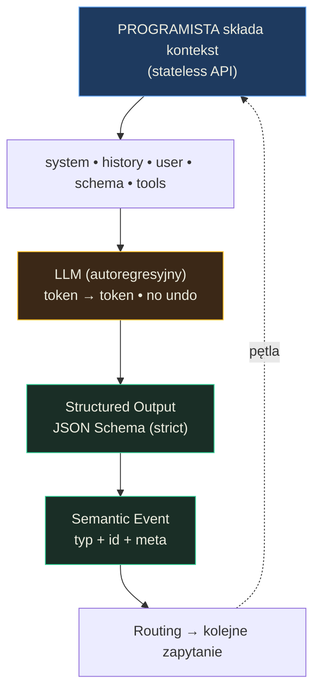

# Programowanie interakcji z modelem językowym — Podsumowanie

## O czym jest ta lekcja? (TL;DR)
Lekcja pokazuje, że programowanie z LLM to nie "zadaj pytanie, dostań odpowiedź", lecz **sterowanie kontekstem za pomocą kodu** — łącznie z wieloma zapytaniami, routingiem, strukturyzowaniem wyników i projektowaniem zdarzeń. Uczysz się traktować model jako niedeterministyczną funkcję wbudowaną w deterministyczny kod, co wymaga zupełnie innego podejścia niż klasyczne programowanie. Kluczowa zmiana w myśleniu: zamiast walczyć z niedeterminizmem, projektujesz systemy, które go kontrolują poprzez kontekst, schematy i zdarzenia.

## Model mentalny

**Zdanie-klucz:** LLM to niedeterministyczna funkcja wbudowana w deterministyczny kod — jakość wyniku zależy od **kontekstu**, który składa programista, nie od magii w prompcie.



**Trzy przemiany myślenia, które ten diagram wymusza:**
1. *Nie prompt, tylko kontekst* — walczysz o to, co wchodzi do LLM, nie o magiczne słowa w instrukcji.
2. *Nie jedno zapytanie, tylko łańcuch* — jedno zapytanie klasyfikuje, drugie obsługuje; z perspektywy użytkownika to nadal "pytanie → odpowiedź".
3. *Nie tekst, tylko zdarzenia* — wyjście modelu trafia do strukturalnego eventa, który można routować, archiwizować i rozbudowywać bez migracji bazy.

## Mapa koncepcji
- **Tokeny i autoregresja** — fundament: model generuje tekst token po tokenie, gdzie każdy kolejny zależy od wszystkich poprzednich
  - **Bezstanowe API i okno kontekstowe** — każde zapytanie wymaga przesłania pełnego kontekstu, ograniczonego limitem tokenów
  - **Routing zapytań** — budowanie wielu zapytań, których wyniki wpływają na siebie nawzajem
- **Structured Outputs i JSON Schema** — wymuszanie ustrukturyzowanej formy odpowiedzi modelu
  - **Kolejność właściwości w schemacie** — wcześniej generowane pola wpływają na późniejsze (autoregresja w praktyce)
- **Semantyczne zdarzenia** — architektura komunikacji oparta o typowane zdarzenia zamiast surowego tekstu
- **Organizacja instrukcji** — techniki zarządzania promptami w kodzie (inline, kompozycja, markdown, zewnętrzne systemy)
  - **Generalizowanie generalizacji** — tworzenie meta-reguł zamiast łatania konkretnych błędów
- **Strategie wyboru modeli** — od jednego modelu po zespoły specjalistów

## Kluczowe koncepcje

### Autoregresja i tokeny

**W jednym zdaniu:** Model generuje odpowiedź token po tokenie, przy czym każdy nowy token zależy od całej dotychczasowej treści — zarówno wejścia, jak i tego, co model już wygenerował.

**Rozwinięcie:** Wyobraź sobie pisanie SMS-a z autokorektą, gdzie każde kolejne sugerowane słowo zależy od wszystkich poprzednich. LLM działa podobnie, ale na poziomie tokenów (fragmentów słów). To wyjaśnia, dlaczego raz wygenerowany token nie może zostać "cofnięty" — model nie ma backspace'a. Dlatego wszystko, co trafia do kontekstu (instrukcja systemowa, historia rozmowy, wcześniejsze odpowiedzi), wpływa na jakość wyniku.

**Przykład z lekcji:** Diagram autoregresji pokazuje, jak dla wejścia "Hello." model w kroku 1 widzi tylko "Hello." i generuje "Hello", w kroku 2 widzi "Hello. Hello" i generuje "-", w kroku 3 widzi "Hello. Hello-" i generuje "how" — kontekst rośnie z każdym krokiem aż do tokenu końca lub limitu `max_output_tokens`.

### Bezstanowe API i zarządzanie kontekstem

**W jednym zdaniu:** API modeli językowych jest bezstanowe — każde zapytanie musi zawierać komplet danych potrzebnych do odpowiedzi, a programista kontroluje, co dokładnie trafia do kontekstu.

**Rozwinięcie:** To jak rozmowa z kimś, kto za każdym razem traci pamięć. Musisz mu przypomnieć całą historię rozmowy, zanim zada kolejne pytanie. Ale to nie jest wada — to potężne narzędzie. Dzięki temu możesz **manipulować kontekstem** między zapytaniami: usuwać zbędne wiadomości, dodawać nowe informacje, zmieniać instrukcję systemową. Efekt "rozmowy" z AI to iluzja budowana po stronie kodu poprzez dopisywanie odpowiedzi modelu do wątku.

**Przykład z lekcji:** Diagram tokenizacji pokazuje, jak wiadomości API (system, user, assistant) są opakowywane w tokeny specjalne (`<|im_start|>`, `<|im_end|>`) i konwertowane na ciąg liczbowych identyfikatorów. Z perspektywy modelu "You are a helpful assistant" to sekwencja liczb: 200264, 17368, 200260, 3575, 553, 261...

### Routing zapytań i łańcuchy przetwarzania

**W jednym zdaniu:** Sterowanie modelem za pomocą kodu polega na budowaniu wielu zapytań, których wyniki mogą być wykorzystywane między sobą — to fundamentalna zasada.

**Rozwinięcie:** Zamiast jednego dużego zapytania "zrób wszystko", rozbijasz zadanie na etapy — jak pipeline w Unixie. Pierwsze zapytanie klasyfikuje, drugie obsługuje na podstawie klasyfikacji. Z perspektywy użytkownika to wciąż "pytanie → odpowiedź", ale pod spodem działa łańcuch zapytań. To daje większą kontrolę nad uwagą modelu i wyższą skuteczność, kosztem czasu i pieniędzy.

**Przykład z lekcji:** Diagram routingu pokazuje dwuetapowy proces: Request 1 z promptem "Classify intent: refund, technical_support, sales" klasyfikuje wiadomość "My payment failed and I was charged twice" jako "refund". Request 2 używa wyniku klasyfikacji — prompt systemowy zmienia się na "You are a **refund** specialist. Be empathetic. Ask for order number." — i ten sam input użytkownika otrzymuje specjalistyczną obsługę.

### Structured Outputs i JSON Schema

**W jednym zdaniu:** JSON Schema dołączony do zapytania API gwarantuje strukturę odpowiedzi i pozwala transformować nieustrukturyzowane dane (tekst, obraz, audio) w dowolny format.

**Rozwinięcie:** Structured Outputs to jak kontrakt TypeScript'owy między twoim kodem a modelem. W trybie `strict` masz gwarancję, że odpowiedź będzie miała dokładny kształt schematu — koniec z try/catch na `JSON.parse`. Ale uwaga: **struktura** jest gwarantowana, **wartości** nie — zależą od jakości nazw i opisów w schemacie. Dlatego projektowanie schematu to prompt engineering w miniaturze.

**Przykład z lekcji:** Diagram Structured Output Flow pokazuje zapytanie z inputem "Meet Anna tomorrow 3pm, Q1 planning" i schematem `CalendarEvent`. Model zwraca `{"title": "Q1 Planning", "attendee": "Anna", "datetime": "2026-01-15T15:00:00", "topic": "Q1 planning discussion"}`. Aplikacja parsuje to bezpiecznie: `const data: CalendarEvent = JSON.parse(event)` — type-safe, bez try/catch.

### Semantyczne zdarzenia zamiast surowego tekstu

**W jednym zdaniu:** Komunikacja z LLM powinna opierać się na typowanych zdarzeniach (z id, typem, metadanymi), a nie na surowym tekście — to fundament skalowalnej architektury.

**Rozwinięcie:** To jak różnica między logowaniem `console.log("coś się stało")` a strukturalnym logowaniem z poziomami, tagami i metadanymi. Zapisywanie surowych wiadomości asystenta szybko staje się ograniczeniem na produkcji — każda zmiana wymaga migracji bazy, back-endu i front-endu. Zdarzenia semantyczne (np. `{type: "thinking_delta", id: "r1", text: "..."}`) pozwalają na swobodne rozbudowywanie interfejsu bez zmiany fundamentów.

**Przykład z lekcji:** Diagram "Streaming Timeline: Semantic Events" pokazuje trzy kolumny: backend event → app state → user sees. W fazie reasoning zdarzenia `thinking_start`, `thinking_delta`, `thinking_end` aktualizują stan `reasoning: {active: true/false}`, a użytkownik widzi animację "Thinking...". W fazie output zdarzenia `text` strumieniują tekst przyrostowo. Pole `id` łączy wszystkie zdarzenia jednej sesji myślenia.

### Generalizowanie generalizacji

**W jednym zdaniu:** Zamiast łatać konkretne błędy modelu konkretnymi regułami, twórz meta-reguły opisujące zgeneralizowany proces myślowy, który działa dla dowolnej konfiguracji.

**Rozwinięcie:** To jak różnica między pisaniem `if (input === "meeting") useAddEvent()` a projektowaniem wzorca Strategy. Każda specyficzna reguła adresuje jeden przypadek i tworzy nowe edge case'y (whack-a-mole). Meta-reguła typu "zanim wybierzesz narzędzie: 1. Opisz dlaczego, 2. Oceń pewność 0-100%, 3. Jeśli <80% — dopytaj" działa dla dowolnych narzędzi i zadań. To "sterowanie snem modelu" — kształtujesz jego proces myślowy, nie dyktując konkretnych odpowiedzi.

**Przykład z lekcji:** Diagram "Generalizing the Generalization" w trzech krokach: 1) Problem — model z narzędziami `add_task` i `add_event` błędnie dodaje "Meeting with Tom" jako task. 2) Bad Fix — reguła "if mentions meeting, use add_event" → dalej błędnie reaguje na "Prepare for meeting" (to task, nie event). 3) Good Fix — meta-reguła "Before selecting any tool: State which tool and why, Rate certainty (0-100%), If <80% ask clarifying question" → model odpowiada "Tool: add_event (has specific time) Certainty: 95%" i poprawnie obsługuje wszystkie przypadki.

### Strategie wyboru modeli

**W jednym zdaniu:** Nie ma "najlepszego modelu" — są modele najlepsze w danej sytuacji, a weryfikacja powinna opierać się na praktycznych testach, nie benchmarkach.

**Rozwinięcie:** Lekcja wyróżnia cztery strategie: (1) jeden główny model — najprostsze, (2) duży + mały — duży do trudnych zadań, mały do reszty (najczęstsze), (3) główny + specjalistyczne — np. z.ai do komponentów, Anthropic do tekstu, xAI do eksploracji plików, (4) zespół małych modeli z dekompozycją i głosowaniem — rzadkie, ale potencjalnie skuteczne. Kluczowe jest unikanie vendor lock-in — "liderzy" zmieniają się szybko.

**Przykład z lekcji:** Autor rekomenduje stworzenie własnego procesu weryfikacji modeli obejmującego: trudne wyzwania z domeny, zadania problematyczne dla innych modeli, zestawy testowe pokrywające posiadane narzędzia, unikatowe łamigłówki oraz "vibe check". Proces ten można zautomatyzować narzędziami takimi jak Promptfoo czy DeepEval.

## Teoria w praktyce

### Prosta interakcja z kontekstem (`01_01_interaction`)
Przykład budowania kontekstu rozmowy — każda odpowiedź modelu jest dopisywana do historii, tworząc efekt konwersacji w bezstanowym API.

```javascript
// Drugie pytanie korzysta z kontekstu pierwszego
const secondQuestionContext = [
  { type: "message", role: "user", content: firstQuestion },
  { type: "message", role: "assistant", content: firstAnswer.text }
];
const secondAnswer = await chat(secondQuestion, secondQuestionContext);
// "Divide that by 4" działa, bo model widzi wcześniejsze "25 * 48 = 1200"
```

Pokazuje fundamentalną mechanikę: API jest bezstanowe, ale programista kontroluje kontekst. To `secondQuestionContext` sprawia, że model "pamięta" poprzednią odpowiedź.

### Ekstrakcja danych ze Structured Outputs (`01_01_structured`)
Ekstrakcja ustrukturyzowanych informacji o osobie z nieustrukturyzowanego tekstu za pomocą JSON Schema.

```javascript
const personSchema = {
  type: "json_schema",
  name: "person",
  strict: true,
  schema: {
    type: "object",
    properties: {
      name: {
        type: ["string", "null"],               // null = "nie wspomniano"
        description: "Full name of the person. Use null if not mentioned."
      },
      occupation: {
        type: ["string", "null"],
        description: "Job title or profession. Use null if not mentioned."
      },
      skills: {
        type: "array",
        items: { type: "string" },
        description: "List of skills, technologies, or competencies."
      }
    },
    required: ["name", "age", "occupation", "skills"],
    additionalProperties: false
  }
};
```

Dwie kluczowe praktyki: (1) `type: ["string", "null"]` zamiast wymuszania wartości — daje modelowi "wyjście awaryjne" gdy informacja nie istnieje w tekście, (2) precyzyjne `description` steruje jakością generowanych wartości.

### Pipeline groundingu z wieloma etapami (`01_01_grounding`)
Wieloetapowy pipeline przetwarzający markdown na interaktywny HTML z tooltipami — ilustracja łańcucha zapytań ze Structured Outputs na każdym etapie.

```javascript
// Przetwarzanie akapitami (nie całością) — skupienie uwagi modelu
const paragraphs = splitParagraphs(markdown);

// Równoległe przetwarzanie w grupach po 5 — balans szybkość vs rate limit
const CONCURRENCY = 5;
const batches = chunk(pending, CONCURRENCY);
for (const batch of batches) {
  const results = await Promise.all(
    batch.map((item) => extractSingleParagraph(item, paragraphs.length))
  );
}
```

Trzy ważne wzorce: (1) dzielenie tekstu na fragmenty zwiększa skuteczność modelu nawet gdy cały tekst zmieściłby się w kontekście, (2) równoległy processing z ograniczoną współbieżnością, (3) cache wyników w plikach JSON — wznowienie po błędzie bez powtarzania pracy.

## Najważniejsze zasady (cheat sheet)

1. **Steruj kontekstem, nie odpowiedziami** — jakość wyniku LLM zależy od tego, co trafia do kontekstu (instrukcja, historia, dane), nie od magicznych słów w prompcie.
2. **Rozbijaj zadania na łańcuchy zapytań** — jedno zapytanie klasyfikuje, drugie obsługuje. Mniejszy zakres = wyższa skuteczność modelu.
3. **Dziel tekst na fragmenty** — nawet gdy mieści się w kontekście, przetwarzanie akapitami skupia uwagę modelu i otwiera drogę do tańszych modeli.
4. **Projektuj kolejność właściwości w JSON Schema** — wcześniejsze pola wpływają na generowanie późniejszych. "Reasoning" przed "sentiment" przed "confidence".
5. **Uwzględniaj wartości neutralne i nieznane** — dodawaj "neutralny", "mieszany", "nieznany" do enumów. Zmniejsza halucynacje, bo model nie jest zmuszany do odpowiedzi.
6. **Buduj architekturę na zdarzeniach semantycznych** — typowane eventy z id i metadanymi zamiast surowego tekstu. Rozbudowa = dodanie nowych właściwości, nie migracja bazy.
7. **Generalizuj generalizacje** — zamiast łatać konkretne błędy, twórz meta-reguły opisujące proces myślowy (np. "oceń pewność wyboru narzędzia").
8. **Unikaj vendor lock-in** — architektura powinna umożliwiać wymianę modeli i providerów. "Liderzy" zmieniają się szybko.
9. **Trzymaj prompty w plikach markdown z frontmatter** — łączy zalety wszystkich podejść i jest natywnie dostępne dla agentów AI jako narzędzie.
10. **Nazwy i opisy w JSON Schema to prompt engineering** — model generuje wartości na podstawie `description` pól, nie tylko na podstawie inputu użytkownika.
11. **Równoległe zapytania z ograniczoną współbieżnością** — `Promise.all` w grupach zamiast sekwencyjnych wywołań. Szybkość × stabilność.
12. **Cache i wznowienie** — zapisuj wyniki pośrednie w plikach. Pipeline, który może być wznowiony po błędzie, to pipeline produkcyjny.

## Czego unikać (anty-wzorce)

- **Jedno zapytanie "zrób wszystko"** → **Łańcuch mniejszych, wyspecjalizowanych zapytań** — model lepiej radzi sobie ze skupionym zadaniem niż z wieloaspektowym poleceniem.
- **Zapisywanie surowego tekstu wiadomości** → **Zdarzenia semantyczne z typem, id i metadanymi** — surowy tekst to ślepy zaułek architektury: każda zmiana wymaga migracji od bazy po front-end.
- **Łatanie błędów konkretnymi regułami ("if X then Y")** → **Meta-reguły opisujące proces myślowy** — konkretne łatki tworzą nowe edge case'y (whack-a-mole), meta-reguły generalizują.
- **Wymuszanie odpowiedzi gdy brak danych** → **Typy nullable i wartości "nieznany"** — `type: ["string", "null"]` z opisem "Use null if not mentioned" redukuje konfabulacje.
- **Stosowanie frameworków AI (LangChain itp.)** → **Cienkie wrappery nad oficjalnymi SDK** — frameworki narzucają ograniczenia, nie oferując proporcjonalnej wartości na tym etapie rozwoju ekosystemu.
- **Ocena modeli na benchmarkach** → **Testy na własnych zadaniach z własnej domeny** — jedyny wiarygodny sposób oceny to "czy ten model działa w mojej sytuacji?".

## Sprawdź się (pytania do refleksji)

- **Dlaczego kolejność właściwości w JSON Schema ma znaczenie i jak możesz to wykorzystać do poprawy jakości wyników?** *Wskazówka: pomyśl o autoregresji — model generuje wartości sekwencyjnie, każda kolejna "widzi" poprzednie.*

- **Masz aplikację, która przetwarza dokumenty i przypisuje im kategorie. Czasem model się myli. Jak zastosujesz zasadę "generalizowania generalizacji" zamiast łatania konkretnych błędów?** *Wskazówka: pomyśl o meta-regule, która opisuje proces decyzyjny, a nie konkretne przypadki.*

- **Dlaczego warto dzielić tekst na mniejsze fragmenty do przetwarzania, nawet gdy cały zmieści się w oknie kontekstowym?** *Wskazówka: pomyśl o uwadze modelu i o tym, co daje ci to w kwestii wyboru modeli.*

- **Zaprojektuj schemat zdarzeń dla czatbota, który oprócz tekstu może wywoływać narzędzia i wymagać potwierdzenia użytkownika. Jakie typy zdarzeń potrzebujesz?** *Wskazówka: diagram z lekcji pokazuje fazy reasoning i output — jakie jeszcze fazy mogą się pojawić przy interakcji z narzędziami?*

- **Twoja aplikacja korzysta z jednego modelu. Kiedy i dlaczego rozważyłbyś dodanie drugiego? Jak zaprojektujesz kod, żeby zmiana modelu nie wymagała przepisywania logiki?** *Wskazówka: pomyśl o strategii "główny + alternatywny" i o warstwie abstrakcji nad providerem.*
