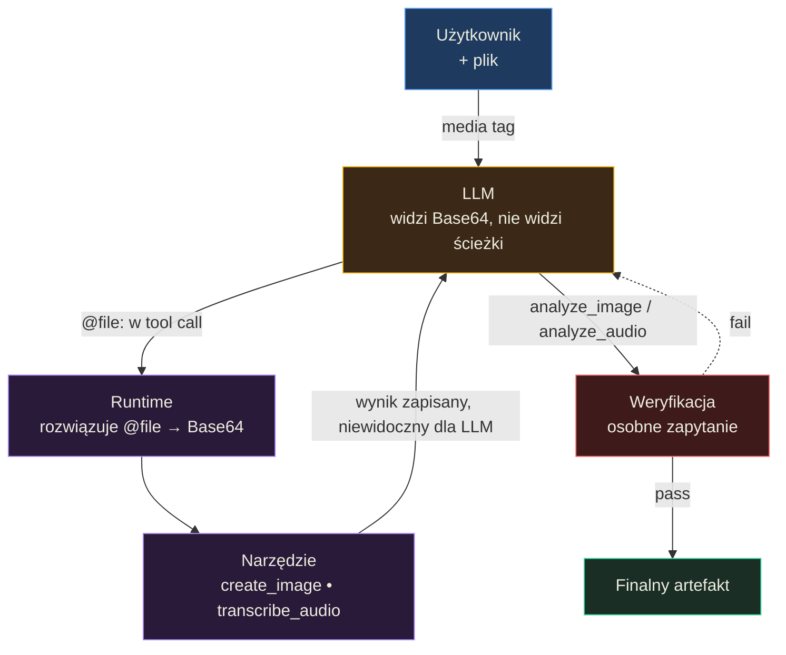

# Wsparcie multimodalności oraz załączników — Podsumowanie

## O czym jest ta lekcja? (TL;DR)

Agent AI generuje tylko tekst — ale dajemy mu "oczy" (analiza obrazu/wideo), "uszy" (transkrypcja/analiza audio) i "ręce do rysowania" (generowanie obrazów/wideo). Ta lekcja uczy, jak praktycznie zintegrować te zdolności: od przekazywania plików między narzędziami (wzorzec `<media>`), przez iteracyjne generowanie obrazów z JSON-owymi szablonami, po budowanie agentów analizujących YouTube i generujących wielostronicowe PDF-y. Kluczowy wniosek: multimodalność nie jest standardem — wymaga świadomego projektowania narzędzi i interfejsów.

## Model mentalny

**Zdanie-klucz:** Multimodalność to **interfejs**, nie feature — agent nie widzi ścieżki przesłanego obrazu, nie widzi tego co sam wygenerował, i **halucynuje wizualnie** tak samo jak tekstowo.



**Trzy przemiany myślenia, które ten diagram wymusza:**
1. *Model nie widzi ścieżki, tylko Base64* — wzorzec `<media>` + referencje `@file:` to must-have, bez tego agent nie przekaże załącznika narzędziu.
2. *Model nie widzi tego, co sam wygenerował* — `create_image` zwraca plik na dysku, ale LLM pozostaje "ślepy"; potrzebuje osobnego `analyze_image` do weryfikacji.
3. *Halucynacje wizualne są subtelne* — 95% detali poprawnych, 5% z glitchami (dodatkowe palce, błędne litery). Iteracyjna pętla edit → analyze → refine to obrona, nie opcja.

## Mapa koncepcji

- **Przekazywanie załączników agentom** — wzorzec `<media>` i referencje `@file:`
  - **Model nie widzi URL-a obrazu** — problem, który trzeba rozwiązać programistycznie
- **Rozpoznawanie obrazów** — agenci + zewnętrzna wiedza (knowledge base)
  - **Instrukcja agenta vs workflow** — przestrzeń na autonomię zamiast sztywnych kroków
- **Generowanie i edycja obrazów** — iteracyjna pętla z weryfikacją
  - **JSON Prompt** — strukturyzowane szablony dla spójności wizualnej
  - **Grafiki referencyjne** — kontrola kompozycji, pozy, kadru
- **Dokumenty PDF** — agenci tworzący HTML → PDF z Puppeteer
- **Audio** — transkrypcja, analiza, generowanie mowy, diaryzacja
- **Wideo** — analiza YouTube/plików lokalnych + generowanie klatka po klatce
- **Halucynacje wizualne** — subtelne "glitche" w generowanych obrazach

## Kluczowe koncepcje

### Przekazywanie załączników agentom (wzorzec `<media>`)

**W jednym zdaniu:** Model "widzi" obraz przesłany w wiadomości, ale nie zna jego URL-a ani ścieżki — trzeba mu ją podać osobno, by mógł przekazać plik do narzędzi.

**Rozwinięcie:** To jak pokazanie komuś zdjęcie, ale nie powiedzenie gdzie ono leży na dysku. Model LLM otrzymuje obraz jako Base64 w wiadomości — potrafi go opisać, ale nie potrafi "wskazać" go narzędziu do edycji. Rozwiązanie: do wiadomości użytkownika dodajemy dodatkowy element tekstowy z tagiem `<media filename="photo.jpg" />`. W instrukcji systemowej informujemy agenta, że referencje `@file:photo.jpg` odnoszą się do załączników. Gdy agent wywołuje narzędzie (np. `remove_background`), podaje `@file:photo.jpg`, a runtime programistycznie zamienia to na Base64 lub publiczny URL.

**Przykład z lekcji:** Diagram "Passing File References to Agents" pokazuje pełny przepływ: system prompt z instrukcją o tagach `<media>` → wiadomość użytkownika z trzema elementami (tekst, obraz Base64, tag media) → agent wywołuje narzędzie z `@file:photo.jpg` → runtime rozwiązuje referencję na `data:image/jpeg;base64,...` przed wykonaniem narzędzia.

### Instrukcje agenta — przestrzeń zamiast skryptu

**W jednym zdaniu:** Instrukcja agenta nie powinna być listą kroków ("najpierw zrób X, potem Y"), lecz zestawem celów, ograniczeń i uniwersalnych zasad, które dają modelowi przestrzeń do autonomicznych decyzji.

**Rozwinięcie:** To fundamentalna różnica między workflow a agentem. Workflow mówi: "krok 1: otwórz katalog images, krok 2: dla każdego pliku wywołaj classify, krok 3: przenieś do odpowiedniego folderu." Agent dostaje: "Cel: sklasyfikuj obrazy z katalogu image/ na podstawie opisów w knowledge/. Ograniczenia: nierozpoznane pliki trafiają do unclassified/. Zasady: czytaj opisy przed klasyfikacją, nie zakładaj czego nie wiesz." Instrukcja agenta nie może być uzależniona od konkretnego zestawu danych — powinna adresować **klasę problemów**.

**Przykład z lekcji:** Diagram porównawczy pokazuje dwa podejścia do instrukcji: po lewej specyficzna (długa lista kroków z konkretnymi ścieżkami i regułami), po prawej zgeneralizowana (cel, ograniczenia, wzorce). Agent z drugą instrukcją ma większą elastyczność — sam eksploruje katalogi, czyta opisy i podejmuje decyzje.

### Iteracyjne generowanie obrazów z pętlą edycji

**W jednym zdaniu:** Agent generuje obraz, analizuje go dedykowanym narzędziem `analyze_image`, porównuje z wytycznymi ze style-guide.md i powtarza próby, aż wynik jest zgodny z oczekiwaniami.

**Rozwinięcie:** Generowanie obrazu to nie jednorazowa operacja — to pętla. Agent: (1) czyta `style-guide.md` z wytycznymi stylu, (2) generuje obraz przez `create_image`, (3) analizuje wynik przez `analyze_image` (osobne narzędzie, bo model nie widzi automatycznie wygenerowanego obrazu!), (4) porównuje z wytycznymi, (5) jeśli nie pasuje — modyfikuje prompt i próbuje ponownie, (6) jeśli pasuje — zapisuje wynik. Kluczowy insight: agent nie jest w stanie fizycznie "zobaczyć" wygenerowanego obrazu, dlatego potrzebuje dedykowanego narzędzia do analizy.

**Przykład z lekcji:** Diagram "Image to Concept Art Agent" pokazuje pełny flow: User → fs_read (load style-guide.md) → fs_search (locate source image) → EDIT LOOP: create_image (apply style) → analyze_image (quality assessment) → FAIL? refine prompt + create_image / PASS? save output → Output.

### JSON Prompt — szablony dla spójności wizualnej

**W jednym zdaniu:** Zamiast pisać prompt tekstem, agent klonuje szablon JSON, modyfikuje wybrane pola i przekazuje go jako referencję do narzędzia generującego obraz.

**Rozwinięcie:** To jak system design tokens w CSS. Szablon `template.json` zawiera pełen opis sceny — postać, tło, oświetlenie, styl, paleta kolorów. Agent: (1) klonuje szablon do nowego katalogu, (2) zmienia tylko te pola, które muszą się zmienić (np. pozę postaci, tło), (3) przekazuje ścieżkę do zmodyfikowanego szablonu do narzędzia. Format JSON pozwala na precyzyjną podmianę zarówno generowanego obiektu, jak i ustawień "sceny". Co więcej — szablony mogą być generowane przez AI na podstawie obrazów referencyjnych, tworząc "uczenie się stylu".

**Przykład z lekcji:** Agent klonuje `template.json`, zmienia pole "scene" z "forest" na "city street", zachowuje pozostałe ustawienia (styl, oświetlenie, postać) i generuje obraz z pełną spójnością wizualną. Ten sam szablon może być użyty do serii obrazów — np. ta sama postać w różnych scenach.

### Audio — transkrypcja, analiza i generowanie mowy

**W jednym zdaniu:** Agent wyposażony w narzędzia audio potrafi transkrybować nagrania (z diaryzacją i emocjami), analizować zawartość dźwiękową, generować mowę z kontrolą stylu, a nawet odpowiadać na pytania o podcasty z YouTube.

**Rozwinięcie:** Cztery narzędzia audio pokrywają pełen zakres: `transcribe_audio` (transkrypcja z timestamps, rozpoznawanie mówców, wykrywanie emocji, tłumaczenie), `analyze_audio` (analiza muzyki, mowy, dźwięków otoczenia), `query_audio` (dowolne pytanie o nagranie), `generate_audio` (TTS z kontrolą głosu, tonu, tempa, wielogłosowy dialog). Narzędzia obsługują pliki lokalne i URL-e YouTube. Pliki >20MB automatycznie idą przez upload API. Kluczowe wyzwania: jakość dźwięku, czas reakcji, koszty, rozmiar pliku. Ważne: styl odpowiedzi agenta musi być dostosowany do audio — nie dyktuje URL-ów, nie używa tabel.

**Przykład z lekcji:** Agent analizuje krótką wypowiedź i zwraca szczegółową analizę: ton, tempo, akcent, emocje, a nawet sugeruje zdolność diaryzacji. Narzędzie `generate_audio` obsługuje kontrolę stylu przez naturalny język w tekście: "Say cheerfully: Hello!" lub "In a whisper: The secret is..."

### Wideo — analiza i generowanie klatka po klatce

**W jednym zdaniu:** Agent analizuje filmy YouTube i lokalne pliki wideo bezpośrednio przez Gemini API, a generuje filmy tworząc klatki (start + end) przez modele obrazów i łącząc je modelem text-to-video.

**Rozwinięcie:** Analiza: Gemini API pozwala na bezpośrednie przesłanie pliku wideo lub URL-a YouTube — nie trzeba już wyodrębniać klatek i analizować osobno. Agent może "rozmawiać" z filmem, odpowiadać na pytania, streszczać. Generowanie: agent (1) tworzy klatkę początkową i końcową przez JSON Prompt (z zachowaniem spójności postaci), (2) przekazuje je do modelu text-to-video (np. Kling na Replicate), (3) otrzymuje 10-sekundowy film. Dla dłuższych filmów — ostatnia klatka jednego fragmentu staje się pierwszą klatką następnego.

**Przykład z lekcji:** Agent sprowadził film YouTube o Claude AI do czterech kluczowych punktów. W przypadku generowania — agent tworzy klatki przez JSON Prompt z referencjami do pozycji postaci, a model Kling generuje animację między nimi.

### Halucynacje wizualne

**W jednym zdaniu:** Modele generujące obrazy halucynują tak samo jak modele tekstowe — subtelne "glitche" (dodatkowe palce, zniekształcone litery) mogą być trudne do zauważenia, gdy 95% detali jest poprawne.

**Rozwinięcie:** Jeszcze rok temu modele wizyjne były "niewidome" — nie radziły sobie z prostymi zadaniami percepcji. Dziś rozwiązują większość z nich, ale precyzja, detale i kolory wciąż sprawiają problemy. Przykład z lekcji: Gemini 3 Pro generuje komiks wyjaśniający mema — pierwsze trzy panele wyglądają świetnie, ale ostatni zawiera oczywisty błąd wizualny. To poważny problem, bo w kontekście produkcyjnym (e-commerce, reklama) takie subtelne artefakty mogą przejść niezauważone. Dlatego agent powinien mieć narzędzie `analyze_image` do weryfikacji — ale nawet ono nie gwarantuje 100% wykrycia problemów.

**Przykład z lekcji:** Gemini generuje czteropanelowy komiks — trzy panele są poprawne, czwarty zawiera widoczny "glitch". Lekcja podkreśla: weryfikacja przez człowieka jest nadal konieczna, ale weryfikacja jest łatwiejsza niż tworzenie od podstaw.

## Teoria w praktyce

### Narzędzie `understand_image` — analiza obrazów (`01_04_image_recognition`)

Agent klasyfikujący obrazy łączy narzędzia MCP (filesystem) z natywnym narzędziem do analizy wizualnej. Model czyta opisy z knowledge base, analizuje obrazy i klasyfikuje je do odpowiednich katalogów.

```javascript
// Natywne narzędzie — agent "widzi" obrazy przez osobne zapytanie do Vision API
export const nativeTools = [{
  type: "function",
  name: "understand_image",
  description: "Analyze an image and answer questions about it.",
  parameters: {
    type: "object",
    properties: {
      image_path: {
        type: "string",
        description: "Path to image relative to project root"
      },
      question: {
        type: "string",
        description: "Question about the image"
      }
    },
    required: ["image_path", "question"],
    additionalProperties: false
  },
  strict: true
}];

// Handler — czyta plik, konwertuje na Base64, wysyła do Vision API
async understand_image({ image_path, question }) {
  const imageBuffer = await readFile(join(PROJECT_ROOT, image_path));
  const imageBase64 = imageBuffer.toString("base64");
  const answer = await vision({ imageBase64, mimeType, question });
  return { answer, image_path };
}
```

Kluczowe: agent nie "widzi" obrazów automatycznie — musi jawnie wywołać `understand_image` z pytaniem. To narzędzie jest mostem między światem tekstu (kontekst LLM) a światem obrazów (pliki na dysku).

### Narzędzia audio — pełen zestaw (`01_04_audio`)

Agent audio łączy cztery narzędzia: transkrypcję, analizę, zapytania i generowanie mowy. Obsługuje pliki lokalne i YouTube, z automatycznym upload API dla dużych plików.

```javascript
// Inteligentne ładowanie audio — małe pliki inline, duże przez upload API
const loadAudio = async (audioPath) => {
  // YouTube? Przekaż URL bezpośrednio
  if (isYouTubeUrl(audioPath)) {
    return { fileUri: audioPath, mimeType: "video/mp4" };
  }

  const buffer = await readFile(join(PROJECT_ROOT, audioPath));
  const mimeType = getAudioMimeType(audioPath);

  if (buffer.length > 20 * 1024 * 1024) {
    // Duży plik → upload API (Gemini File API)
    const uploaded = await uploadAudioFile(buffer, mimeType, displayName);
    return { fileUri: uploaded.fileUri, mimeType };
  } else {
    // Mały plik → inline Base64
    return { audioBase64: buffer.toString("base64"), mimeType };
  }
};
```

Wzorzec: jedno narzędzie (np. `transcribe_audio`) obsługuje wiele scenariuszy przez opcjonalne parametry — timestamps, diaryzacja, emocje, tłumaczenie. To konsolidacja z lekcji S01E03 zastosowana do audio.

### Generowanie mowy z kontrolą stylu (`01_04_audio`)

Narzędzie `generate_audio` zapisuje wygenerowaną mowę jako WAV, obsługuje dialog wielogłosowy i waliduje nazwy głosów z sugestiami naprawy.

```javascript
// Walidacja głosu z sugestią — wzorzec hints z S01E03
if (!TTS_VOICES[voice]) {
  const validVoices = Object.keys(TTS_VOICES).join(", ");
  return {
    success: false,
    error: `Invalid voice "${voice}". Valid options: ${validVoices}`
  };
}

// Odpowiedź z pełnym kontekstem — ścieżka, format, metadata
return {
  success: true,
  output_path: relativePath,    // Agent wie gdzie plik
  format: "WAV (24kHz, 16-bit, mono)",  // Agent wie jaki format
  voice: isMultiSpeaker ? speakers : voice,
  text_length: text.length
};
```

Ten sam wzorzec z lekcji S01E03: walidacja z sugestiami ("Invalid voice, valid options: ...") i odpowiedzi wzmacniające model (ścieżka, format, metadata).

## Najważniejsze zasady (cheat sheet)

1. **Model nie widzi URL-a/ścieżki obrazu** — dodaj tag `<media>` z referencją do pliku, by agent mógł przekazać go narzędziom. Runtime rozwiązuje `@file:` na Base64 lub URL.
2. **Agent nie widzi automatycznie wygenerowanego obrazu** — potrzebuje dedykowanego narzędzia `analyze_image` do weryfikacji wyników generowania.
3. **Instrukcja agenta ≠ lista kroków** — podaj cel, ograniczenia i uniwersalne zasady. Instrukcja nie powinna zależeć od konkretnego zestawu danych, lecz od klasy problemów.
4. **JSON Prompt daje spójność wizualną** — klonuj szablon, modyfikuj wybrane pola, przekazuj referencję. To design tokens dla AI art.
5. **Grafiki referencyjne sterują kompozycją** — przekaż obraz z pozą, kadrem, stylem. W połączeniu z JSON Prompt pozwala na zachowanie spójności postaci w różnych scenach.
6. **Automatyczny upload dla dużych plików** — >20MB przez upload API, mniejsze inline Base64. Agent nie musi o tym wiedzieć.
7. **Styl odpowiedzi musi pasować do medium** — agent odpowiadający audio nie dyktuje URL-ów, nie używa tabel, nie formatuje markdown.
8. **Ostatnia klatka = pierwsza klatka następnego filmu** — technika łączenia fragmentów wideo w dłuższe nagrania.
9. **Halucynacje wizualne są subtelne** — 95% detali poprawnych, 5% z glitchami. Agent + `analyze_image` pomaga, ale weryfikacja przez człowieka jest nadal konieczna.
10. **Weryfikacja jest łatwiejsza niż tworzenie** — 100% skuteczności agenta nie jest celem; ludzki nadzór nad wynikami to feature, nie bug.
11. **Workflow może być narzędziem agenta** — to nie jest wybór "jedno albo drugie". Agent może uruchamiać workflow jako jeden z kroków.

## Czego unikać (anty-wzorce)

- **Zakładanie, że model "widzi" ścieżkę do przesłanego obrazu** → **Dodaj jawną referencję `<media>`** — obraz trafia jako Base64, model nie zna ani URL-a, ani ścieżki na dysku. Bez referencji agent nie może przekazać pliku narzędziom.
- **Jednorazowe generowanie obrazu bez weryfikacji** → **Pętla: generuj → analizuj → popraw** — model generujący halucynuje tak samo jak model tekstowy. Bez analizy wyniku agent nie wie, czy obraz jest poprawny.
- **Sztywne instrukcje agenta uzależnione od danych** → **Cel + ograniczenia + uniwersalne zasady** — "Otwórz images/cat1.jpg i sklasyfikuj jako zwierzę" łamie się przy zmianie danych. "Sklasyfikuj obrazy z katalogu na podstawie opisów w knowledge base" działa z dowolnym zestawem.
- **Ładowanie pełnych wytycznych stylu do system promptu** → **Plik style-guide.md czytany przez narzędzie** — wytyczne zmieniają się per projekt. Agent czyta je na żądanie, co zachowuje prompt cache i jest elastyczniejsze.
- **Bezpośrednie mapowanie 1:1 modeli na modalności** → **Jeden zestaw narzędzi per agent, elastyczne modele "pod spodem"** — agent nie musi wiedzieć, czy transkrypcja idzie do Whisper czy Gemini. Narzędzie `transcribe_audio` abstrahuje model.
- **Generowanie filmów dłuższych niż limit modelu za jednym razem** → **Technika łańcuchowania klatek** — Kling ma limit 10s, ale agent może generować fragmenty i łączyć je.

## Sprawdź się (pytania do refleksji)

- **Agent wygenerował obraz produktu, ale nie jest pewien, czy logo firmy jest czytelne. Jak zaprojektujesz pętlę weryfikacji?** *Wskazówka: pomyśl o narzędziu `analyze_image` z precyzyjnym pytaniem o logo i warunku "retry until pass".*

- **Masz agenta, który musi przetworzyć 50 zdjęć produktów i opisać je na podstawie katalogu. Czy wybierzesz workflow czy agenta i dlaczego?** *Wskazówka: czy opisy mogą się zmieniać? Czy agent musi obsługiwać nierozpoznane produkty? Czy potrzebujesz samokorekty?*

- **Użytkownik przesyła agentowi zdjęcie i prosi o "usunięcie tła". Agent ma narzędzie `remove_background`, ale nie wie, gdzie jest plik. Co zrobisz?** *Wskazówka: pomyśl o wzorcu `<media>` i o tym, co musi znajdować się w wiadomości użytkownika oprócz obrazu.*

- **Agent ma generować serię 5 obrazów tej samej postaci w różnych scenach. Jak zapewnisz spójność wizualną?** *Wskazówka: pomyśl o JSON Prompt jako szablonie, który agent klonuje i modyfikuje, zachowując opis postaci bez zmian.*

- **Jak zoptymalizujesz agenta audio, który musi przetworzyć 2-godzinny podcast?** *Wskazówka: pomyśl o rozmiarze pliku (>20MB), sposobie ładowania, podziale na fragmenty i ograniczeniu kontekstu odpowiedzi.*
