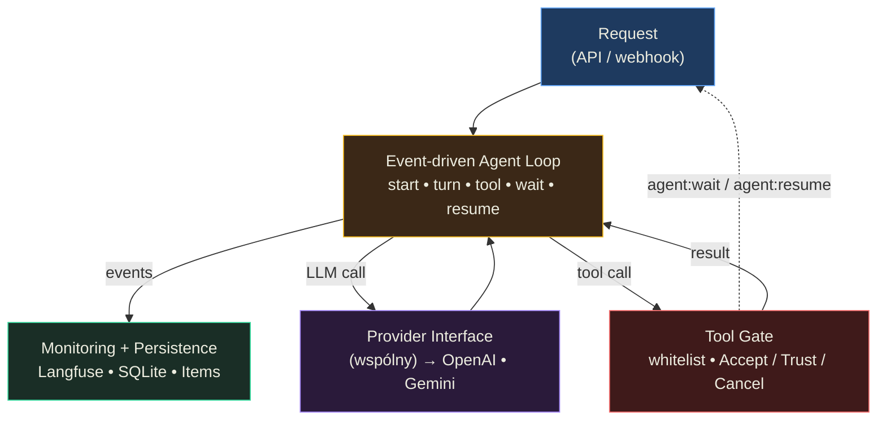

# Zarządzanie jawnymi oraz niejawnymi limitami modeli — Podsumowanie

## O czym jest ta lekcja? (TL;DR)

Prototyp z LLM działa świetnie — problemy zaczynają się na produkcji. Ta lekcja to checklist wszystkiego, co pójdzie nie tak: limity kontekstu, halucynacje, koszty tokenów, stabilność API, rate limity, prompt injection, naruszenia polityk. Ale nie tylko diagnozuje problemy — pokazuje architekturę produkcyjnej aplikacji agentowej od A do Z: event-driven loop, ujednolicony interfejs providerów, monitorowanie, deployment. Kluczowy wniosek: 80% to klasyczna inżynieria, ale te 20% związane z AI wymaga fundamentalnie innego myślenia o kontroli, wydajności i bezpieczeństwie.

## Model mentalny

**Zdanie-klucz:** **80% to klasyczna inżynieria, 20% to AI** — ale te 20% wymusza nowy sposób myślenia o kontroli, wydajności i bezpieczeństwie w pozostałych 80%.



**Trzy przemiany myślenia, które ten diagram wymusza:**
1. *"Tak, wyślij" w czacie to nie zgoda* — potwierdzenia akcji muszą być deterministyczne (przycisk w UI), bo tekstową zgodę model może zignorować lub zinterpretować opacznie.
2. *Gwarancja struktury ≠ gwarancja wartości* — Structured Output waliduje kształt JSON, nie poprawność danych. Krytyczne wartości weryfikujesz programistycznie lub osobnym zapytaniem.
3. *Framework AI to dług techniczny* — Langchain/CrewAI starzeje się w miesiące. Wspólny interfejs providerów + własna event-driven logika jest bardziej odporny na zmiany modeli i API.

## Mapa koncepcji

- **Wyzwania produkcyjne** — 10 obszarów, z którymi spotkasz się na produkcji
  - **Kontekst** — użytkownicy przesyłają 500-stronnicowe PDF-y i aktywują setki narzędzi
  - **Kontrola** — error recovery, potwierdzenia użytkownika, zaufane narzędzia
  - **Wydajność** — heartbeat, wielowątkowość, przetwarzanie w tle, wznawianie
  - **Cena** — "tańszy model" ≠ niższy koszt (GPT-4.1-nano vs mini)
  - **Bezpieczeństwo** — moderacja, naruszenia, Moderation API
- **Jawne limity** — okno kontekstowe, max output tokens, rate limits API
  - **Estymacja tokenów** — chars/4 + 20% bufor
  - **Limity użytkowników** — dedykowane klucze z ograniczeniami (OpenRouter)
- **Niejawne limity** — halucynacje, "gwarancja struktury ≠ gwarancja wartości"
  - **Structured Output + błędne wartości** — JSON ma poprawny kształt, ale złe dane
  - **Halucynacje kontekstowe** — model "domyśla się" zamiast dopytać
- **Limity środowiskowe** — rozproszone bazy, brak API, procesy manualne
- **Architektura produkcyjna** — event-driven agent loop, providery, monitoring
  - **Brak frameworków AI** — Langchain/CrewAI to dług techniczny
  - **Ujednolicony interfejs providerów** — ale z limitami tłumaczenia
  - **Deployment** — VPS, nginx, certbot, GitHub Actions

## Kluczowe koncepcje

### 10 wyzwań produkcyjnych

**W jednym zdaniu:** Na produkcji spotkasz się z problemami kontekstu, kontroli, wydajności, kosztów, bezpieczeństwa, stabilności API, skalowania, prywatności, naruszeń polityk i konieczności utrzymania elastycznej architektury — jednocześnie.

**Rozwinięcie:** Pomyśl o tym jak o liście kontrolnej przed lotem. Każdy punkt jest krytyczny, a pominięcie jednego może zestrzelić cały system. Najważniejsze: (1) użytkownicy nie znają limitów LLM — będą przesyłać 500-stronnicowe PDF-y i oczekiwać nieskończonych rozmów, (2) model popełni błędy — system musi umożliwić mu samonaprawę lub wymagać ludzkiej weryfikacji, (3) wydajność jest niska — potrzebujesz heartbeatu, wielowątkowości i przetwarzania w tle, (4) koszty rosną nieliniowo — proaktywny agent w tle generuje tokeny nawet bez użytkownika, (5) model może zrobić coś niechcianego — zabezpiecz się prawnie (regulaminy, polityka prywatności).

**Przykład z lekcji:** Interakcja z kalendarzem — agent dodaje wydarzenie z zaproszeniem. Adres email nie jest na whiteliście → agent dodaje kontakt → użytkownik potwierdza **przyciskiem** (nie wiadomością!). Ale: adres może być pomylony, opis może zawierać dane z innych narzędzi → potwierdzenie **musi** zawierać wszystkie detale, nie tylko email.

### Mechanizm zaufanych narzędzi

**W jednym zdaniu:** Ręczne zatwierdzanie każdego kroku agenta jest męczące — ale pozwolenie na uruchamianie narzędzi bez zgody jest niebezpieczne. Rozwiązanie: lista "zaufanych" narzędzi z automatycznym odwołaniem zaufania przy zmianie schematu.

**Rozwinięcie:** To jak uprawnienia sudo — raz dajesz zgodę, ale możesz ją cofnąć. Trzy przyciski: **Akceptuj** (jednorazowo), **Zaufaj** (dodaj do wyjątków — kolejne użycia nie wymagają zgody), **Anuluj** (odrzuć). Krytyczne zasady: (1) identyfikuj narzędzie unikatowo — `resend__send`, nie `send`, (2) **automatycznie cofnij zaufanie** gdy zmieni się nazwa, opis lub schemat narzędzia (szczególnie przy MCP, gdzie serwer może się zmienić bez wiedzy użytkownika!), (3) akceptacja/odrzucenie **musi** być deterministyczne — przez kod/przycisk, nie przez wiadomość do modelu.

**Przykład z lekcji:** Agent `01_05_confirmation` z Resend — wysyła emaile tylko na adresy z `whitelist.json`. Walidacja działa dwupoziomowo: programistyczny whitelist (kod blokuje niedozwolone adresy) + potwierdzenie użytkownika (przycisk Accept/Trust/Cancel).

### Jawne limity: okno kontekstowe i rate limits

**W jednym zdaniu:** Okno kontekstowe to nie tylko input — output zabiera z niego miejsce, rate limits API dają się we znaki dopiero na skali, a estymacja tokenów to chars/4 z 20% buforem.

**Rozwinięcie:** GPT-5.2 ma 400k okno, ale max output to 128k — zostaje 272k na input. Estymacja: (1) przed wysłaniem — `chars / 4` (bo 1 token ≈ 3-4 litery), (2) po odpowiedzi — API zwraca dokładne zużycie tokenów, (3) kompresja kontekstu już przy ~30% zużycia limitu. Rate limits: nagłówki odpowiedzi informują o requests/minute i tokens/minute — monitoruj je i informuj użytkownika o opóźnieniach. Na produkcji **każdy użytkownik powinien mieć własny limit** — OpenRouter pozwala na programistyczne generowanie kluczy z indywidualnymi ograniczeniami.

**Przykład z lekcji:** Diagram estymacji pokazuje dwa etapy: wstępna estymacja (chars/4 + bufor 20%) przed zapytaniem, doprecyzowanie na podstawie response.usage po zapytaniu. Przy 30% zużycia — uruchom kompresję/ekstrakcję.

### Niejawne limity: "gwarancja struktury ≠ gwarancja wartości"

**W jednym zdaniu:** Structured Output gwarantuje, że JSON ma poprawny kształt — ale nie gwarantuje, że wartości są prawidłowe. Wykres może mieć poprawną strukturę `{labels: [...], values: [...]}`, ale dane mogą być całkowicie zmyślone.

**Rozwinięcie:** To najniebezpieczniejszy typ halucynacji, bo system nie widzi problemu. JSON Schema validation przejdzie — obiekt ma właściwe typy, wymagane pola, poprawny format. Ale wartość `revenue: 5200000` może być kompletnie zmyślona. Nawet jeśli poprosimy model o weryfikację — nie mamy pewności, że wykryje błąd. Drugi typ niejawnych halucynacji: model "domyśla się" zamiast dopytać — np. generuje adres email na podstawie nazwiska. Gemini Flash halucynuje treść strony www na podstawie samego URL-a, podczas gdy GPT-5.2 mówi wprost "nie mam dostępu".

**Przykład z lekcji:** Diagram dynamicznego interfejsu z wykresem: struktura JSON jest poprawna, ale wartości na wykresie są błędne. System nie był w stanie wykryć problemu, bo walidacja struktury przeszła pomyślnie.

### Architektura produkcyjna — event-driven agent loop

**W jednym zdaniu:** Produkcyjna aplikacja agentowa to: event-driven pętla z resume support, ujednolicony interfejs providerów, baza danych SQLite, monitoring Langfuse, deployment przez GitHub Actions.

**Rozwinięcie:** Architektura `01_05_agent` składa się z warstw: (1) **API** — `/api/chat` z autentykacją kluczem API, CORS, timeouty, rate-limit, (2) **Kontekst** — agent jako plik markdown z ustawieniami, budowanie listy narzędzi (natywne + MCP), sesje, (3) **Pętla agenta** — event-driven z zdarzeniami: start, iteracja, tool select/execute/complete, wait/resume, error/cancel, (4) **Providery** — ujednolicony interfejs tłumaczący między wewnętrznym formatem a OpenAI/Gemini, (5) **Monitoring** — dwupoziomowy: klasyczne logi + śledzenie akcji agenta przez Langfuse. Kluczowe: architektura oparta o zdarzenia pozwala na heartbeat, wstrzymanie/wznowienie, monitorowanie i moderację — bez twardego sprzężenia między komponentami.

**Przykład z lekcji:** Diagram agent loop events pokazuje: `agent:start` → `turn:start` → `tool:select` → `tool:execute` → `tool:complete` → `turn:end` → (loop lub) `agent:complete`. Plus zdarzenia: `agent:wait`, `agent:resume`, `agent:error`, `agent:cancel`.

### Decyzje architektoniczne: bez frameworków AI

**W jednym zdaniu:** Langchain, CrewAI i podobne frameworki to dług techniczny — dynamiczny rozwój modeli sprawia, że szybko stają się obciążeniem. Lepiej: wspólny interfejs providerów + własna logika.

**Rozwinięcie:** Cztery zasady: (1) **Wspólny interfejs** — umożliwiaj przełączanie między modelami. AI SDK jest ok, ale własny interfejs daje lepsze dopasowanie (eventy, hooki). (2) **Brak frameworków AI** — w sieci trudno znaleźć pozytywne doświadczenia z Langchain/CrewAI na produkcji. Modele, API i techniki zmieniają się zbyt szybko. (3) **Niezależność** — ograniczaj natywne funkcjonalności API i platformy z lock-inem danych. Rozwiązanie, którego używasz dziś, przeżyje krócej niż w klasycznych aplikacjach. (4) **Elastyczna architektura** — wzrost dynamiki zmian oznacza modyfikacje nawet fundamentalnych modułów. Jednocześnie: OpenRouter NIE wspiera wszystkich funkcjonalności — dedykowane połączenia i tak będą potrzebne. Gemini, Anthropic i OpenAI coraz częściej wprowadzają elementy API blokujące tłumaczenie między providerami.

**Przykład z lekcji:** Diagram "wspólny interfejs providerów" — API i agent "mówią tym samym językiem", warstwa tłumaczeń konwertuje na OpenAI/Gemini. Ale adnotacja: "dedicated connections are still needed" dla funkcji, których OpenRouter nie wspiera.

## Teoria w praktyce

### Whitelist email z potwierdzeniem użytkownika (`01_05_confirmation`)

Agent wysyłający emaile przez Resend z programistycznym ograniczeniem — whitelist walidowany w kodzie, nie przez model.

```javascript
// Whitelist — programistyczne ograniczenie, nie instrukcja dla modelu
const isEmailAllowed = (email, whitelist) => {
  const normalized = email.toLowerCase();
  const domain = normalized.split("@")[1];

  return whitelist.some(pattern => {
    const p = pattern.toLowerCase();
    if (p.startsWith("@")) {
      // Wzorzec domenowy: @example.com
      return domain === p.slice(1);
    }
    // Dokładne dopasowanie adresu
    return normalized === p;
  });
};

const validateRecipients = (recipients, whitelist) => {
  const blocked = recipients.filter(
    email => !isEmailAllowed(email, whitelist)
  );
  return blocked.length === 0
    ? { valid: true }
    : { valid: false, blocked };
};
```

Kluczowe: walidacja działa w kodzie, nie w prompcie. Model nie decyduje, czy adres jest dozwolony — kod blokuje niedopuszczalne adresy deterministycznie. To wzorzec z lekcji S01E02 o programistycznych ograniczeniach, zastosowany w praktyce.

### Produkcyjny agent z event-driven pętlą (`01_05_agent`)

Pełna aplikacja agentowa: TypeScript, SQLite, Langfuse, multi-provider, MCP + natywne narzędzia, sesje, deployment.

```typescript
// Agent runner — non-blocking execution with resume support
export type RunResult =
  | { ok: true; status: 'completed'; agent: Agent; items: Item[] }
  | { ok: true; status: 'waiting'; agent: Agent; waitingFor: WaitingFor[] }
  | { ok: false; status: 'failed'; error: string }
  | { ok: false; status: 'cancelled' }

// Cztery możliwe wyniki — completed, waiting (na użytkownika),
// failed, cancelled. "waiting" to klucz: agent może się wstrzymać
// (np. czekając na potwierdzenie) i wznowić później.
```

Architektura event-driven: każdy krok emituje zdarzenie, do którego można się podpiąć (monitoring, moderacja, heartbeat). Stan agenta jest persystowany w SQLite — zamknięcie przeglądarki nie traci postępu.

```typescript
// Provider output → persisted Items
// Każdy element konwersacji zapisany w DB z turnNumber
async function storeProviderOutput(
  agentId: AgentId,
  output: ProviderOutputItem[],
  runtime: RuntimeContext,
  turnNumber?: number
): Promise<Item[]> {
  const stored: Item[] = []

  // Tekst → assistant message
  const textParts = output.filter(o => o.type === 'text')
  if (textParts.length > 0) {
    const item = await runtime.repositories.items.create(agentId, {
      type: 'message', role: 'assistant',
      content: textParts.map(t => t.text).join(''),
      turnNumber,
    })
    stored.push(item)
  }

  // Function calls i reasoning → osobne Items
  for (const o of output) {
    if (o.type === 'function_call') {
      stored.push(await runtime.repositories.items.create(agentId, {
        type: 'function_call',
        callId: o.callId, name: o.name,
        arguments: o.arguments, turnNumber,
      }))
    }
  }
  return stored
}
```

Każdy element konwersacji (wiadomość, tool call, reasoning) jest persystowany w bazie z numerem tury. To pozwala na wznowienie pracy agenta po przerwie i na pełny audit trail.

## Najważniejsze zasady (cheat sheet)

1. **80% to klasyczna inżynieria, 20% to AI** — ale te 20% zmienia sposób myślenia o kontroli, wydajności i bezpieczeństwie w pozostałych 80%.
2. **Potwierdzenia akcji przez przycisk, nie wiadomość** — "Tak, wyślij" w chacie to wiadomość do modelu, który może ją zignorować. Przycisk Accept/Cancel to deterministyczna akcja w kodzie.
3. **Zaufanie do narzędzia cofnij automatycznie przy zmianie schematu** — szczególnie MCP, gdzie serwer może się zmienić bez wiedzy użytkownika. Zmiana nazwy, opisu lub parametrów = reset zaufania.
4. **Estymuj tokeny: chars/4 + 20% bufor** — przed wysłaniem. Po odpowiedzi — doprecyzuj na podstawie `response.usage`. Kompresję uruchamiaj już przy ~30% zużycia.
5. **Gwarancja struktury ≠ gwarancja wartości** — Structured Output gwarantuje kształt JSON, nie poprawność danych. Weryfikuj krytyczne wartości programistycznie lub przez osobne zapytanie.
6. **Nie używaj frameworków AI na produkcji** — Langchain/CrewAI szybko stają się długiem. Wspólny interfejs providerów + własna logika event-driven.
7. **Każdy użytkownik powinien mieć własny limit tokenów** — OpenRouter pozwala na programistyczne generowanie kluczy z indywidualnymi ograniczeniami.
8. **Tańszy model ≠ niższy koszt** — GPT-4.1-nano wymagał więcej kroków niż GPT-4.1-mini w tym samym zadaniu. Obserwuj i mierz, nie zakładaj.
9. **Event-driven architektura** — zdarzenia (tool:select, agent:wait, agent:resume) pozwalają na heartbeat, monitoring, moderację i wstrzymanie/wznowienie bez twardego sprzężenia.
10. **Persystuj stan agenta w bazie** — zamknięcie przeglądarki, utrata połączenia, timeout — agent musi wznowić pracę bez powtarzania kroków.
11. **Moderacja treści to obowiązek, nie opcja** — Moderation API OpenAI. Bez niego: ryzyko zablokowania konta organizacji.
12. **Monitoruj generatywną część aplikacji osobno** — Langfuse/Confident AI. Klasyczne logi nie wystarczą — potrzebujesz śledzenia tokenów, kosztów, zachowań agenta.

## Czego unikać (anty-wzorce)

- **Poleganie na instrukcji systemowej jako zabezpieczeniu** → **Programistyczne ograniczenia** — whitelist w kodzie, limity w middleware, deterministyczne potwierdzenia. Model halucynuje, kod nie.
- **Zakładanie, że Structured Output gwarantuje poprawność** → **Walidacja wartości programistycznie** — JSON ma poprawny kształt, ale revenue=5200000 może być zmyślone. Weryfikuj krytyczne pola.
- **Frameworki AI (Langchain, CrewAI) na produkcji** → **Własna logika + wspólny interfejs providerów** — rozwój modeli i API jest zbyt dynamiczny. Framework, który działa dziś, będzie ciężarem za 3 miesiące.
- **Jedna cena za token dla wszystkich użytkowników** → **Indywidualne limity** — jeden power user może "spalić" budżet całej aplikacji. Dedykowane klucze z ograniczeniami.
- **Ignorowanie rate limits API** → **Monitoruj nagłówki, informuj użytkownika** — zbyt agresywne odpytywanie = blokady. Parsuj `x-ratelimit-*` headers po każdym zapytaniu.
- **Brak heartbeatu przy długich operacjach** → **Informuj co się dzieje** — generowanie obrazu/wideo trwa minuty. Bez informacji zwrotnej użytkownik myśli, że aplikacja się zawiesiła.
- **Utrata postępu przy zamknięciu przeglądarki** → **Przetwarzanie w tle + persystencja stanu** — event-driven architektura z bazą danych pozwala na wznowienie po przerwie.

## Sprawdź się (pytania do refleksji)

- **Agent ma wysłać email z wynikami analizy dokumentu. Jakie warstwy ochrony zastosujesz między "model chce wysłać" a "email jest wysłany"?** *Wskazówka: pomyśl o whiteliście, potwierdzeniu użytkownika, walidacji treści — i o tym, że dane z analizy mogą zawierać informacje z innych narzędzi.*

- **Structured Output zwraca poprawny JSON z danymi do wykresu, ale wartości są błędne. Jak to wykryjesz i co z tym zrobisz?** *Wskazówka: pomyśl o tym, czego nie da się zwalidować schema — i o tym, czy osobne zapytanie weryfikujące to wystarczy.*

- **Twoja aplikacja agentowa kosztuje 10x więcej niż planowałeś. Gdzie szukasz oszczędności?** *Wskazówka: nie zaczynaj od "weź tańszy model". Zacznij od obserwacji: ile zapytań na akcję użytkownika, ile tokenów na zapytanie, czy prompt cache działa.*

- **Agent pracuje z dwoma providerami (OpenAI i Gemini). Gemini nie wspiera pewnej funkcji, którą używa OpenAI. Jak to rozwiążesz w ujednoliconym interfejsie?** *Wskazówka: pomyśl o tym, czy tłumaczenie między providerami ma sens we wszystkich przypadkach — i o systemach wieloagentowych.*

- **Użytkownik zamyka przeglądarkę w środku 5-minutowego zadania agenta. Co powinno się stać?** *Wskazówka: pomyśl o persystencji stanu, event-driven architekturze i mechanizmie resume.*
