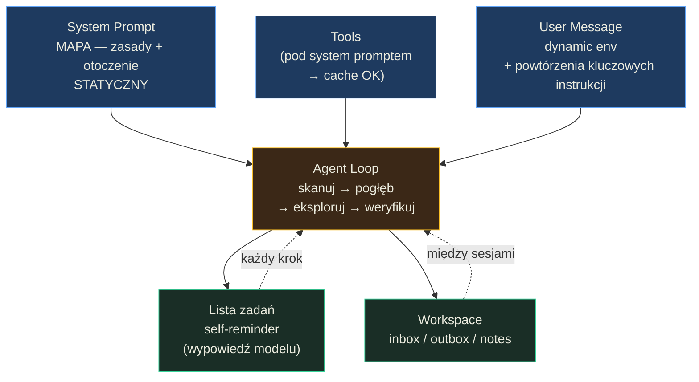

# Zarządzanie kontekstem w konwersacji — Podsumowanie

## O czym jest ta lekcja? (TL;DR)

Context Engineering to nie "wrzuć wszystko do promptu" — to sztuka stwarzania warunków, w których agent sam buduje wartościowy kontekst. Ta lekcja uczy, jak projektować instrukcje systemowe agentów (generyczne, nie specyficzne), jak prowadzić agenta przez eksplorację zasobów (Agentic RAG), jak strukturyzować okno kontekstowe z myślą o prompt cache, i jak organizować przestrzeń współdzieloną między sesjami i agentami. Kluczowy wniosek: rola kodu maleje, rola kontekstu rośnie — ale to oznacza, że kod musi być jeszcze lepszy.

## Model mentalny

**Zdanie-klucz:** Context Engineering to nie "wrzuć wszystko do promptu", lecz projektowanie mapy, po której agent sam eksploruje zasoby — a stabilny system prompt trzyma cache narzędzi przy życiu.



**Trzy przemiany myślenia, które ten diagram wymusza:**
1. *Nie GPS, tylko mapa* — system prompt opisuje otoczenie i zasady nawigacji, a nie sekwencję kroków; dzięki temu agent elastycznie radzi sobie z nieprzewidzianymi sytuacjami.
2. *Nie system prompt, tylko wiadomość użytkownika* — dynamic data (godzina, gałąź git, otwarte pliki) musi trafić do user message, bo każda zmiana w system prompcie niszczy cache narzędzi pod spodem.
3. *Nie top-K chunków, tylko eksploracja* — Agentic RAG zastępuje statyczne wyszukiwanie wieloetapowym procesem, w którym agent sam generuje i koryguje zapytania — a instrukcje mają być generyczne, bo "agent nie wie, o czym wie".

## Mapa koncepcji

- **Instrukcja systemowa jako "mapa"** — uniwersalne reguły, otoczenie, sesja, zespół agentów
  - **Generalizowanie instrukcji** — zasady zamiast kroków, klasa problemów zamiast konkretnego przypadku
  - **Iterowanie z LLM** — analiza problemu → generalizacja → własne uwagi → iteracje
- **Agentic RAG** — agent sam buduje kontekst przez wieloetapowe przeszukiwanie
  - **Skanowanie → Pogłębianie → Eksplorowanie → Weryfikacja pokrycia**
  - **Agent "nie wie, o czym wie"** — trzeba go poprowadzić
- **Struktura okna kontekstowego** — narzędzia pod system promptem, dynamiczne dane w wiadomościach użytkownika
  - **Cache hit jako priorytet** — zmiana w system prompcie niszczy cache narzędzi
  - **Dynamiczne dane w wiadomościach, nie w system prompcie**
- **Kontrola stanu poza oknem kontekstu** — sesja, pamięć, pliki, otoczenie, agenci
- **Planowanie i monitorowanie** — lista zadań jako zarządzanie uwagą modelu
- **Workspace agentów** — struktura katalogów dla sesji, komunikacja przez pliki

## Kluczowe koncepcje

### Instrukcja systemowa jako "mapa" (nie GPS)

**W jednym zdaniu:** System prompt nie powinien prowadzić agenta krok po kroku, lecz dawać mu orientację w terenie — wiedzę o otoczeniu, dostępnych zasobach i uniwersalne zasady nawigacji.

**Rozwinięcie:** Analogia z mapą cyfrową jest trafna: mapa nie jest terenem, ale pozwala się po nim poruszać. Cztery warstwy: (1) **Uniwersalne instrukcje** — jeśli agent ma pamięć, prompt mówi o **roli** pamięci i jej głównych obszarach (profile, "osobowość", wiedza o użytkowniku), nie o konkretnych wspomnieniach. Opisy w prompcie muszą być zgeneralizowane, bo to samo narzędzie może pełnić inną rolę u różnych agentów. (2) **Otoczenie** — system operacyjny, ustawienia użytkownika, rodzaj interfejsu (głosowy?), typ interakcji (CRON bez człowieka?). Pytanie kluczowe: "o czym agent musi wiedzieć PRZED uruchomieniem narzędzi?" (3) **Sesja** — informacje o kompresji kontekstu, ale ostrożnie z chronologią — starsze fakty w system prompcie mogą kolidować z nowszymi w wiadomościach. (4) **Zespół agentów** — zasady komunikacji, współdzielenia kontekstu, wspólne fragmenty instrukcji z placeholderami.

**Przykład z lekcji:** Claude wie, że nie ma dostępu do Internetu (bo prompt mówi "if the search tool is not turned on, it can't verify these claims"), a Cursor zna aktualnie otwarty plik bez wywołania narzędzia — informacja ta jest w dynamicznym fragmencie wiadomości użytkownika, nie w system prompcie.

### Agentic RAG — agent buduje kontekst przez obserwację

**W jednym zdaniu:** Zamiast ładować wszystko do kontekstu, agent sam eksploruje zasoby wieloetapowo — skanuje strukturę, generuje zapytania, koryguje podejście na podstawie wyników i weryfikuje pokrycie.

**Rozwinięcie:** Klasyczne RAG: zapytanie → embedding → top-K dokumentów → odpowiedź. Agentic RAG: agent sam decyduje co szukać, jak transformować zapytania i kiedy przestać. Cztery fazy z instrukcji: (1) **Skanowanie** — zapoznaj się ze strukturą zasobów (foldery, nazwy, metadane, nagłówki). (2) **Pogłębianie** — odkrywaj słowa kluczowe, synonimy, powiązane tematy, skróty, nazwy własne przez serię zwięzłych pytań. (3) **Eksplorowanie** — szukaj powiązań: przyczyna/skutek, część/całość, problem/rozwiązanie, ograniczenia/obejścia. (4) **Weryfikacja pokrycia** — czy mam definicje, liczby, warunki brzegowe, wyjątki? Czy kontynuować szukanie? Kluczowe: agent "nie wie, o czym wie" — musi mieć generyczne instrukcje prowadzące go przez eksplorację, ale nie sztywny proces.

**Przykład z lekcji:** Agent pyta o "context management" w bazie lekcji AI_devs. Pierwsze wyniki — słabe (bo lekcje po polsku). Agent koryguje język zapytań i generuje polskie frazy. Drugie podejście — trafne wyniki. Ale: agent zapytany o "limity okna kontekstowego" może nie trafić do S01E05, bo to słowo kluczowe tam nie padło. Rozwiązanie: instrukcje o eksploracji powiązanych zagadnień, nie bezpośrednia reguła "szukaj S01E05".

### Generalizowanie instrukcji z pomocą LLM

**W jednym zdaniu:** Model potrafi zasugerować zmiany w prompcie, ale proponuje zbyt specyficzne instrukcje — musisz go poprowadzić w kierunku generalizacji i samodzielnie ocenić wynik.

**Rozwinięcie:** Proces w czterech krokach: (1) **Analiza problemu** — opisz modelowi konkretny błąd agenta (np. "agent wczytuje link do wideo przez load_url zamiast analyze_video") wraz z pełnym kontekstem (narzędzia, instrukcje). (2) **Generalizacja** — poproś o "uniwersalne przyczyny, nie powiązane z tym konkretnym przypadkiem, lecz z kategorią problemów". (3) **Własne uwagi** — z sugestii modelu ~60% nie ma sensu, ~30% wymaga zmian, ~10% jest ok. Podkreśl niezależność instrukcji od narzędzi i unikanie "przesterowania". (4) **Iteracje** — proste wskazówki w kolejnych wiadomościach. Efekt: "provide clear, concise answers" i "ask or pick safest option" — zwięzłe sformułowania, do których trudno dojść samodzielnie, ale łatwo z modelem.

**Przykład z lekcji:** Diagram "przed i po" transformacji promptu: oryginalna instrukcja zawiera specyficzne reguły powiązane z narzędziami. Nowa wersja jest generyczna, niezależna od aktualnie przypisanych narzędzi, i adresuje klasę problemów zamiast jednego przypadku.

### Struktura okna kontekstowego i cache hit

**W jednym zdaniu:** Narzędzia znajdują się **pod** system promptem — każda zmiana w prompcie niszczy cache narzędzi. Dynamiczne dane przenieś do wiadomości użytkownika.

**Rozwinięcie:** Cursor wie na jakiej gałęzi Gita jesteś, jaki masz dzień, które pliki otwierałeś — ale te dane NIE są w system prompcie, bo zmieniałyby go co chwilę. Są w wiadomości użytkownika, oddzielone tagami XML: `<environment>`, `<recent_files>`, `<git_status>`. System prompt pozostaje statyczny → cache narzędzi utrzymany. W kolejnych wiadomościach — mniejsza porcja dynamicznych danych (tylko to, co się zmieniło). Agent może odświeżyć resztę narzędziami. Bonus: powtarzanie kluczowych instrukcji w wiadomościach użytkownika **zarządza uwagą modelu**, który przy długich konwersacjach gubi fakty z początku.

**Przykład z lekcji:** Diagram "coding agent context window": system prompt (statyczny) → narzędzia (cache!) → wiadomość użytkownika z blokami `<environment>`, `<open_files>`, `<git_status>` + właściwe pytanie → kolejne wiadomości z mniejszą porcją aktualizacji.

### Planowanie i lista zadań jako zarządzanie uwagą

**W jednym zdaniu:** Lista zadań w kontekście agenta to nie notatka dla użytkownika — to mechanizm powtórzeń, który "przypomina" modelowi co jest najważniejsze, zarządzając jego uwagą przy złożonych zadaniach.

**Rozwinięcie:** Koncepcja Many-shot jailbreaking (Anthropic) sugeruje, że wypowiedzi modelu wpływają na jego dalsze zachowanie. Lista zadań generowana i aktualizowana przez agenta to wypowiedź modelu powtarzana przy każdym kroku — silniejszy sygnał niż instrukcja w system prompcie. Problem: bez programistycznego wsparcia modele zapominają o aktualizacji listy lub aktualizują ją dopiero po ukończeniu wszystkich punktów. Tryb planowania (inspirowany Claude Code) działa podobnie — informacja o trybie i zasadach dołączana do najnowszej wiadomości użytkownika (nie do system promptu, ze względu na cache).

**Przykład z lekcji:** Diagram listy zadań: agent generuje listę z 5 punktami, po wykonaniu każdego — przepisuje pozostałe. "Powtórzenie" kluczowych wątków w każdej turze wzmacnia zachowanie modelu.

### Workspace agentów — struktura współdzielenia

**W jednym zdaniu:** Agenci komunikują się przez pliki w ustrukturyzowanym workspace: sesja → data → agenci, z podziałem na inbox/outbox/notes i programistycznym ograniczeniem dostępu.

**Rozwinięcie:** Pięć kategorii plików: (1) załączniki użytkownika, (2) notatki sesji, (3) "publiczne" dokumenty dla użytkownika, (4) "wewnętrzne" dokumenty dla innych agentów, (5) dokumenty od innych agentów. Struktura: `workspace/{userId}/{date}/{sessionId}/{agentId}/{inbox|outbox|notes}`. Reguły: agent modyfikuje swoje `notes` i `outbox`. `inbox` zapisywany wyłącznie przez root agenta. Jeśli agent kończy etap — udostępnia dokument, root przekazuje dalej. Programistyczne ograniczenie: agent nie może sięgnąć do sesji innego użytkownika.

**Przykład z lekcji:** Diagram workspace: `sessions/user_abc/2026-02-08/session_1/{root_agent, sub_agent_a, sub_agent_b}`, każdy z inbox/outbox/notes. Root koordynuje przepływ dokumentów.

## Teoria w praktyce

### Agentic RAG z historią konwersacji (`02_01_agentic_rag`)

Agent eksplorujący dokumenty z zachowaniem historii konwersacji — follow-up pytania korzystają z kontekstu poprzednich odpowiedzi.

```javascript
// Agent z persystentną historią — follow-up pytania mają pełen kontekst
export const run = async (query, { mcpClient, mcpTools, conversationHistory = [] }) => {
  const tools = mcpToolsToOpenAI(mcpTools);

  // Nowe pytanie dołączane do istniejącej historii
  const messages = [...conversationHistory, { role: "user", content: query }];

  for (let step = 1; step <= MAX_STEPS; step++) {
    const response = await chat({ input: messages, tools });
    const toolCalls = extractToolCalls(response);

    if (toolCalls.length === 0) {
      // Agent odpowiedział — zapisz w historii i zwróć
      messages.push(...response.output);
      return {
        response: extractText(response),
        conversationHistory: messages  // Historia do następnego pytania
      };
    }

    // Tool calls — wykonaj i kontynuuj pętlę
    messages.push(...response.output);
    const results = await runTools(mcpClient, toolCalls);
    messages.push(...results);
  }
};
```

Kluczowe: `conversationHistory` jest zwracane i przekazywane przy follow-up pytaniach. Agent buduje kontekst wieloetapowo: skanuje katalogi, czyta nagłówki, generuje zapytania wyszukiwania, koryguje język — wszystko w ramach jednej pętli max 50 kroków. Historia pozwala na pytania "a co z tym tematem, o którym mówiliśmy wcześniej?"

## Najważniejsze zasady (cheat sheet)

1. **System prompt to mapa, nie GPS** — podaj cel, ograniczenia, otoczenie. Nie prowadź agenta krok po kroku, bo zablokujesz mu elastyczność.
2. **Narzędzia leżą pod system promptem** — każda zmiana w system prompcie niszczy cache narzędzi. Dynamiczne dane przenieś do wiadomości użytkownika.
3. **Agent "nie wie, o czym wie"** — musi mieć instrukcje prowadzące go przez eksplorację (skanowanie → pogłębianie → eksplorowanie → weryfikacja pokrycia), ale nie sztywny proces.
4. **Generalizuj instrukcje** — "szukaj powiązanych zagadnień" zamiast "szukaj S01E05". Instrukcja nie powinna zależeć od zestawu danych ani aktualnie przypisanych narzędzi.
5. **Iteruj instrukcje z LLM, ale prowadź kierunek** — model sugeruje zbyt specyficzne instrukcje. Ty: generalizacja, niezależność od narzędzi, unikanie "przesterowania".
6. **Powtarzaj kluczowe instrukcje w wiadomościach** — model gubi fakty z początku konwersacji. Dynamiczne fragmenty z powtórzeniami w ostatniej wiadomości zarządzają uwagą.
7. **Lista zadań to mechanizm powtórzeń** — nie notatka. Agent generuje listę, aktualizuje po każdym kroku, "przypominając" sobie co najważniejsze. Wymaga programistycznego wsparcia.
8. **Stan kontroluj poza oknem kontekstu** — sesja, pamięć, pliki, otoczenie, agenci. Hooki i zdarzenia pozwalają na akcje w tle bez obciążania kontekstu.
9. **Workspace z podziałem na inbox/outbox/notes** — agenci komunikują się przez pliki z programistycznie ograniczonym dostępem. Root koordynuje przepływ.
10. **100% skuteczności to nie cel** — Agentic RAG nie gwarantuje odnalezienia wszystkich informacji. Projektuj system z myślą o interwencji człowieka lub innych agentów.

## Czego unikać (anty-wzorce)

- **Ładowanie całej bazy wiedzy do kontekstu** → **Agentic RAG** — agent sam eksploruje zasoby wieloetapowo, ładując do kontekstu tylko to, czego aktualnie potrzebuje.
- **Dynamiczne dane w system prompcie (data, gałąź git, otwarte pliki)** → **Przenieś do wiadomości użytkownika** — każda zmiana w system prompcie niszczy cache narzędzi pod nim.
- **Specyficzne instrukcje powiązane z konkretnymi danymi** → **Generyczne zasady adresujące klasę problemów** — "dokumenty AI_devs są po polsku" jest ok jako pragmatyczne rozwiązanie, ale "eksploruj powiązane zagadnienia" jest lepsze długoterminowo.
- **Sztywny proces wyszukiwania (zawsze 3 kroki)** → **Generyczne fazy z decyzyjnością agenta** — dla prostych pytań z konkretnymi nazwami plików agent skraca do 1 kroku. Dla złożonych — 10+ kroków.
- **Zaburzanie chronologii w system prompcie** → **Postępy realizacji w wiadomościach, nie w system prompcie** — jeśli system prompt zawiera "starsze" fakty niż późniejsze wiadomości, model się gubi.
- **Bezpośredni dostęp agentów do danych innych użytkowników** → **Programistyczne ograniczenie per sesja** — workspace z izolacją: agent widzi tylko swoją sesję, root koordynuje przepływ między agentami.

## Sprawdź się (pytania do refleksji)

- **Agent eksplorujący bazę wiedzy po angielsku trafia na dokumenty po polsku i zwraca "nie znaleziono". Jak naprawisz to generycznie, bez hardcodowania języka?** *Wskazówka: pomyśl o fazie "pogłębiania" — agent powinien sam odkryć język dokumentów i dostosować zapytania.*

- **Masz agenta z 15 narzędziami w system prompcie. Chcesz dodać dynamiczną informację o godzinie. Gdzie ją umieścisz i dlaczego?** *Wskazówka: pomyśl o tym, co leży "pod" system promptem i co się stanie z cache.*

- **Agent z listą zadań poprawnie generuje ją na początku, ale po 10 krokach zaczyna gubić punkty. Co zrobisz?** *Wskazówka: pomyśl o programistycznym wsparciu — kto powinien pilnować, że lista jest aktualizowana przy każdym kroku?*

- **Projektujesz system wieloagentowy: agent A zbiera dane, agent B generuje raport, agent C wysyła email. Jak zorganizujesz komunikację między nimi?** *Wskazówka: pomyśl o workspace z inbox/outbox i roli root agenta jako koordynatora.*

- **Model sugeruje zmianę w instrukcji: "jeśli link kończy się na .mp4, użyj analyze_video". Dlaczego to zła sugestia i jak ją zgeneralizujesz?** *Wskazówka: pomyśl o niezależności instrukcji od narzędzi i o tym, co się stanie gdy dodasz nowe formaty lub zmienisz nazwy narzędzi.*
